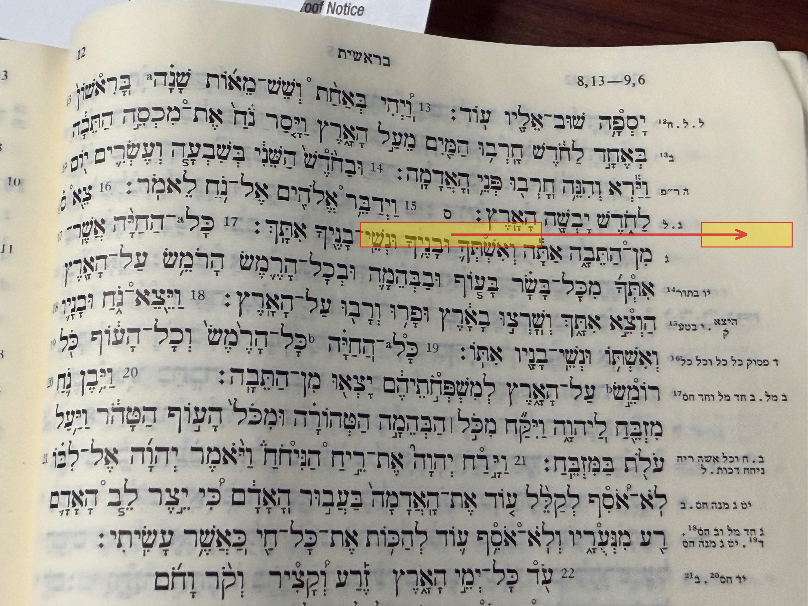

# BBH Ch36 — Introduction to the Hebrew Bible

A brief orientation to reading the Hebrew Bible: the Masoretic apparatus, pausal forms, Kethiv-Qere, and the textual apparatus of BHS.

---

## Pausal Forms

Words occurring at the major points of verse division (under the Athnach or Silluq accent) are said to be "in pause." Common spelling changes in pausal position:

| Pausal change | Example | References |
|---|---|---|
| Pathach → Qamets | עַם → עָם | Ps 23:1 (אֶחְסָֽר, Silluq); Isa 40:28 (יִיגָ֑ע, Athnach) |
| Seghol → Qamets (Segholate nouns) | אֶ֫רֶץ → אָ֫רֶץ | Gen 1:1 (הָאָ֑רֶץ, Silluq); Ps 33:5 (הָאָ֑רֶץ, Athnach) |
| 2ms suffix Shewa → Seghol | סוּסְךָ → סוּסֶ֫ךָ | Ps 23:4 (מִשְׁעַנְתֶּ֑ךָ, Athnach); Deut 6:5 (מְאֹדֶֽךָ, Silluq) |
| Accent shift: Vocal Shewa → Qamets | כָּֽתְבָה → כָּתָ֫בָה | Ps 45:2 (רָחַ֣שׁ, Athnach); Lam 1:1 (יָשְׁבָ֣ה, Tiphcha) |

---

## Masorah

The Masoretes (6th–10th c. AD) added three layers of annotation to the consonantal text:

| Layer | Location | Content |
|---|---|---|
| Masorah parva (Mp) | Outer side margins | Word-use statistics; Kethiv-Qere signals |
| Masorah magna (Mm) | Top and bottom margins | Expanded Mp entries (register in BHS) |
| Final Masorah | End of books/sections | Verse/word/letter counts; midpoint data |

---

## Kethiv-Qere

The **Kethiv** (כְּתִיב, "what is written") is the consonantal text as it stands. The **Qere** (קְרֵי, "what is to be read") is the Masoretic correction, signaled by a small circle in the text and the Qere consonants in the margin (marked ק֗).

The most important perpetual Kethiv-Qere:

| Kethiv | Qere | Notes |
|---|---|---|
| יהוה | אֲדֹנָי | Not pronounced out of reverence; vowels of אֲדֹנָי placed under יהוה → יְהוָה |

### Example: Genesis 8:17 in BHS

The yellow box marks the Kethiv form in the main text; the arrow points to the corresponding Qere reading in the outer margin.

### Other Notable Kethiv-Qere Occurrences

1. **יהוה → אֲדֹנָי** (throughout the OT) — The defining perpetual Qere. Consonants of the divine name remain in the text; the vowels and reading of אֲדֹנָי replace them. Where יהוה follows אֲדֹנָי in the text, the Qere is אֱלֹהִים instead.
2. **הוּא → הִיא** (~100× in the Pentateuch; e.g., Gen 3:20; Exod 2:2) — Perpetual Qere: the 3fs pronoun is spelled with masculine consonants throughout the Torah, reflecting an archaic spelling convention.
3. **Isa 9:2** — Kethiv לוֹ ("to him") / Qere לֹא ("not"). The reversal fundamentally changes the verse's sense: "the joy thou hast multiplied *to him*" vs. "thou hast *not* increased the joy."
4. **Ps 100:3** — Kethiv לֹא ("not") / Qere לוֹ ("his"). The same lō/lô ambiguity runs in the opposite direction: "we are *not* his" vs. "we are *his*."
5. **1 Sam 3:13** — Kethiv לוֹ ("for him") / Qere לָהֶם ("for themselves"). Changes who incurs the guilt of Eli's sons' behavior.
6. **2 Sam 12:14** — Kethiv: David "despised YHWH"; Qere adds אֹיְבֵי — "despised the *enemies of* YHWH." One of the 18 *Tiqqune Sopherim* (scribal corrections) that protect the divine name from association with blasphemy.
7. **Ezek 8:17** — Kethiv: "branch to *my* nose" (אַפִּי); Qere: "to *their* nose" (אַפָּם). Another *Tiqqun Sopherim*, removing an anthropomorphism that places offense directly against God.
8. **Deut 33:2** — Kethiv: אֵשְׁדָּת (one word, perhaps "fiery law"); Qere: אֵשׁ דָּת (two words, "fire of law"). Word-division uncertainty.
9. **Jer 3:1** — Kethiv includes a solitary לֵ; Qere supplies the full word לֵאמֹר. Illustrates how the Masoretes could fill in an abbreviated or damaged text.
10. **Ps 22:17** — Kethiv: כָּאֲרִי ("like a lion"); some manuscripts and ancient versions read כָּרוּ ("they pierced"). BHS notes the variant; the difference is exegetically significant and debated across Jewish and Christian interpretation.

---

## Textual Apparatus

The textual apparatus appears at the bottom of each BHS page. It contains:
- Significant textual variants from other ancient manuscripts (LXX, Peshitta, Vulgate, Targums)
- Conjectural emendations by the BHS editors
- Notes on full/defective spelling

**Key categories of textual error:**

| Type | Description |
|---|---|
| Unintentional | Letter confusion, haplography, dittography, word division errors |
| Intentional | Theological euphemisms, anti-anthropomorphisms, glosses |

**Purpose of textual criticism:**
1. Reconstruct the text as close to the autograph as the evidence allows
2. Document the history of textual transmission
