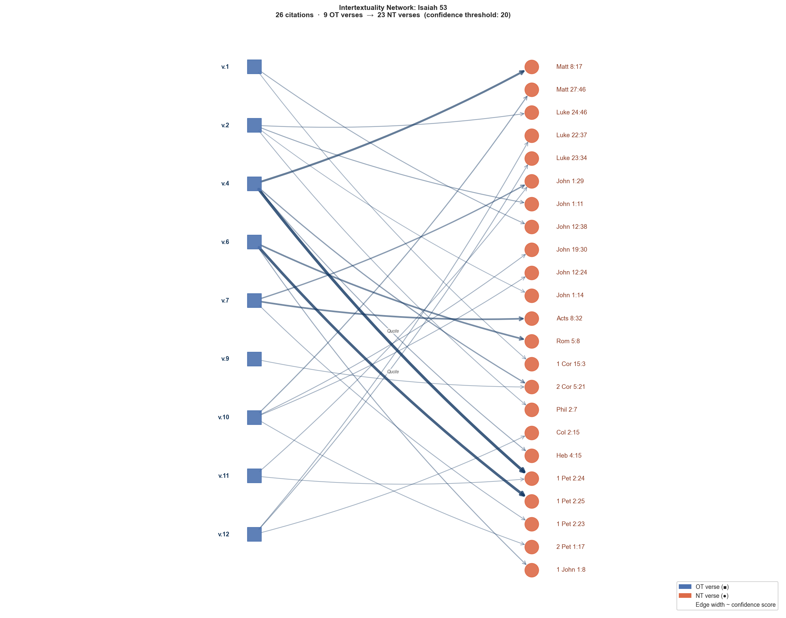

# Intertextuality Network: Isaiah 53

**OT anchor:** Isaiah 53  
**NT citations:** 26  
**Confidence threshold:** 20  
**NT books covered:** 13  

## About the Confidence Score

Each OT→NT link is drawn from the [scrollmapper / OpenBible.info](https://www.openbible.info/labs/cross-references/) cross-reference dataset (CC-BY). The **confidence score** is a community-curated integer: every time a scholar or student marks a link as valid, the score increments; down-votes decrement it. A higher score therefore reflects broader scholarly consensus that the NT author is drawing on the OT passage.

The table below uses the following tiers (following the categories used by scholars such as Beale & Carson, *Commentary on the NT Use of the OT*):

| Tier | Score | Meaning |
|---|---:|---|
| Quote | ≥ 100 | Direct verbal quotation — high certainty |
| Allusion | 50–99 | Clear conceptual borrowing, shared vocabulary |
| Echo | 20–49 | Probable intertextual link, less explicit |

## Network Graph

## NT Book Coverage

| NT Book | Citations | Total Confidence |
|---|---:|---:|
| 1 Peter | 4 | 291 |
| John | 7 | 201 |
| Matthew | 2 | 122 |
| Luke | 3 | 79 |
| Acts | 1 | 68 |
| Romans | 1 | 67 |
| 2 Corinthians | 2 | 65 |
| 1 John | 1 | 30 |
| Hebrews | 1 | 30 |
| Philippians | 1 | 23 |
| 1 Corinthians | 1 | 22 |
| 2 Peter | 1 | 22 |
| Colossians | 1 | 22 |

## All Citations

> **Note on the text columns:** The *OT Text* and *NT Text* columns show a **word-by-word interlinear gloss** drawn from the STEPBible TAHOT (Hebrew OT) and TAGNT (Greek NT) datasets. Each word's gloss is concatenated in order, so the result reads like a literal word-for-word rendering rather than a polished translation. For smooth reading, consult a Bible in the Verse-by-Verse Detail section below or look up the reference directly.

| OT Verse | NT Verse | Score | OT Text | NT Text |
|---|---|---:|---|---|
| Isaiah 53:4 | 1 Peter 2:24 | 127 | Surely he hath borne our griefs, and carried our sorrows: yet we did esteem him ... | Who his own self bare our sins in his own body on the tree, that we, being dead ... |
| Isaiah 53:6 | 1 Peter 2:25 | 119 | All we like sheep have gone astray; we have turned every one to his own way; and... | For ye were as sheep going astray; but are now returned unto the Shepherd and Bi... |
| Isaiah 53:4 | Matthew 8:17 | 86 | Surely he hath borne our griefs, and carried our sorrows: yet we did esteem him ... | That it might be fulfilled which was spoken by Esaias the prophet, saying, Himse... |
| Isaiah 53:7 | Acts 8:32 | 68 | He was oppressed, and he was afflicted, yet he opened not his mouth: he is broug... | The place of the scripture which he read was this, He was led as a sheep to the ... |
| Isaiah 53:6 | Romans 5:8 | 67 | All we like sheep have gone astray; we have turned every one to his own way; and... | But God commendeth his love toward us, in that, while we were yet sinners, Chris... |
| Isaiah 53:7 | John 1:29 | 49 | He was oppressed, and he was afflicted, yet he opened not his mouth: he is broug... | The next day John seeth Jesus coming unto him, and saith, Behold the Lamb of God... |
| Isaiah 53:4 | 2 Corinthians 5:21 | 44 | Surely he hath borne our griefs, and carried our sorrows: yet we did esteem him ... | For he hath made him to be sin for us, who knew no sin; that we might be made th... |
| Isaiah 53:10 | Matthew 27:46 | 36 | Yet it pleased the Lord to bruise him; he hath put him to grief: when thou shalt... | And about the ninth hour Jesus cried with a loud voice, saying, Eli, Eli, lama s... |
| Isaiah 53:2 | John 1:11 | 31 | For he shall grow up before him as a tender plant, and as a root out of a dry gr... | He came unto his own, and his own received him not. |
| Isaiah 53:4 | Hebrews 4:15 | 30 | Surely he hath borne our griefs, and carried our sorrows: yet we did esteem him ... | For we have not an high priest which cannot be touched with the feeling of our i... |
| Isaiah 53:6 | 1 John 1:8 | 30 | All we like sheep have gone astray; we have turned every one to his own way; and... | If we say that we have no sin, we deceive ourselves, and the truth is not in us. |
| Isaiah 53:1 | John 12:38 | 28 | Who hath believed our report? and to whom is the arm of the Lord revealed? | That the saying of Esaias the prophet might be fulfilled, which he spake, Lord, ... |
| Isaiah 53:2 | Luke 24:46 | 27 | For he shall grow up before him as a tender plant, and as a root out of a dry gr... | And said unto them, Thus it is written, and thus it behoved Christ to suffer, an... |
| Isaiah 53:12 | Luke 22:37 | 26 | Therefore will I divide him a portion with the great, and he shall divide the sp... | For I say unto you, that this that is written must yet be accomplished in me, An... |
| Isaiah 53:12 | Luke 23:34 | 26 | Therefore will I divide him a portion with the great, and he shall divide the sp... | Then said Jesus, Father, forgive them; for they know not what they do. And they ... |
| Isaiah 53:10 | John 19:30 | 25 | Yet it pleased the Lord to bruise him; he hath put him to grief: when thou shalt... | When Jesus therefore had received the vinegar, he said, It is finished: and he b... |
| Isaiah 53:11 | John 1:29 | 24 | He shall see of the travail of his soul, and shall be satisfied: by his knowledg... | The next day John seeth Jesus coming unto him, and saith, Behold the Lamb of God... |
| Isaiah 53:7 | 1 Peter 2:23 | 24 | He was oppressed, and he was afflicted, yet he opened not his mouth: he is broug... | Who, when he was reviled, reviled not again; when he suffered, he threatened not... |
| Isaiah 53:10 | John 12:24 | 24 | Yet it pleased the Lord to bruise him; he hath put him to grief: when thou shalt... | Verily, verily, I say unto you, Except a corn of wheat fall into the ground and ... |
| Isaiah 53:2 | Philippians 2:7 | 23 | For he shall grow up before him as a tender plant, and as a root out of a dry gr... | But made himself of no reputation, and took upon him the form of a servant, and ... |
| Isaiah 53:12 | Colossians 2:15 | 22 | Therefore will I divide him a portion with the great, and he shall divide the sp... | And having spoiled principalities and powers, he made a shew of them openly, tri... |
| Isaiah 53:10 | 2 Peter 1:17 | 22 | Yet it pleased the Lord to bruise him; he hath put him to grief: when thou shalt... | For he received from God the Father honour and glory, when there came such a voi... |
| Isaiah 53:1 | 1 Corinthians 15:3 | 22 | Who hath believed our report? and to whom is the arm of the Lord revealed? | For I delivered unto you first of all that which I also received, how that Chris... |
| Isaiah 53:11 | 1 Peter 2:24 | 21 | He shall see of the travail of his soul, and shall be satisfied: by his knowledg... | Who his own self bare our sins in his own body on the tree, that we, being dead ... |
| Isaiah 53:9 | 2 Corinthians 5:21 | 21 | And he made his grave with the wicked, and with the rich in his death; because h... | For he hath made him to be sin for us, who knew no sin; that we might be made th... |
| Isaiah 53:2 | John 1:14 | 20 | For he shall grow up before him as a tender plant, and as a root out of a dry gr... | And the Word was made flesh, and dwelt among us, (and we beheld his glory, the g... |

## Verse-by-Verse Detail

### Isaiah 53:4

> Surely he hath borne our griefs, and carried our sorrows: yet we did esteem him stricken, smitten of God, and afflicted.

**[1 Peter 2:24]** (Quote, confidence: 127)  
> Who his own self bare our sins in his own body on the tree, that we, being dead to sins, should live unto righteousness: by whose stripes ye were healed.

**[Matthew 8:17]** (Allusion, confidence: 86)  
> That it might be fulfilled which was spoken by Esaias the prophet, saying, Himself took our infirmities, and bare our sicknesses.

**[2 Corinthians 5:21]** (Echo, confidence: 44)  
> For he hath made him to be sin for us, who knew no sin; that we might be made the righteousness of God in him.

**[Hebrews 4:15]** (Echo, confidence: 30)  
> For we have not an high priest which cannot be touched with the feeling of our infirmities; but was in all points tempted like as we are, yet without sin.

### Isaiah 53:6

> All we like sheep have gone astray; we have turned every one to his own way; and the Lord hath laid on him the iniquity of us all.

**[1 Peter 2:25]** (Quote, confidence: 119)  
> For ye were as sheep going astray; but are now returned unto the Shepherd and Bishop of your souls.

**[Romans 5:8]** (Allusion, confidence: 67)  
> But God commendeth his love toward us, in that, while we were yet sinners, Christ died for us.

**[1 John 1:8]** (Echo, confidence: 30)  
> If we say that we have no sin, we deceive ourselves, and the truth is not in us.

### Isaiah 53:7

> He was oppressed, and he was afflicted, yet he opened not his mouth: he is brought as a lamb to the slaughter, and as a sheep before her shearers is dumb, so he openeth not his mouth.

**[Acts 8:32]** (Allusion, confidence: 68)  
> The place of the scripture which he read was this, He was led as a sheep to the slaughter; and like a lamb dumb before his shearer, so opened he not his mouth:

**[John 1:29]** (Echo, confidence: 49)  
> The next day John seeth Jesus coming unto him, and saith, Behold the Lamb of God, which taketh away the sin of the world.

**[1 Peter 2:23]** (Echo, confidence: 24)  
> Who, when he was reviled, reviled not again; when he suffered, he threatened not; but committed himself to him that judgeth righteously:

### Isaiah 53:10

> Yet it pleased the Lord to bruise him; he hath put him to grief: when thou shalt make his soul an offering for sin, he shall see his seed, he shall prolong his days, and the pleasure of the Lord shall prosper in his hand.

**[Matthew 27:46]** (Echo, confidence: 36)  
> And about the ninth hour Jesus cried with a loud voice, saying, Eli, Eli, lama sabachthani? that is to say, My God, my God, why hast thou forsaken me?

**[John 19:30]** (Echo, confidence: 25)  
> When Jesus therefore had received the vinegar, he said, It is finished: and he bowed his head, and gave up the ghost.

**[John 12:24]** (Echo, confidence: 24)  
> Verily, verily, I say unto you, Except a corn of wheat fall into the ground and die, it abideth alone: but if it die, it bringeth forth much fruit.

**[2 Peter 1:17]** (Echo, confidence: 22)  
> For he received from God the Father honour and glory, when there came such a voice to him from the excellent glory, This is my beloved Son, in whom I am well pleased.

### Isaiah 53:2

> For he shall grow up before him as a tender plant, and as a root out of a dry ground: he hath no form nor comeliness; and when we shall see him, there is no beauty that we should desire him.

**[John 1:11]** (Echo, confidence: 31)  
> He came unto his own, and his own received him not.

**[Luke 24:46]** (Echo, confidence: 27)  
> And said unto them, Thus it is written, and thus it behoved Christ to suffer, and to rise from the dead the third day:

**[Philippians 2:7]** (Echo, confidence: 23)  
> But made himself of no reputation, and took upon him the form of a servant, and was made in the likeness of men:

**[John 1:14]** (Echo, confidence: 20)  
> And the Word was made flesh, and dwelt among us, (and we beheld his glory, the glory as of the only begotten of the Father,) full of grace and truth.

### Isaiah 53:1

> Who hath believed our report? and to whom is the arm of the Lord revealed?

**[John 12:38]** (Echo, confidence: 28)  
> That the saying of Esaias the prophet might be fulfilled, which he spake, Lord, who hath believed our report? and to whom hath the arm of the Lord been revealed?

**[1 Corinthians 15:3]** (Echo, confidence: 22)  
> For I delivered unto you first of all that which I also received, how that Christ died for our sins according to the scriptures;

### Isaiah 53:12

> Therefore will I divide him a portion with the great, and he shall divide the spoil with the strong; because he hath poured out his soul unto death: and he was numbered with the transgressors; and he bare the sin of many, and made intercession for the transgressors.

**[Luke 22:37]** (Echo, confidence: 26)  
> For I say unto you, that this that is written must yet be accomplished in me, And he was reckoned among the transgressors: for the things concerning me have an end.

**[Luke 23:34]** (Echo, confidence: 26)  
> Then said Jesus, Father, forgive them; for they know not what they do. And they parted his raiment, and cast lots.

**[Colossians 2:15]** (Echo, confidence: 22)  
> And having spoiled principalities and powers, he made a shew of them openly, triumphing over them in it.

### Isaiah 53:11

> He shall see of the travail of his soul, and shall be satisfied: by his knowledge shall my righteous servant justify many; for he shall bear their iniquities.

**[John 1:29]** (Echo, confidence: 24)  
> The next day John seeth Jesus coming unto him, and saith, Behold the Lamb of God, which taketh away the sin of the world.

**[1 Peter 2:24]** (Echo, confidence: 21)  
> Who his own self bare our sins in his own body on the tree, that we, being dead to sins, should live unto righteousness: by whose stripes ye were healed.

### Isaiah 53:9

> And he made his grave with the wicked, and with the rich in his death; because he had done no violence, neither was any deceit in his mouth.

**[2 Corinthians 5:21]** (Echo, confidence: 21)  
> For he hath made him to be sin for us, who knew no sin; that we might be made the righteousness of God in him.

---

_Cross-reference data: scrollmapper / OpenBible.info (CC-BY). Confidence scores reflect community consensus on each OT→NT link (Quote ≥ 100 · Allusion 50–99 · Echo 20–49). Text: KJV (STEPBible TAHOT/TAGNT CC BY 4.0, Tyndale House Cambridge)._