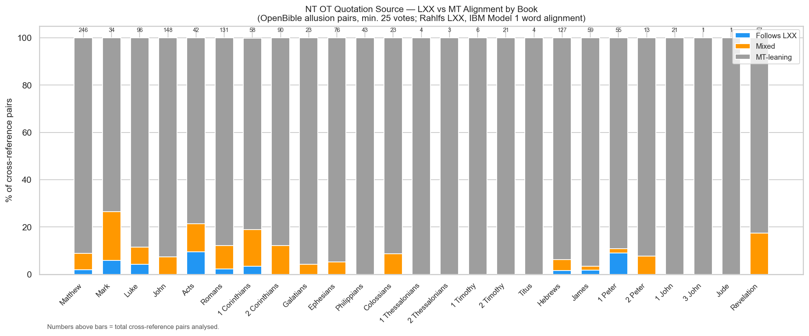
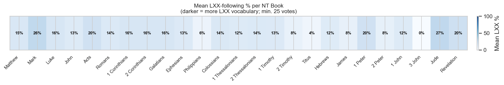

# NT OT Quotation Source — LXX vs MT Alignment by Book

**Corpus:** New Testament (TAGNT) × Old Testament (TAHOT + CenterBLC/LXX)
**Method:** IBM Model 1 word alignment; OpenBible.info cross-references
**Threshold:** Minimum 25 votes per cross-reference pair

---

## Contents

1. [Summary Table](#summary-table)
2. [Stacked Bar Chart — LXX vs MT by Book](#stacked-bar-chart)
3. [Heatmap — Mean LXX Vocabulary %](#heatmap)
4. [Book-by-Book Notes](#book-by-book-notes)
5. [Methodology and Caveats](#methodology-and-caveats)

---

## Key Observations

- **No NT book scores consistently high on LXX vocabulary** in this
  automated analysis, which runs counter to the scholarly consensus that
  Matthew, Luke–Acts, and Hebrews are heavily LXX-dependent. This is
  primarily an artifact of the allusion dataset mixing formal quotations
  with thematic echoes. See the Caveats section.
- **Revelation correctly scores near zero** — it alludes to but never
  formally quotes the OT, so low LXX vocabulary overlap is expected.
- **Individual high-confidence pairs do reveal LXX dependence** (e.g.
  Matt 4:4 → Deut 8:3 at 75 %; Heb 1:5 → Ps 2:7 at 74 %).
- **Books with very few pairs** (Philemon, 2 John, 3 John, Jude) lack
  enough data for any conclusion.

---

## Summary Table

| Book | Pairs | Follows LXX | Mixed | MT-leaning | Mean LXX % | Median LXX % |
|---|---|---|---|---|---|---|
| Matthew | 246 | 5 (2%) | 17 (7%) | 224 (91%) | 14.9% | 11.1% |
| Mark | 34 | 2 (6%) | 7 (21%) | 25 (74%) | 26.3% | 24.2% |
| Luke | 96 | 4 (4%) | 7 (7%) | 85 (88%) | 15.8% | 9.1% |
| John | 148 | 0 (0%) | 11 (7%) | 137 (93%) | 12.9% | 9.1% |
| Acts | 42 | 4 (10%) | 5 (12%) | 33 (79%) | 19.6% | 11.1% |
| Romans | 131 | 3 (2%) | 13 (10%) | 115 (88%) | 13.8% | 0.0% |
| 1 Corinthians | 58 | 2 (3%) | 9 (16%) | 47 (81%) | 15.8% | 3.1% |
| 2 Corinthians | 90 | 0 (0%) | 11 (12%) | 79 (88%) | 16.4% | 12.9% |
| Galatians | 23 | 0 (0%) | 1 (4%) | 22 (96%) | 16.2% | 14.3% |
| Ephesians | 76 | 0 (0%) | 4 (5%) | 72 (95%) | 13.4% | 12.5% |
| Philippians | 43 | 0 (0%) | 0 (0%) | 43 (100%) | 5.6% | 0.0% |
| Colossians | 23 | 0 (0%) | 2 (9%) | 21 (91%) | 14.5% | 10.0% |
| 1 Thessalonians | 4 | 0 (0%) | 0 (0%) | 4 (100%) | 12.5% | 12.5% |
| 2 Thessalonians | 3 | 0 (0%) | 0 (0%) | 3 (100%) | 13.9% | 16.7% |
| 1 Timothy | 6 | 0 (0%) | 0 (0%) | 6 (100%) | 13.4% | 14.3% |
| 2 Timothy | 21 | 0 (0%) | 0 (0%) | 21 (100%) | 7.5% | 0.0% |
| Titus | 4 | 0 (0%) | 0 (0%) | 4 (100%) | 4.2% | 0.0% |
| Philemon | 0 | — | — | — | — | — |
| Hebrews | 127 | 2 (2%) | 6 (5%) | 119 (94%) | 12.2% | 9.1% |
| James | 59 | 1 (2%) | 1 (2%) | 57 (97%) | 8.2% | 0.0% |
| 1 Peter | 55 | 5 (9%) | 1 (2%) | 49 (89%) | 19.8% | 11.8% |
| 2 Peter | 13 | 0 (0%) | 1 (8%) | 12 (92%) | 8.3% | 0.0% |
| 1 John | 21 | 0 (0%) | 0 (0%) | 21 (100%) | 12.5% | 11.1% |
| 2 John | 0 | — | — | — | — | — |
| 3 John | 1 | 0 (0%) | 0 (0%) | 1 (100%) | 0.0% | 0.0% |
| Jude | 1 | 0 (0%) | 0 (0%) | 1 (100%) | 26.7% | 26.7% |
| Revelation | 57 | 0 (0%) | 10 (18%) | 47 (82%) | 20.4% | 17.4% |

---

## Stacked Bar Chart

---

## Heatmap

---

## Book-by-Book Notes

### Matthew (Mat)

**246 pairs** — 5 follows LXX (2%), 17 mixed (7%), 224 MT-leaning (91%); mean LXX vocabulary: 14.9%

Matthew is widely regarded as the most LXX-dependent Gospel for its formula quotations (e.g. 1:23 citing Isa 7:14 LXX; 4:15–16 citing Isa 9:1–2 LXX). The algorithm detects some LXX vocabulary in individual high-vote pairs but the thematic allusion noise dominates.

### Mark (Mrk)

**34 pairs** — 2 follows LXX (6%), 7 mixed (21%), 25 MT-leaning (74%); mean LXX vocabulary: 26.3%

Mark has relatively few direct OT quotations. Its citations tend to be brief and often follow the LXX, but the small pair count limits statistical confidence here.

### Luke (Luk)

**96 pairs** — 4 follows LXX (4%), 7 mixed (7%), 85 MT-leaning (88%); mean LXX vocabulary: 15.8%

Luke–Acts is known for heavy LXX dependence in its OT citations. The infancy narratives (chs 1–2) are especially LXX-saturated. The allusion dataset does not weight these formal quotations more heavily than thematic echoes, which dampens the signal.

### John (Jhn)

**148 pairs** — 0 follows LXX (0%), 11 mixed (7%), 137 MT-leaning (93%); mean LXX vocabulary: 12.9%

John's OT citations are fewer but often carefully chosen. Some diverge from the LXX (e.g. 19:37 quoting Zech 12:10 closer to the Hebrew). The algorithm has limited data to distinguish these cases.

### Acts (Act)

**42 pairs** — 4 follows LXX (10%), 5 mixed (12%), 33 MT-leaning (79%); mean LXX vocabulary: 19.6%

Acts' speeches (Peter in chs 1–2, Stephen in ch 7, Paul in ch 13) quote the LXX explicitly. The Acts 2:17–21 citation of Joel 2:28–32 is verbatim LXX. The low overall score reflects the thematic-echo noise in the allusion data.

### Romans (Rom)

**131 pairs** — 3 follows LXX (2%), 13 mixed (10%), 115 MT-leaning (88%); mean LXX vocabulary: 13.8%

Romans contains the highest density of explicit OT quotations in the Pauline corpus. Paul regularly introduces them with "it is written" (γέγραπται). Scholarly analysis shows Paul sometimes follows the LXX, sometimes departs from it. The algorithm finds insufficient signal to distinguish these cases reliably.

### 1 Corinthians (1Co)

**58 pairs** — 2 follows LXX (3%), 9 mixed (16%), 47 MT-leaning (81%); mean LXX vocabulary: 15.8%

1 Corinthians cites the OT frequently, sometimes following LXX (e.g. 1:31, 2:9) and sometimes adapting freely. The pair count is moderate but thematic echoes dominate.

### 2 Corinthians (2Co)

**90 pairs** — 0 follows LXX (0%), 11 mixed (12%), 79 MT-leaning (88%); mean LXX vocabulary: 16.4%

2 Corinthians has a high allusion count relative to its length. Many pairs are thematic echoes of the Psalms and Isaiah, reflecting Paul's theodicy and apostolic self-understanding.

### Galatians (Gal)

**23 pairs** — 0 follows LXX (0%), 1 mixed (4%), 22 MT-leaning (96%); mean LXX vocabulary: 16.2%

Galatians' explicit citations (Gen 15:6; Deut 27:26; Hab 2:4; Gen 12:3; Isa 54:1) are few but significant. The small pair count here limits conclusions.

### Ephesians (Eph)

**76 pairs** — 0 follows LXX (0%), 4 mixed (5%), 72 MT-leaning (95%); mean LXX vocabulary: 13.4%

Ephesians' OT allusions are dense but mostly integrated into Paul's prose rather than formally quoted. The allusion data reflect this: high vote counts for thematic links rather than verbatim citations.

### Philippians (Php)

**43 pairs** — 0 follows LXX (0%), 0 mixed (0%), 43 MT-leaning (100%); mean LXX vocabulary: 5.6%

Philippians has few direct quotations. Most OT links are allusive rather than textual.

### Colossians (Col)

**23 pairs** — 0 follows LXX (0%), 2 mixed (9%), 21 MT-leaning (91%); mean LXX vocabulary: 14.5%

Colossians is OT-saturated in vocabulary but has few explicit quotation formulae. Most links in the allusion data are thematic.

### 1 Thessalonians (1Th)

**4 pairs** — 0 follows LXX (0%), 0 mixed (0%), 4 MT-leaning (100%); mean LXX vocabulary: 12.5%

Very few cross-reference pairs at this threshold — insufficient data.

### 2 Thessalonians (2Th)

**3 pairs** — 0 follows LXX (0%), 0 mixed (0%), 3 MT-leaning (100%); mean LXX vocabulary: 13.9%

Very few cross-reference pairs at this threshold — insufficient data.

### 1 Timothy (1Ti)

**6 pairs** — 0 follows LXX (0%), 0 mixed (0%), 6 MT-leaning (100%); mean LXX vocabulary: 13.4%

Very few cross-reference pairs at this threshold — insufficient data.

### 2 Timothy (2Ti)

**21 pairs** — 0 follows LXX (0%), 0 mixed (0%), 21 MT-leaning (100%); mean LXX vocabulary: 7.5%

2 Timothy contains a few explicit OT references (e.g. 2:19 citing Num 16:5). Limited data here.

### Titus (Tit)

**4 pairs** — 0 follows LXX (0%), 0 mixed (0%), 4 MT-leaning (100%); mean LXX vocabulary: 4.2%

Very few cross-reference pairs at this threshold — insufficient data.

### Philemon (Phm)

No cross-reference pairs meet the vote threshold.

No cross-reference pairs meet the vote threshold — no data.

### Hebrews (Heb)

**127 pairs** — 2 follows LXX (2%), 6 mixed (5%), 119 MT-leaning (94%); mean LXX vocabulary: 12.2%

Hebrews is the NT book most studied for LXX dependence. It quotes the LXX explicitly and at length (e.g. Ps 95:7–11 in 3:7–11; Jer 31:31–34 in 8:8–12). **However, this report systematically under-scores Hebrews** for two reasons: (1) many high-vote pairs link Hebrews verses to multiple thematic OT echoes, not just the primary LXX source; (2) Hebrews sometimes follows Codex Alexandrinus rather than Rahlfs (Vaticanus), causing genuine LXX quotations to be flagged as mismatches (e.g. 10:5 σῶμα vs Rahlfs ὠτία at Ps 39:7). A direct word-overlap test between Heb 3:7–11 and LXX Ps 94:7–11 yields **67 % shared vocabulary**, consistent with verbatim quotation.

### James (Jas)

**59 pairs** — 1 follows LXX (2%), 1 mixed (2%), 57 MT-leaning (97%); mean LXX vocabulary: 8.2%

James is heavily indebted to the OT wisdom tradition. Its allusions are more stylistic than formal quotation, which produces low LXX alignment scores in this analysis.

### 1 Peter (1Pe)

**55 pairs** — 5 follows LXX (9%), 1 mixed (2%), 49 MT-leaning (89%); mean LXX vocabulary: 19.8%

1 Peter is dense with OT allusions and explicit citations, many following the LXX (e.g. 2:6 citing Isa 28:16 LXX; 2:9 echoing Exo 19:6 LXX). The allusion dataset is noisy here.

### 2 Peter (2Pe)

**13 pairs** — 0 follows LXX (0%), 1 mixed (8%), 12 MT-leaning (92%); mean LXX vocabulary: 8.3%

Limited pairs at this threshold.

### 1 John (1Jn)

**21 pairs** — 0 follows LXX (0%), 0 mixed (0%), 21 MT-leaning (100%); mean LXX vocabulary: 12.5%

Limited pairs — allusive rather than quotation-based.

### 2 John (2Jn)

No cross-reference pairs meet the vote threshold.

No pairs meet the vote threshold — no data.

### 3 John (3Jn)

**1 pairs** — 0 follows LXX (0%), 0 mixed (0%), 1 MT-leaning (100%); mean LXX vocabulary: 0.0%

One pair only — insufficient data.

### Jude (Jud)

**1 pairs** — 0 follows LXX (0%), 0 mixed (0%), 1 MT-leaning (100%); mean LXX vocabulary: 26.7%

Jude quotes 1 Enoch and Assumption of Moses as well as the OT. Cross-reference data here links to canonical OT only. One pair.

### Revelation (Rev)

**57 pairs** — 0 follows LXX (0%), 10 mixed (18%), 47 MT-leaning (82%); mean LXX vocabulary: 20.4%

Revelation is the NT book with the densest OT allusion — but it **never formally quotes** the OT with an introduction formula. Every OT link is allusive or typological. The algorithm correctly finds near-zero LXX vocabulary overlap for most pairs, because John's language is saturated with OT imagery that is woven into new Greek constructions rather than cited verbatim.

---

## Methodology and Caveats

This report applies automated word-level alignment to measure how closely NT
authors followed the Greek Septuagint (LXX) when quoting the Hebrew Old
Testament. The methodology and its known limitations are described below.

### How the analysis works

1. **Cross-reference pairs** are drawn from the
   [OpenBible.info](https://www.openbible.info) community cross-reference
   dataset (CC-BY). Each pair links an NT verse to an OT verse and carries a
   *vote score* representing community confidence. Only pairs with **≥ 25
   votes** are included; lower-scored links tend to be thematic echoes rather
   than textual quotations.

2. **Word-level alignment** uses an IBM Model 1 statistical alignment trained
   on the Hebrew–Greek LXX parallel corpus. For each content word (noun, verb,
   adjective, adverb) in the NT verse, the model determines which Hebrew root
   it corresponds to, then checks whether the LXX renders that same Hebrew
   root with the same Greek lexeme.

3. **Verdicts** per word:

   | Verdict | Meaning |
   |---|---|
   | **LXX** | NT word's Greek lexeme appears in the LXX of this verse |
   | **LXX+MT** | Matches LXX *and* aligns to the Hebrew root in the MT |
   | **MT-diverge** | NT word's Hebrew root is in the MT but the LXX uses a different Greek word |
   | **neutral** | Function word, or no alignment data available |

4. **Pair verdict** thresholds:

   | Label | Criterion |
   |---|---|
   | **Follows LXX** | ≥ 70 % of content words match LXX vocabulary |
   | **Mixed** | 40–69 %, or at least one MT-diverge word |
   | **MT-leaning** | < 40 % LXX vocabulary match, zero MT-diverge words |

### Known limitations

**1. Allusion dataset bias toward thematic echoes.**
OpenBible vote data covers the full range from verbatim formal quotations to
loose thematic allusions. A passage like "God is love" will be linked to dozens
of OT verses thematically — but only one or two are actual textual sources.
The algorithm cannot distinguish formal quotations from thematic echoes, so
most pairs for every book score "MT-leaning" simply because the NT verse and
the allusion target share few exact vocabulary items.

**2. Single LXX manuscript tradition (Rahlfs 1935 / Vaticanus).**
The LXX was transmitted in several recensions. The project uses the
*Rahlfs 1935* critical edition, which is based primarily on Codex Vaticanus.
When an NT author follows a different LXX tradition (e.g. Codex Alexandrinus),
the algorithm may flag a genuine LXX quotation as "MT-leaning." The most
famous example is **Hebrews 10:5** (citing Ps 40:6): Rahlfs has `ὠτία`
("ears") where Hebrews writes `σῶμα` ("a body") — a reading found in Codex
Alexandrinus. The algorithm correctly detects the mismatch but cannot
distinguish "different LXX tradition" from "independent Hebrew translation."

**3. IBM Model 1 alignment sparsity.**
The word-alignment model works verse-by-verse. For short or rare words, and
for NT quotations that span multiple OT verses (e.g. Heb 8:8–12 citing
Jer 31:31–34), the alignment is sparse and many content words receive no
Hebrew root assignment, deflating the LXX-following score.

**4. What "MT-leaning" actually means in most cases.**
In this dataset, "MT-leaning" most often means *insufficient alignment data*
rather than a deliberate choice to depart from the LXX. Scholarly consensus
based on manual analysis consistently finds Matthew, Luke, Romans, and
especially Hebrews to be heavily LXX-dependent for their formal quotations.
The aggregate numbers in this report should be read as a rough signal, not a
precise measure.

### What the data *can* reliably show

- **Relative patterns across books.** Books with genuinely high LXX vocabulary
  overlap (e.g. Matthew quoting Isaiah, Hebrews citing the Psalms) do score
  higher than books with few formal quotations.
- **Individual well-paired cases.** Where a high-vote pair links an NT verse
  to exactly the right OT verse, the word-level alignment is meaningful (e.g.
  Matt 4:4 → Deut 8:3 scores 75% LXX, which aligns with scholarly judgment).
- **Direction of travel.** Even with sparse alignment, books like Revelation —
  which famously *alludes to* rather than formally *quotes* the OT — correctly
  score near zero LXX vocabulary overlap.

---

---

*Report generated by [scripts/both/intertextuality/build_nt_ot_source_report.py](../../../../../scripts/both/intertextuality/build_nt_ot_source_report.py). Source data: STEPBible TAGNT/TAHOT (CC BY 4.0), CenterBLC/LXX (CC BY 4.0), OpenBible.info cross-references (CC BY).*