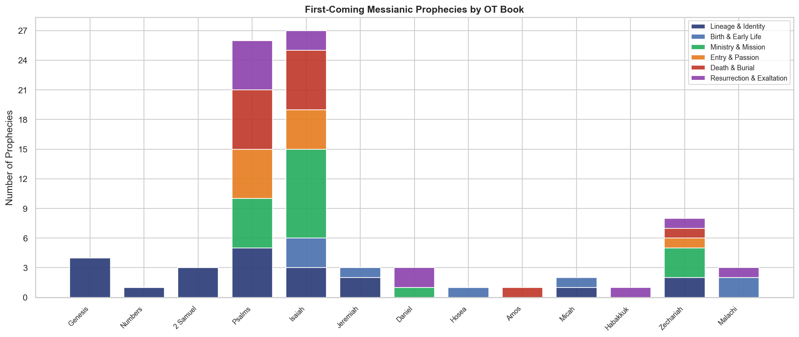
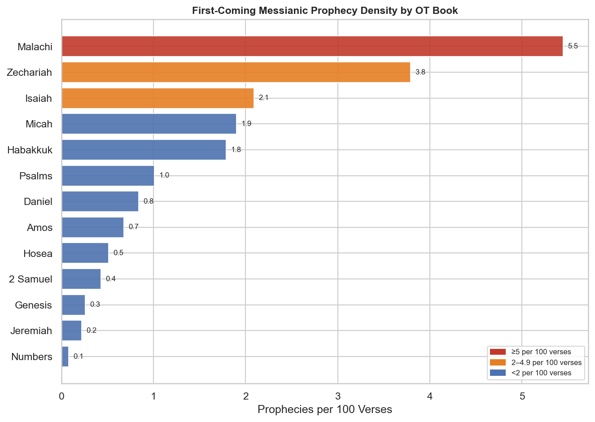

# First-Coming Messianic Prophecy Density — OT Study

**Scope:** Old Testament prophecies explicitly cited or applied to Jesus' first coming in the NT  
**Density metric:** prophecies per 100 verses

## Contents

- [Overview](#overview)
- [Key Observations](#key-observations)
- [Density by Book — Charts](#density-by-book--charts)
- [Density Table](#density-table)
- [Full Prophecy List](#full-prophecy-list)

---

## Overview

This study charts the distribution of **first-coming messianic prophecies** across the Old Testament. "First coming" covers the full arc of Christ's earthly ministry: his lineage and identity, birth and early life, ministry and mission, triumphal entry and passion, death and burial, and resurrection and exaltation.

The dataset is drawn from prophecies **explicitly cited or applied to Jesus in the NT** — not a general list of typological or thematic correspondences, but references where an NT author names a specific OT text as fulfilled in Christ. Each prophecy is classified into one of six thematic categories.

**Total prophecies charted:** 83  
**OT books represented:** 13

> **Methodological note:** Prophecy counts are intentionally conservative — only passages where an NT author cites or applies the OT text to Christ's first coming are included. Widely accepted typological correspondences (e.g. the Passover lamb, Jonah's three days) that are not explicitly cited are excluded. This keeps the dataset anchored to NT exegesis rather than scholarly inference.

---

## Key Observations

- **Isaiah (27 prophecies)** has the most first-coming prophecies in absolute terms. This reflects the book's breadth — lament Psalms (Psa 22, 69) prefigure the passion in detail; the royal Psalms (Psa 2, 110) ground the resurrection and exaltation. The NT cites the Psalms more than any other OT book.

- **Malachi (density: 5.5 per 100 verses)** has the highest prophecy density. Its brevity combined with concentrated messianic content — especially Malachi 3:1 and 4:5 (the forerunner) — makes it the densest prophetic book per verse.

- **Isaiah 53 alone** accounts for 9 of the prophecies in this list — the single most prophetically concentrated chapter in the OT. It is cited for Christ's rejection, suffering, death, burial, resurrection (implied in v.10), and exaltation (v.12) by Matthew, Luke, John, Acts, Romans, and 1 Peter.

- **The five most prophetically concentrated books** (by density) are all from the later canonical corpus (Psalms, Minor Prophets, Isaiah, Zechariah, Malachi) — reflecting the progressive intensification of messianic expectation through Israel's history.

- **Zechariah** is remarkable for its density of passion and entry prophecies: the king on a donkey (9:9), thirty pieces of silver (11:12–13), striking the shepherd (13:7), and looking on the one they pierced (12:10) — all explicitly cited in the passion narratives.

- **The Torah** contributes foundational prophecies (Gen 3:15; 49:10; Num 24:17) but at low density — consistent with the progressive pattern of revelation.

---

## Density by Book — Charts

---

## Density Table

| Book | Total | Density (per 100 vv) | Lin & Id | Birth | Ministry | Passion | Death | Res & Ex |
|---|---:|---:|---:|---:|---:|---:|---:|---:|
| Genesis | 4 | 0.3 | 4 | 0 | 0 | 0 | 0 | 0 |
| Numbers | 1 | 0.1 | 1 | 0 | 0 | 0 | 0 | 0 |
| 2 Samuel | 3 | 0.4 | 3 | 0 | 0 | 0 | 0 | 0 |
| Psalms | 26 | 1.0 | 5 | 0 | 5 | 5 | 6 | 5 |
| Isaiah | 27 | 2.1 | 3 | 3 | 9 | 4 | 6 | 2 |
| Jeremiah | 3 | 0.2 | 2 | 1 | 0 | 0 | 0 | 0 |
| Daniel | 3 | 0.8 | 0 | 0 | 1 | 0 | 0 | 2 |
| Hosea | 1 | 0.5 | 0 | 1 | 0 | 0 | 0 | 0 |
| Amos | 1 | 0.7 | 0 | 0 | 0 | 0 | 1 | 0 |
| Micah | 2 | 1.9 | 1 | 1 | 0 | 0 | 0 | 0 |
| Habakkuk | 1 | 1.8 | 0 | 0 | 0 | 0 | 0 | 1 |
| Zechariah | 8 | 3.8 | 2 | 0 | 3 | 1 | 1 | 1 |
| Malachi | 3 | 5.5 | 0 | 2 | 0 | 0 | 0 | 1 |

---

## Full Prophecy List

### Lineage & Identity

| OT Reference | NT Fulfillment / Application |
|---|---|
| Gen 3:15 | Offspring of woman crushing serpent — Gal 4:4; Rev 12 |
| Gen 12:3 | All nations blessed in Abraham's seed — Acts 3:25; Gal 3:16 |
| Gen 17:19 | Through Isaac — Luke 3:34; Gal 4:28 |
| Gen 49:10 | Scepter from Judah — Matt 1:2–3; Heb 7:14; Rev 5:5 |
| Num 24:17 | Star out of Jacob — Matt 2:2; Rev 22:16 |
| 2 Sam 7:12 | Son of David, eternal throne — Luke 1:32–33; Acts 13:22–23 |
| 2 Sam 7:13 | His kingdom established forever — Heb 1:5; Acts 2:30 |
| 2 Sam 7:16 | House and kingdom established forever — Luke 1:32 |
| Psa 2:2 | The LORD's Anointed — Acts 4:26 |
| Psa 2:7 | "Thou art my Son" — Acts 13:33; Heb 1:5; 5:5 |
| Psa 89:3-4 | Covenant with David; seed forever — Acts 2:30; 13:23 |
| Psa 110:1 | "Sit at my right hand" — Matt 22:44; Acts 2:34; Heb 1:13 |
| Psa 110:4 | Priest forever after Melchizedek — Heb 5:6; 6:20; 7:17 |
| Isa 9:6 | Son given; Wonderful Counselor, Mighty God — Luke 1:31–33 |
| Isa 11:1 | Branch from Jesse — Rom 15:12; Rev 5:5; 22:16 |
| Isa 11:2 | Spirit of the LORD rests on him — Matt 3:16; John 1:32 |
| Jer 23:5 | Righteous Branch for David — Luke 1:32; Acts 13:23 |
| Jer 33:15 | Branch of righteousness for David — Luke 1:32 |
| Mic 5:2 | Ruler from Bethlehem; goings forth from everlasting — Matt 2:6 |
| Zec 3:8 | "My servant the Branch" — John 10:11; Rev 5:5 |
| Zec 6:12 | The man whose name is Branch — John 10:11 |

### Birth & Early Life

| OT Reference | NT Fulfillment / Application |
|---|---|
| Isa 7:14 | Virgin conceives, bears Immanuel — Matt 1:22–23 |
| Mic 5:2 | Born in Bethlehem — Matt 2:6; Luke 2:4–7 |
| Hos 11:1 | "Out of Egypt I called my son" — Matt 2:15 |
| Jer 31:15 | Rachel weeping for her children — Matt 2:17–18 |
| Isa 40:3 | Voice in wilderness, prepare the way — Matt 3:3; John 1:23 |
| Mal 3:1 | Messenger to prepare the way — Matt 11:10; Mark 1:2; Luke 7:27 |
| Mal 4:5 | Elijah to come before — Matt 11:14; 17:10–12; Luke 1:17 |
| Isa 9:1-2 | Light to Galilee, land of shadow — Matt 4:14–16 |

### Ministry & Mission

| OT Reference | NT Fulfillment / Application |
|---|---|
| Psa 40:7-8 | "I come to do your will" — Heb 10:7 |
| Psa 78:2 | Teaching in parables — Matt 13:35 |
| Isa 42:1 | Servant; Spirit upon him — Matt 12:18–21 |
| Isa 42:2-3 | Will not cry out; bruised reed not broken — Matt 12:19–20 |
| Isa 42:6 | Light to the nations, covenant for the people — Luke 2:32; Acts 13:47 |
| Isa 49:6 | Light for the Gentiles, salvation to the ends — Acts 13:47; 26:23 |
| Isa 50:4 | The well-taught tongue; instructed — John 7:16; 8:28 |
| Isa 61:1 | Spirit anointed; preach good news — Luke 4:18–19 |
| Isa 61:2 | Year of the LORD's favor — Luke 4:19, 21 |
| Zec 9:9 | King comes lowly, riding a donkey — Matt 21:4–5; John 12:14–15 |
| Psa 118:22 | Stone the builders rejected becomes cornerstone — Matt 21:42; 1 Pet 2:7 |
| Psa 118:26 | "Blessed is he who comes" — Matt 21:9; 23:39 |
| Isa 28:16 | Cornerstone in Zion — Rom 9:33; 1 Pet 2:6 |
| Psa 69:9 | Zeal for your house consumes me — John 2:17; Rom 15:3 |
| Isa 53:4 | He bore our infirmities — Matt 8:17 |
| Dan 9:25 | Seven weeks to the Anointed One — Luke 19:44; Dan 9:26 |
| Zec 11:12 | Thirty pieces of silver — Matt 26:15; 27:9 |
| Zec 11:13 | Silver cast into house of the LORD — Matt 27:9–10 |

### Entry & Passion

| OT Reference | NT Fulfillment / Application |
|---|---|
| Psa 41:9 | Betrayed by close friend — John 13:18; 17:12 |
| Zec 13:7 | "Strike the shepherd, scatter the sheep" — Matt 26:31; Mark 14:27 |
| Isa 50:6 | Back to smiters; spitting on face — Matt 26:67; 27:26 |
| Psa 22:7 | Scorned, mocked, surrounded — Matt 27:39–44 |
| Psa 22:8 | "He trusted in the LORD; let him deliver" — Matt 27:43 |
| Isa 53:3 | Despised and rejected; man of sorrows — John 1:11; 7:5 |
| Isa 53:7 | Led as lamb to slaughter; did not open mouth — Acts 8:32–33 |
| Psa 69:21 | Gall for food; vinegar to drink — Matt 27:34, 48; John 19:29 |
| Psa 109:4 | Prayed for those who accuse — Luke 23:34 |
| Isa 53:12 | Numbered with transgressors — Luke 22:37; Mark 15:28 |

### Death & Burial

| OT Reference | NT Fulfillment / Application |
|---|---|
| Psa 22:1 | "My God, my God, why hast thou forsaken me" — Matt 27:46; Mark 15:34 |
| Psa 22:16 | Hands and feet pierced — John 20:25; Luke 24:39 |
| Psa 22:17 | Can count all my bones; stare and gloat — John 19:36 |
| Psa 22:18 | Divide garments; cast lots for clothing — Matt 27:35; John 19:24 |
| Psa 34:20 | Not one bone broken — John 19:36 |
| Zec 12:10 | "They shall look on me whom they have pierced" — John 19:37; Rev 1:7 |
| Isa 53:5 | Wounded for our transgressions, bruised for iniquities — Rom 5:6; 1 Pet 2:24 |
| Isa 53:6 | Iniquity of us all laid on him — 1 Pet 2:25; 2 Cor 5:21 |
| Isa 53:8 | Cut off from the land of the living — Acts 8:33 |
| Isa 53:9 | Grave with the wicked; with the rich in his death — Matt 27:57–60 |
| Isa 53:10 | It pleased the LORD to bruise him — Acts 2:23; 4:28 |
| Isa 53:11 | By his knowledge my righteous servant shall justify many — Rom 5:19 |
| Psa 69:4 | Hated without cause — John 15:25 |
| Amos 8:9 | Sun goes dark at noon — Matt 27:45; Luke 23:44 |

### Resurrection & Exaltation

| OT Reference | NT Fulfillment / Application |
|---|---|
| Psa 16:10 | "Not leave my soul in Sheol; not see corruption" — Acts 2:27, 31; 13:35 |
| Psa 16:11 | "Path of life; fullness of joy" — Acts 2:28 |
| Psa 2:8 | Nations given as inheritance — Rom 4:13; Rev 2:27; 12:5 |
| Psa 68:18 | Ascended on high, led captivity captive — Eph 4:8 |
| Isa 53:10 | He shall see his seed; prolong his days — 1 Cor 15:4 |
| Isa 53:12 | Receive a portion with the great — Phil 2:9–11 |
| Dan 7:13 | Son of Man coming on clouds — Matt 26:64; Acts 1:9; Rev 1:13 |
| Dan 7:14 | All peoples serve him; everlasting dominion — Phil 2:10; Rev 11:15 |
| Psa 110:1 | "Sit at my right hand" — Acts 2:34–35; Heb 1:13; 1 Cor 15:25 |
| Zec 9:10 | His dominion from sea to sea — Luke 1:32–33; Eph 1:20–22 |
| Hab 2:3 | "He who is coming will come and will not delay" — Heb 10:37 |
| Mal 3:1 | Lord suddenly comes to his temple — Mark 11:15–17; Luke 19:45 |

---

*Prophecy dataset anchored to explicit NT citations. Sources consulted: Kaiser, *Messiah in the Old Testament*; Motyer, *Look to the Rock*; McDowell, *Evidence That Demands a Verdict*; Fruchtenbaum, *Messianic Christology*; Edersheim, *Life and Times of Jesus the Messiah*.*  
*OT verse counts: TAHOT (STEPBible CC BY 4.0, Tyndale House Cambridge).*  
*Generated by [scripts/both/build_messianic_prophecy_density.py](../../../../scripts/both/build_messianic_prophecy_density.py).*