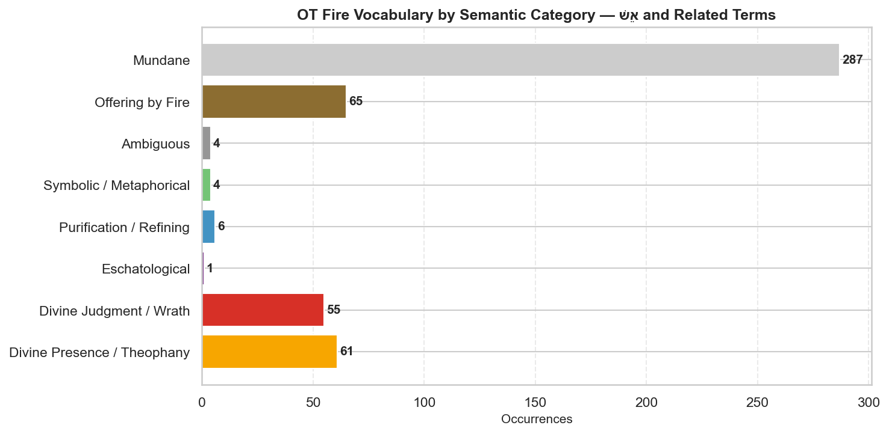
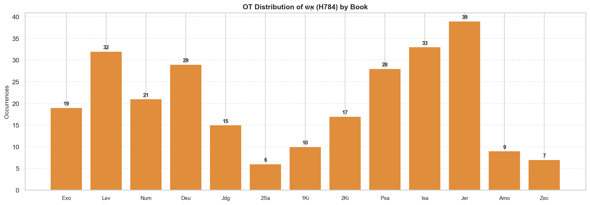
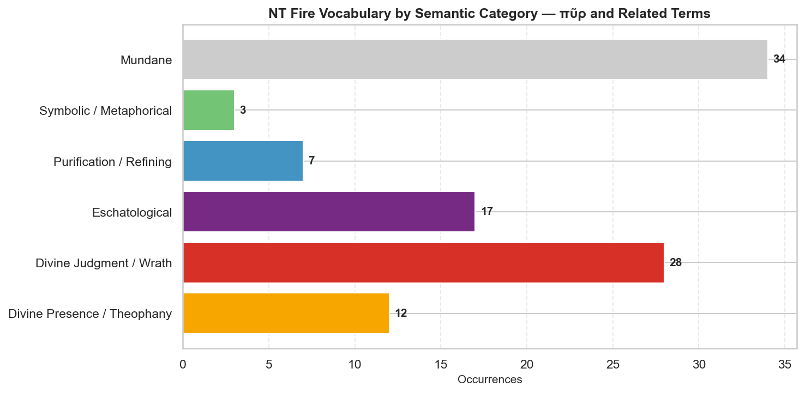
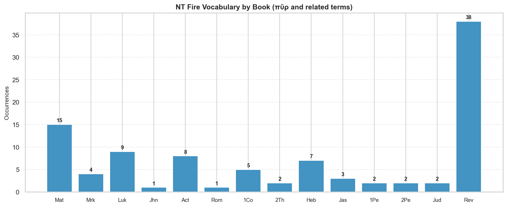
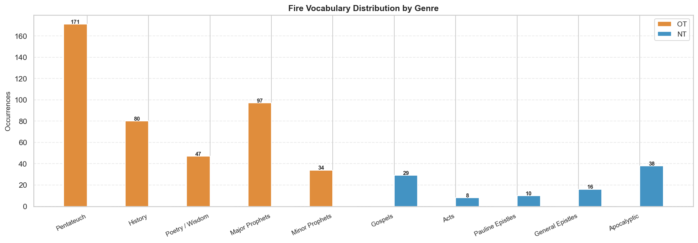

# Fire in Scripture: A Semantic Study
## Hebrew OT · LXX · Greek NT

*Generated 2026-06-13*

*Build script: [scripts/both/word_studies/fire/build_fire_report.py](../../../../scripts/both/word_studies/fire/build_fire_report.py)*

---

## Contents

- [Key Observations](#key-observations)
- [Lexical Overview](#lexical-overview)
- [OT: Fire by Semantic Category](#ot-fire-by-semantic-category)
  - [Divine Presence / Theophany](#ot-divine-presence--theophany)
  - [Divine Judgment / Wrath](#ot-divine-judgment--wrath)
  - [Eschatological Fire](#ot-eschatological-fire)
  - [Purification / Refining](#ot-purification--refining)
  - [Symbolic / Metaphorical](#ot-symbolic--metaphorical)
  - [Ambiguous](#ot-ambiguous)
  - [Mundane Uses](#ot-mundane-uses-count-only)
  - [Offering by Fire](#ot-offering-by-fire-count-only)
- [NT: Fire by Semantic Category](#nt-fire-by-semantic-category)
  - [Divine Presence / Theophany](#nt-divine-presence--theophany)
  - [Divine Judgment / Wrath](#nt-divine-judgment--wrath)
  - [Eschatological Fire](#nt-eschatological-fire)
  - [Purification / Refining](#nt-purification--refining)
  - [Symbolic / Metaphorical](#nt-symbolic--metaphorical)
  - [Mundane Uses](#nt-mundane-uses-count-only)
  - [Ambiguous](#nt-ambiguous)
- [Genre Distribution](#genre-distribution)
- [OT → NT Intertextual Links](#ot--nt-intertextual-links)
- [Data Files](#data-files)

---

## Key Observations

- **Fire dominates the prophets**: Ezekiel (OT) and Revelation (NT) contain the highest concentrations of fire language, reflecting their apocalyptic-judgment orientation.
- **Judgment is the primary theological register**: Across both testaments, divine judgment accounts for the largest share of theologically significant fire references, followed closely by divine presence/theophany.
- **The refining arc**: The OT refining/purification theme (Ps 12:6; Mal 3:2–3; Zech 13:9) finds direct NT application in 1 Cor 3:13–15 and 1 Pet 1:7, forming a coherent cross-testament thread.
- **Eschatological fire is almost exclusively NT**: While Dan 7:9–11, Isa 66:24, and Mal 4:1 establish OT roots, the explicit Gehenna and lake-of-fire imagery is predominantly NT and concentrated in the Synoptics and Revelation.
- **Pentateuch and Major Prophets dominate the OT**: The Pentateuch establishes fire as theophanic (Exod) and as cultic/offering (Lev), while the Major Prophets expand it into a vehicle for judgment oracles.

---

## Lexical Overview

| Lemma | Corpus | Strong's | Occurrences |
|---|---|---|---|
| אֵשׁ | Hebrew OT | H784 | 378 |
| אִשֶּׁה | Hebrew OT | H801 | 65 |
| נוּר | Hebrew OT | H5135 | 17 |
| לַפִּיד | Hebrew OT | H3940 | 13 |
| לַהַב | Hebrew OT | H3857 | 10 |
| πῦρ | Greek NT | G4442 | 71 |
| κατακαίω | Greek NT | G2618 | 12 |
| φλόξ | Greek NT | G5395 | 7 |
| πυρόω | Greek NT | G4448 | 6 |
| πύρωσις | Greek NT | G4451 | 3 |
| πυρά | Greek NT | G4443 | 2 |

**Terms included in this study:**

*Hebrew OT:* אֵשׁ H784 (fire), אִשֶּׁה H801 (offering by fire), לַהַב H3857 (flame), לַפִּיד H3940 (torch/flame), נוּר H5135 (Aramaic: fire — Daniel).  # noqa: E501

*Greek NT:* πῦρ G4442 (fire), φλόξ G5395 (flame), πυρά G4443 (bonfire), πυρόω G4448 (to be ablaze), πύρωσις G4451 (fiery trial/burning), κατακαίω G2618 (to burn up completely).  # noqa: E501

*Not included:* General burning verbs (H1197 בָּעַר, H3341 יָקַד, G2545 καίω) unless they appear in direct fire-noun constructions captured above.  # noqa: E501

---

## OT: Fire by Semantic Category

| Category | Count | % of Total |
|---|---|---|
| Divine Presence / Theophany | 61 | 13% |
| Divine Judgment / Wrath | 55 | 11% |
| Eschatological | 1 | 0% |
| Purification / Refining | 6 | 1% |
| Symbolic / Metaphorical | 4 | 1% |
| Ambiguous | 4 | 1% |
| Offering by Fire | 65 | 13% |
| Mundane | 287 | 59% |

### OT: Divine Presence / Theophany

| Reference | Form | Lemma | KJV |
|---|---|---|---|
| Gen 15:17 | לַפִּ֣יד | לַפִּיד (H3940) | And it came to pass, that, when the sun went down, and it was dark, behold a smoking furnace, and a … |
| Exo 3:2 | אֵ֖שׁ | אֵשׁ (H784) | And the angel of the Lord appeared unto him in a flame of fire out of the midst of a bush: and he lo… |
| Exo 13:21 | אֵ֖שׁ | אֵשׁ (H784) | And the Lord went before them by day in a pillar of a cloud, to lead them the way; and by night in a… |
| Exo 13:22 | אֵ֖שׁ | אֵשׁ (H784) | He took not away the pillar of the cloud by day, nor the pillar of fire by night, from before the pe… |
| Exo 14:24 | אֵ֖שׁ | אֵשׁ (H784) | And it came to pass, that in the morning watch the Lord looked unto the host of the Egyptians throug… |
| Exo 19:18 | אֵ֑שׁ | אֵשׁ (H784) | And mount Sinai was altogether on a smoke, because the Lord descended upon it in fire: and the smoke… |
| Exo 24:17 | אֵ֥שׁ | אֵשׁ (H784) | And the sight of the glory of the Lord was like devouring fire on the top of the mount in the eyes o… |
| Exo 40:38 | אֵ֕שׁ | אֵשׁ (H784) | For the cloud of the Lord was upon the tabernacle by day, and fire was on it by night, in the sight … |
| Num 9:15 | אֵ֖שׁ | אֵשׁ (H784) | And on the day that the tabernacle was reared up the cloud covered the tabernacle, namely, the tent … |
| Num 9:16 | אֵ֖שׁ | אֵשׁ (H784) | So it was alway: the cloud covered it by day, and the appearance of fire by night. |
| Num 14:14 | אֵ֖שׁ | אֵשׁ (H784) | And they will tell it to the inhabitants of this land: for they have heard that thou Lord art among … |
| Deu 1:33 | אֵ֣שׁ ׀ | אֵשׁ (H784) | Who went in the way before you, to search you out a place to pitch your tents in, in fire by night, … |
| Deu 4:11 | אֵשׁ֙ | אֵשׁ (H784) | And ye came near and stood under the mountain; and the mountain burned with fire unto the midst of h… |
| Deu 4:12 | אֵ֑שׁ | אֵשׁ (H784) | And the Lord spake unto you out of the midst of the fire: ye heard the voice of the words, but saw n… |
| Deu 4:15 | אֵֽשׁ | אֵשׁ (H784) | Take ye therefore good heed unto yourselves; for ye saw no manner of similitude on the day that the … |
| Deu 4:24 | אֵ֥שׁ | אֵשׁ (H784) | For the Lord thy God is a consuming fire, even a jealous God. |
| Deu 4:33 | אֵ֛שׁ | אֵשׁ (H784) | Did ever people hear the voice of God speaking out of the midst of the fire, as thou hast heard, and… |
| Deu 4:36 | אִשּׁ | אֵשׁ (H784) | Out of heaven he made thee to hear his voice, that he might instruct thee: and upon earth he shewed … |
| Deu 5:4 | אֵֽשׁ | אֵשׁ (H784) | The Lord talked with you face to face in the mount out of the midst of the fire, |
| Deu 5:5 | אֵ֔שׁ | אֵשׁ (H784) | (I stood between the Lord and you at that time, to shew you the word of the Lord: for ye were afraid… |
| Deu 5:22 | אֵשׁ֙ | אֵשׁ (H784) | These words the Lord spake unto all your assembly in the mount out of the midst of the fire, of the … |
| Deu 5:23 | אֵ֑שׁ | אֵשׁ (H784) | And it came to pass, when ye heard the voice out of the midst of the darkness, (for the mountain did… |
| Deu 5:24 | אֵ֑שׁ | אֵשׁ (H784) | And ye said, Behold, the Lord our God hath shewed us his glory and his greatness, and we have heard … |
| Deu 5:25 | אֵ֥שׁ | אֵשׁ (H784) | Now therefore why should we die? for this great fire will consume us: if we hear the voice of the Lo… |
| Deu 5:26 | אֵ֛שׁ | אֵשׁ (H784) | For who is there of all flesh, that hath heard the voice of the living God speaking out of the midst… |
| Deu 9:3 | אֵ֣שׁ | אֵשׁ (H784) | Understand therefore this day, that the Lord thy God is he which goeth over before thee; as a consum… |
| Deu 9:10 | אֵ֖שׁ | אֵשׁ (H784) | And the Lord delivered unto me two tables of stone written with the finger of God; and on them was w… |
| Deu 9:15 | אֵ֑שׁ | אֵשׁ (H784) | So I turned and came down from the mount, and the mount burned with fire: and the two tables of the … |
| Deu 10:4 | אֵ֖שׁ | אֵשׁ (H784) | And he wrote on the tables, according to the first writing, the ten commandments, which the Lord spa… |
| Deu 33:2 | אֵ֥שׁ | אֵשׁ (H784) | And he said, The Lord came from Sinai, and rose up from Seir unto them; he shined forth from mount P… |
| 1Ki 18:38 | אֵשׁ־ | אֵשׁ (H784) |  |
| 1Ki 19:12 | אֵ֔שׁ | אֵשׁ (H784) |  |
| 2Ki 2:11 | אֵשׁ֙ | אֵשׁ (H784) |  |
| 2Ki 6:17 | אֵ֖שׁ | אֵשׁ (H784) |  |
| 2Ch 7:1 | אֵ֗שׁ | אֵשׁ (H784) |  |
| 2Ch 7:3 | אֵ֔שׁ | אֵשׁ (H784) |  |
| Neh 9:12 | אֵשׁ֙ | אֵשׁ (H784) | Moreover thou leddest them in the day by a cloudy pillar; and in the night by a pillar of fire, to g… |
| Neh 9:19 | אֵ֤שׁ | אֵשׁ (H784) | Yet thou in thy manifold mercies forsookest them not in the wilderness: the pillar of the cloud depa… |
| Psa 78:14 | אֵֽשׁ | אֵשׁ (H784) | In the daytime also he led them with a cloud, and all the night with a light of fire. |
| Psa 97:3 | אֵ֭שׁ | אֵשׁ (H784) | A fire goeth before him, and burneth up his enemies round about. |
| Psa 105:39 | אֵ֗שׁ | אֵשׁ (H784) | He spread a cloud for a covering; and fire to give light in the night. |
| Dan 3:20 | נוּר | נוּר (H5135) | And he commanded the most mighty men that were in his army to bind Shadrach, Meshach, and Abed–nego,… |
| Dan 3:21 | נוּר | נוּר (H5135) | Then these men were bound in their coats, their hosen, and their hats, and their other garments, and… |
| Dan 3:22 | נוּר | נוּר (H5135) | Therefore because the king’s commandment was urgent, and the furnace exceeding hot, the flame of the… |
| Dan 3:23 | נוּר | נוּר (H5135) | And these three men, Shadrach, Meshach, and Abed–nego, fell down bound into the midst of the burning… |
| Dan 3:24 | נוּר | נוּר (H5135) | Then Nebuchadnezzar the king was astonied, and rose up in haste, and spake, and said unto his counse… |
| Dan 3:25 | נוּר | נוּר (H5135) | He answered and said, Lo, I see four men loose, walking in the midst of the fire, and they have no h… |
| Dan 3:26 | נוּר | נוּר (H5135) | Then Nebuchadnezzar came near to the mouth of the burning fiery furnace, and spake, and said, Shadra… |
| Dan 3:27 | נוּר | נוּר (H5135) | And the princes, governors, and captains, and the king’s counsellors, being gathered together, saw t… |
| Dan 7:9 | נ֔וּר | נוּר (H5135) | I beheld till the thrones were cast down, and the Ancient of days did sit, whose garment was white a… |
| Dan 7:10 | נ֗וּר | נוּר (H5135) | A fiery stream issued and came forth from before him: thousand thousands ministered unto him, and te… |

### OT: Divine Judgment / Wrath

| Reference | Form | Lemma | KJV |
|---|---|---|---|
| Gen 19:24 | אֵ֑שׁ | אֵשׁ (H784) | Then the Lord rained upon Sodom and upon Gomorrah brimstone and fire from the Lord out of heaven; |
| Lev 10:2 | אֵ֛שׁ | אֵשׁ (H784) | And there went out fire from the Lord, and devoured them, and they died before the Lord. |
| Num 11:1 | אֵ֣שׁ | אֵשׁ (H784) | And when the people complained, it displeased the Lord: and the Lord heard it; and his anger was kin… |
| Num 11:3 | אֵ֥שׁ | אֵשׁ (H784) | And he called the name of the place Taberah: because the fire of the Lord burnt among them. |
| Num 16:35 | אֵ֥שׁ | אֵשׁ (H784) | And there came out a fire from the Lord, and consumed the two hundred and fifty men that offered inc… |
| 2Sa 22:9 | אֵ֥שׁ | אֵשׁ (H784) |  |
| 2Sa 22:13 | אֵֽשׁ | אֵשׁ (H784) |  |
| Psa 18:13 | אֵֽשׁ | אֵשׁ (H784) | The Lord also thundered in the heavens, and the Highest gave his voice; hail stones and coals of fir… |
| Psa 50:3 | אֵשׁ־ | אֵשׁ (H784) | Our God shall come, and shall not keep silence: a fire shall devour before him, and it shall be very… |
| Isa 5:24 | אֵ֗שׁ | אֵשׁ (H784) | Therefore as the fire devoureth the stubble, and the flame consumeth the chaff, so their root shall … |
| Isa 9:18 | אֵ֔שׁ | אֵשׁ (H784) | For wickedness burneth as the fire: it shall devour the briers and thorns, and shall kindle in the t… |
| Isa 10:16 | אֵֽשׁ | אֵשׁ (H784) | Therefore shall the Lord, the Lord of hosts, send among his fat ones leanness; and under his glory h… |
| Isa 10:17 | אֵ֔שׁ | אֵשׁ (H784) | And the light of Israel shall be for a fire, and his Holy One for a flame: and it shall burn and dev… |
| Isa 29:6 | אֵ֥שׁ | אֵשׁ (H784) | Thou shalt be visited of the Lord of hosts with thunder, and with earthquake, and great noise, with … |
| Isa 30:27 | אֵ֥שׁ | אֵשׁ (H784) | Behold, the name of the Lord cometh from far, burning with his anger, and the burden thereof is heav… |
| Isa 30:30 | אֵ֣שׁ | אֵשׁ (H784) | And the Lord shall cause his glorious voice to be heard, and shall shew the lighting down of his arm… |
| Isa 30:33 | אֵ֤שׁ | אֵשׁ (H784) | For Tophet is ordained of old; yea, for the king it is prepared; he hath made it deep and large: the… |
| Isa 33:11 | אֵ֖שׁ | אֵשׁ (H784) | Ye shall conceive chaff, ye shall bring forth stubble: your breath, as fire, shall devour you. |
| Isa 33:14 | אֵ֚שׁ | אֵשׁ (H784) | The sinners in Zion are afraid; fearfulness hath surprised the hypocrites. Who among us shall dwell … |
| Isa 47:14 | אֵ֣שׁ | אֵשׁ (H784) | Behold, they shall be as stubble; the fire shall burn them; they shall not deliver themselves from t… |
| Isa 50:11 | אֵ֖שׁ | אֵשׁ (H784) | Behold, all ye that kindle a fire, that compass yourselves about with sparks: walk in the light of y… |
| Isa 66:15 | אֵ֣שׁ | אֵשׁ (H784) | For, behold, the Lord will come with fire, and with his chariots like a whirlwind, to render his ang… |
| Isa 66:16 | אֵשׁ֙ | אֵשׁ (H784) | For by fire and by his sword will the Lord plead with all flesh: and the slain of the Lord shall be … |
| Jer 4:4 | אֵ֜שׁ | אֵשׁ (H784) | Circumcise yourselves to the Lord, and take away the foreskins of your heart, ye men of Judah and in… |
| Jer 11:16 | אֵשׁ֙ | אֵשׁ (H784) | The Lord called thy name, A green olive tree, fair, and of goodly fruit: with the noise of a great t… |
| Jer 15:14 | אֵ֛שׁ | אֵשׁ (H784) | And I will make thee to pass with thine enemies into a land which thou knowest not: for a fire is ki… |
| Jer 17:4 | אֵ֛שׁ | אֵשׁ (H784) | And thou, even thyself, shalt discontinue from thine heritage that I gave thee; and I will cause the… |
| Jer 17:27 | אֵ֣שׁ | אֵשׁ (H784) | But if ye will not hearken unto me to hallow the sabbath day, and not to bear a burden, even enterin… |
| Jer 21:12 | אֵ֜שׁ | אֵשׁ (H784) | O house of David, thus saith the Lord; Execute judgment in the morning, and deliver him that is spoi… |
| Jer 21:14 | אֵשׁ֙ | אֵשׁ (H784) | But I will punish you according to the fruit of your doings, saith the Lord: and I will kindle a fir… |
| Jer 22:7 | אֵֽשׁ | אֵשׁ (H784) | And I will prepare destroyers against thee, every one with his weapons: and they shall cut down thy … |
| Jer 43:12 | אֵ֗שׁ | אֵשׁ (H784) | And I will kindle a fire in the houses of the gods of Egypt; and he shall burn them, and carry them … |
| Jer 48:45 | אֵ֞שׁ | אֵשׁ (H784) | They that fled stood under the shadow of Heshbon because of the force: but a fire shall come forth o… |
| Jer 49:2 | אֵ֣שׁ | אֵשׁ (H784) | Therefore, behold, the days come, saith the Lord, that I will cause an alarm of war to be heard in R… |
| Jer 49:27 | אֵ֖שׁ | אֵשׁ (H784) | And I will kindle a fire in the wall of Damascus, and it shall consume the palaces of Ben–hadad. |
| Jer 50:32 | אֵשׁ֙ | אֵשׁ (H784) | And the most proud shall stumble and fall, and none shall raise him up: and I will kindle a fire in … |
| Jer 51:32 | אֵ֑שׁ | אֵשׁ (H784) | And that the passages are stopped, and the reeds they have burned with fire, and the men of war are … |
| Jer 51:58 | אֵ֣שׁ | אֵשׁ (H784) | Thus saith the Lord of hosts; The broad walls of Babylon shall be utterly broken, and her high gates… |
| Amo 1:4 | אֵ֖שׁ | אֵשׁ (H784) | But I will send a fire into the house of Hazael, which shall devour the palaces of Ben–hadad. |
| Amo 1:7 | אֵ֖שׁ | אֵשׁ (H784) | But I will send a fire on the wall of Gaza, which shall devour the palaces thereof: |
| Amo 1:10 | אֵ֖שׁ | אֵשׁ (H784) | But I will send a fire on the wall of Tyrus, which shall devour the palaces thereof. |
| Amo 1:12 | אֵ֖שׁ | אֵשׁ (H784) | But I will send a fire upon Teman, which shall devour the palaces of Bozrah. |
| Amo 1:14 | אֵשׁ֙ | אֵשׁ (H784) | But I will kindle a fire in the wall of Rabbah, and it shall devour the palaces thereof, with shouti… |
| Amo 2:2 | אֵ֣שׁ | אֵשׁ (H784) | But I will send a fire upon Moab, and it shall devour the palaces of Kerioth: and Moab shall die wit… |
| Amo 2:5 | אֵ֖שׁ | אֵשׁ (H784) | But I will send a fire upon Judah, and it shall devour the palaces of Jerusalem. |
| Zep 1:18 | אֵשׁ֙ | אֵשׁ (H784) | Neither their silver nor their gold shall be able to deliver them in the day of the Lord’s wrath; bu… |
| Zep 3:8 | אֵ֣שׁ | אֵשׁ (H784) | Therefore wait ye upon me, saith the Lord, until the day that I rise up to the prey: for my determin… |
| Zec 9:4 | אֵ֥שׁ | אֵשׁ (H784) | Behold, the Lord will cast her out, and he will smite her power in the sea; and she shall be devoure… |
| Zec 11:1 | אֵ֖שׁ | אֵשׁ (H784) | Open thy doors, O Lebanon, that the fire may devour thy cedars. |
| Zec 12:6 | אֵ֣שׁ | אֵשׁ (H784) | In that day will I make the governors of Judah like an hearth of fire among the wood, and like a tor… |

### OT: Eschatological

| Reference | Form | Lemma | KJV |
|---|---|---|---|
| Isa 66:24 | אִשּׁ | אֵשׁ (H784) | And they shall go forth, and look upon the carcases of the men that have transgressed against me: fo… |

### OT: Purification / Refining

| Reference | Form | Lemma | KJV |
|---|---|---|---|
| Num 31:23 | אֵ֗שׁ | אֵשׁ (H784) | Every thing that may abide the fire, ye shall make it go through the fire, and it shall be clean: ne… |
| Jer 6:29 | אֵ֖שׁ | אֵשׁ (H784) | The bellows are burned, the lead is consumed of the fire; the founder melteth in vain: for the wicke… |
| Zec 13:9 | אֵ֔שׁ | אֵשׁ (H784) | And I will bring the third part through the fire, and will refine them as silver is refined, and wil… |
| Mal 3:2 | אֵ֣שׁ | אֵשׁ (H784) | But who may abide the day of his coming? and who shall stand when he appeareth? for he is like a ref… |

### OT: Symbolic / Metaphorical

| Reference | Form | Lemma | KJV |
|---|---|---|---|
| Pro 6:27 | אֵ֬שׁ | אֵשׁ (H784) | Can a man take fire in his bosom, and his clothes not be burned? |
| Pro 16:27 | אֵ֣שׁ | אֵשׁ (H784) | An ungodly man diggeth up evil: and in his lips there is as a burning fire. |
| Jer 20:9 | אֵ֣שׁ | אֵשׁ (H784) | Then I said, I will not make mention of him, nor speak any more in his name. But his word was in min… |
| Jer 23:29 | אֵ֖שׁ | אֵשׁ (H784) | Is not my word like as a fire? saith the Lord; and like a hammer that breaketh the rock in pieces? |

### OT: Ambiguous

| Reference | Form | Lemma | KJV |
|---|---|---|---|
| Gen 22:6 | אֵ֖שׁ | אֵשׁ (H784) | And Abraham took the wood of the burnt offering, and laid it upon Isaac his son; and he took the fir… |
| Gen 22:7 | אֵשׁ֙ | אֵשׁ (H784) | And Isaac spake unto Abraham his father, and said, My father: and he said, Here am I, my son. And he… |
| Psa 148:8 | אֵ֣שׁ | אֵשׁ (H784) | Fire, and hail; snow, and vapour; stormy wind fulfilling his word: |
| Jer 5:14 | אֵ֗שׁ | אֵשׁ (H784) | Wherefore thus saith the Lord God of hosts, Because ye speak this word, behold, I will make my words… |

### OT: Mundane

**287 occurrences** across 31 books.

These are cooking fires, torches, burning of cities in warfare, and other non-theological uses. Individual references are omitted; see `fire_all_references.csv` for the complete list.

### OT: Offering by Fire

**65 occurrences** across 6 books.

| Book | Count |
|---|---|
| Lev | 42 |
| Num | 16 |
| Exo | 4 |
| Deu | 1 |
| Jos | 1 |
| 1Sa | 1 |

---

## OT Distribution by Book

| Book | Count |
|---|---|
| Lev | 74 |
| Ezk | 48 |
| Jer | 39 |
| Num | 37 |
| Isa | 35 |
| Psa | 32 |
| Deu | 31 |
| Exo | 24 |
| Jdg | 20 |
| Dan | 19 |
| 2Ki | 17 |
| Job | 10 |
| 1Ki | 10 |
| Jos | 9 |
| Amo | 9 |
| Zec | 8 |
| Jol | 7 |
| Neh | 6 |
| 2Sa | 6 |
| 2Ch | 6 |
| Gen | 5 |
| Pro | 5 |
| Nam | 5 |
| Lam | 4 |
| 1Sa | 4 |
| 1Ch | 2 |
| Mic | 2 |
| Mal | 2 |
| Hos | 2 |
| Zep | 2 |
| Oba | 1 |
| Sng | 1 |
| Hab | 1 |

---

## NT: Fire by Semantic Category

| Category | Count | % of Total |
|---|---|---|
| Divine Presence / Theophany | 12 | 12% |
| Divine Judgment / Wrath | 28 | 28% |
| Eschatological | 17 | 17% |
| Purification / Refining | 7 | 7% |
| Symbolic / Metaphorical | 3 | 3% |
| Mundane | 34 | 34% |

### NT: Divine Presence / Theophany

| Reference | Form | Lemma | KJV |
|---|---|---|---|
| Mat 3:11 | πυρί | πῦρ (G4442) | I indeed baptize you with water unto repentance: but he that cometh after me is mightier than I, who… |
| Luk 3:16 | πυρί | πῦρ (G4442) | John answered, saying unto them all, I indeed baptize you with water; but one mightier than I cometh… |
| Act 2:3 | πυρός | πῦρ (G4442) | And there appeared unto them cloven tongues like as of fire, and it sat upon each of them. |
| Heb 12:18 | πυρὶ | πῦρ (G4442) | For ye are not come unto the mount that might be touched, and that burned with fire, nor unto blackn… |
| Heb 12:29 | πῦρ | πῦρ (G4442) | For our God is a consuming fire. |
| Rev 1:14 | φλὸξ | φλόξ (G5395) | His head and his hairs were white like wool, as white as snow; and his eyes were as a flame of fire; |
| Rev 2:18 | φλόγα | φλόξ (G5395) | And unto the angel of the church in Thyatira write; These things saith the Son of God, who hath his … |
| Rev 4:5 | πυρὸς | πῦρ (G4442) | And out of the throne proceeded lightnings and thunderings and voices: and there were seven lamps of… |
| Rev 10:1 | πυρός | πῦρ (G4442) | And I saw another mighty angel come down from heaven, clothed with a cloud: and a rainbow was upon h… |
| Rev 15:2 | πυρί | πῦρ (G4442) | And I saw as it were a sea of glass mingled with fire: and them that had gotten the victory over the… |

### NT: Divine Judgment / Wrath

| Reference | Form | Lemma | KJV |
|---|---|---|---|
| Mat 3:12 | κατακαύσει | κατακαίω (G2618) | Whose fan is in his hand, and he will throughly purge his floor, and gather his wheat into the garne… |
| Mat 13:40 | πυρὶ | πῦρ (G4442) | As therefore the tares are gathered and burned in the fire; so shall it be in the end of this world. |
| Mat 13:42 | πυρός | πῦρ (G4442) | And shall cast them into a furnace of fire: there shall be wailing and gnashing of teeth. |
| Mat 13:50 | πυρός | πῦρ (G4442) | And shall cast them into the furnace of fire: there shall be wailing and gnashing of teeth. |
| Luk 3:17 | κατακαύσει | κατακαίω (G2618) | Whose fan is in his hand, and he will throughly purge his floor, and will gather the wheat into his … |
| Luk 9:54 | πῦρ | πῦρ (G4442) | And when his disciples James and John saw this, they said, Lord, wilt thou that we command fire to c… |
| 2Th 1:8 | πυρὶ | πῦρ (G4442) | In flaming fire taking vengeance on them that know not God, and that obey not the gospel of our Lord… |
| Heb 10:27 | πυρὸς | πῦρ (G4442) | But a certain fearful looking for of judgment and fiery indignation, which shall devour the adversar… |
| Rev 8:5 | πυρὸς | πῦρ (G4442) | And the angel took the censer, and filled it with fire of the altar, and cast it into the earth: and… |
| Rev 8:7 | πῦρ | πῦρ (G4442) | The first angel sounded, and there followed hail and fire mingled with blood, and they were cast upo… |
| Rev 8:8 | πυρὶ | πῦρ (G4442) | And the second angel sounded, and as it were a great mountain burning with fire was cast into the se… |
| Rev 9:17 | πῦρ | πῦρ (G4442) | And thus I saw the horses in the vision, and them that sat on them, having breastplates of fire, and… |
| Rev 9:18 | πυρὸς | πῦρ (G4442) | By these three was the third part of men killed, by the fire, and by the smoke, and by the brimstone… |
| Rev 11:5 | πῦρ | πῦρ (G4442) | And if any man will hurt them, fire proceedeth out of their mouth, and devoureth their enemies: and … |
| Rev 14:10 | πυρὶ | πῦρ (G4442) | The same shall drink of the wine of the wrath of God, which is poured out without mixture into the c… |
| Rev 16:8 | πυρί | πῦρ (G4442) | And the fourth angel poured out his vial upon the sun; and power was given unto him to scorch men wi… |
| Rev 17:16 | κατακαύσουσιν | κατακαίω (G2618) | And the ten horns which thou sawest upon the beast, these shall hate the whore, and shall make her d… |
| Rev 18:8 | πυρὶ | πῦρ (G4442) | Therefore shall her plagues come in one day, death, and mourning, and famine; and she shall be utter… |
| Rev 20:9 | πῦρ | πῦρ (G4442) | And they went up on the breadth of the earth, and compassed the camp of the saints about, and the be… |

### NT: Eschatological

| Reference | Form | Lemma | KJV |
|---|---|---|---|
| Mat 5:22 | πυρός | πῦρ (G4442) | But I say unto you, That whosoever is angry with his brother without a cause shall be in danger of t… |
| Mat 18:8 | πῦρ | πῦρ (G4442) | Wherefore if thy hand or thy foot offend thee, cut them off, and cast them from thee: it is better f… |
| Mat 18:9 | πυρός | πῦρ (G4442) | And if thine eye offend thee, pluck it out, and cast it from thee: it is better for thee to enter in… |
| Mat 25:41 | πῦρ | πῦρ (G4442) | Then shall he say also unto them on the left hand, Depart from me, ye cursed, into everlasting fire,… |
| Mrk 9:43 | πῦρ | πῦρ (G4442) | And if thy hand offend thee, cut it off: it is better for thee to enter into life maimed, than havin… |
| Mrk 9:48 | πῦρ | πῦρ (G4442) | Where their worm dieth not, and the fire is not quenched. |
| Luk 16:24 | φλογὶ | φλόξ (G5395) | And he cried and said, Father Abraham, have mercy on me, and send Lazarus, that he may dip the tip o… |
| 2Pe 3:7 | πυρὶ | πῦρ (G4442) | But the heavens and the earth, which are now, by the same word are kept in store, reserved unto fire… |
| 2Pe 3:12 | πυρούμενοι | πυρόω (G4448) | Looking for and hasting unto the coming of the day of God, wherein the heavens being on fire shall b… |
| Jud 1:7 | πυρὸς | πῦρ (G4442) | Even as Sodom and Gomorrha, and the cities about them in like manner, giving themselves over to forn… |
| Jud 1:23 | πυρὸς | πῦρ (G4442) | And others save with fear, pulling them out of the fire; hating even the garment spotted by the fles… |
| Rev 19:20 | πυρὸς | πῦρ (G4442) | And the beast was taken, and with him the false prophet that wrought miracles before him, with which… |
| Rev 20:10 | πυρὸς | πῦρ (G4442) | And the devil that deceived them was cast into the lake of fire and brimstone, where the beast and t… |
| Rev 20:14 | πυρός | πῦρ (G4442) | And death and hell were cast into the lake of fire. This is the second death. |
| Rev 20:15 | πυρός | πῦρ (G4442) | And whosoever was not found written in the book of life was cast into the lake of fire. |
| Rev 21:8 | πυρὶ | πῦρ (G4442) | But the fearful, and unbelieving, and the abominable, and murderers, and whoremongers, and sorcerers… |

### NT: Purification / Refining

| Reference | Form | Lemma | KJV |
|---|---|---|---|
| 1Co 3:13 | πυρὶ | πῦρ (G4442) | Every man’s work shall be made manifest: for the day shall declare it, because it shall be revealed … |
| 1Co 3:15 | κατακαήσεται | κατακαίω (G2618) | If any man’s work shall be burned, he shall suffer loss: but he himself shall be saved; yet so as by… |
| 1Pe 1:7 | πυρὸς | πῦρ (G4442) | That the trial of your faith, being much more precious than of gold that perisheth, though it be tri… |
| Rev 3:18 | πεπυρωμένον | πυρόω (G4448) | I counsel thee to buy of me gold tried in the fire, that thou mayest be rich; and white raiment, tha… |

### NT: Symbolic / Metaphorical

| Reference | Form | Lemma | KJV |
|---|---|---|---|
| Luk 12:49 | Πῦρ | πῦρ (G4442) | I am come to send fire on the earth; and what will I, if it be already kindled? |
| Rom 12:20 | πυρὸς | πῦρ (G4442) | Therefore if thine enemy hunger, feed him; if he thirst, give him drink: for in so doing thou shalt … |
| Jas 3:6 | πῦρ | πῦρ (G4442) | And the tongue is a fire, a world of iniquity: so is the tongue among our members, that it defileth … |

### NT: Mundane

**34 occurrences** across 12 books. Includes campfire at Peter's denial (John 18:18) and Paul's fire on Malta (Acts 28:2–3). See `fire_all_references.csv` for the complete list.

### NT: Ambiguous

_None identified within this study's term set._

---

## NT Distribution by Book

| Book | Count |
|---|---|
| Rev | 38 |
| Mat | 15 |
| Luk | 9 |
| Act | 8 |
| Heb | 7 |
| 1Co | 5 |
| Mrk | 4 |
| Jas | 3 |
| 1Pe | 2 |
| 2Pe | 2 |
| 2Th | 2 |
| Jud | 2 |
| 2Co | 1 |
| Eph | 1 |
| Jhn | 1 |
| Rom | 1 |

---

## Genre Distribution

| Genre | OT Occurrences | NT Occurrences |
|---|---|---|
| Pentateuch | 171 | — |
| History | 80 | — |
| Poetry / Wisdom | 47 | — |
| Major Prophets | 97 | — |
| Minor Prophets | 34 | — |
| Gospels | — | 29 |
| Acts | — | 8 |
| Pauline Epistles | — | 10 |
| General Epistles | — | 16 |
| Apocalyptic | — | 38 |

**Notes:**
- Major Prophets (Isa, Jer, Eze, Dan) carry the heaviest OT fire load — primarily judgment oracles.
- Apocalyptic (Revelation) dominates the NT, with Gehenna references spreading across the Gospels.
- The Pentateuch's high count reflects both the theophanic fire of Sinai/Exodus narratives and the cultic אִשֶּּה (offering-by-fire) legislation of Leviticus.

---

## OT → NT Intertextual Links

| OT Passage | Theme | NT Passage | Connection |
|---|---|---|---|
| Exod 3:2 | Burning bush | Acts 7:30 | Stephen quotes: "the angel in the flame of the burning bush" |
| Ps 69:9 | Zeal consuming me | John 2:17 | Disciples recall Ps 69:9 at temple cleansing |
| Ps 69:9 | Zeal consuming me | Rom 15:3 | Paul applies Ps 69:9 to Christ's self-denial |
| Isa 66:24 | Unquenched fire on corpses | Mark 9:48 | Jesus quotes: "where their worm does not die and fire is not quenched" |
| Dan 7:9–10 | River of fire from Ancient of Days | Rev 20:11–15 | Great White Throne judgment echoes Dan 7 imagery |
| Mal 3:2 | Refiner's fire | Matt 3:11–12 | John's baptism of fire and Spirit echoes Malachi |
| Mal 4:1 | Day burning like furnace | Matt 13:42 | Furnace of fire at end of age |
| Gen 19:24 | Fire on Sodom | Jude 7 | Sodom as "example of eternal fire" |
| Gen 19:24 | Fire on Sodom | Luke 17:29 | Jesus references Sodom's destruction |
| Prov 25:22 | Coals of fire on head | Rom 12:20 | Paul quotes verbatim from LXX |
| 1 Kgs 18:38 | Fire from LORD on Elijah's altar | Luke 9:54 | Disciples ask Jesus to call fire like Elijah did |
| Exod 13:21 | Pillar of fire | Heb 12:18 | Hebrews contrasts Sinai fire with Mt. Zion |
| Deu 4:24 | God is a consuming fire | Heb 12:29 | Direct quotation |

---

## Data Files

| File | Contents |
|---|---|
| [fire_all_references.csv](fire_all_references.csv) | All OT + NT fire references: reference, form, lemma, Strong's, category, KJV text |  # noqa: E501
