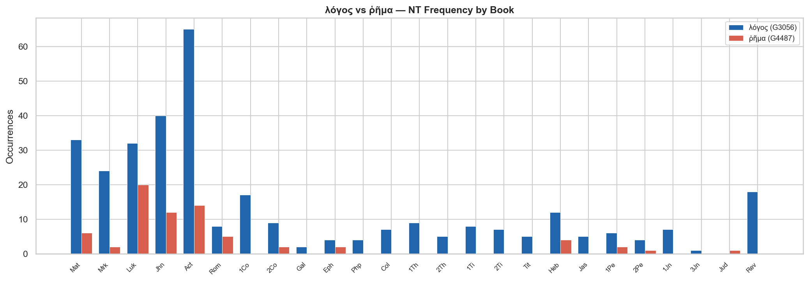
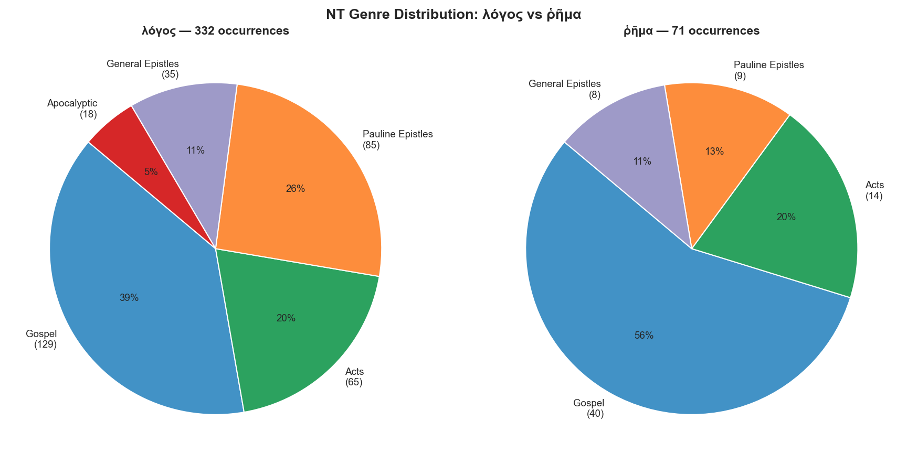
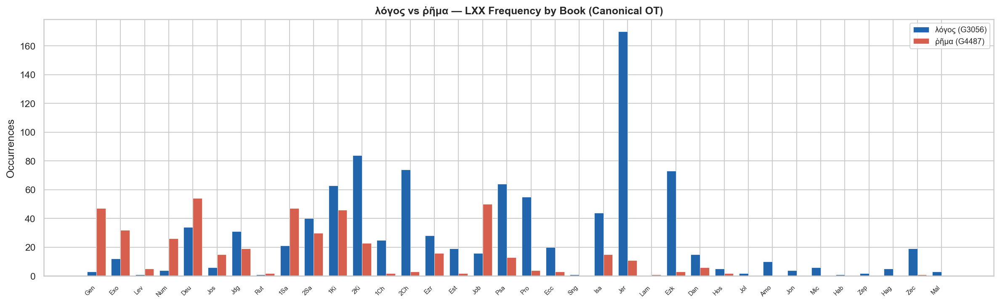
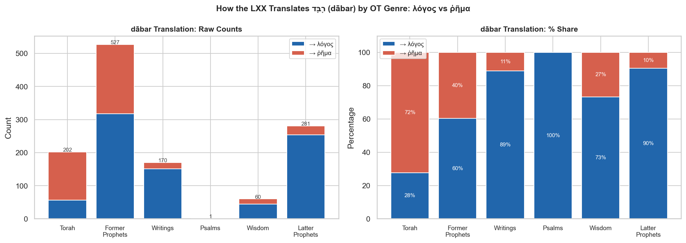
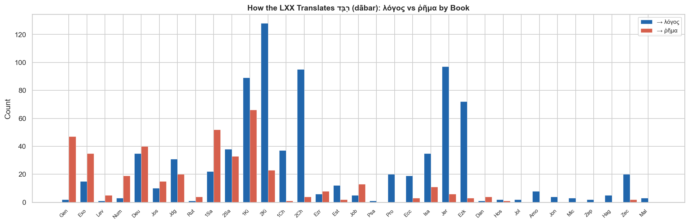

# Word Study: λόγος (G3056) and ῥῆμα (G4487)

*Build script: [scripts/both/word_studies/logos-rhema/build_logos_rhema_report.py](../../../../../scripts/both/word_studies/logos-rhema/build_logos_rhema_report.py)*

---

## Contents

- [Overview](#overview)
- [Definitions and Semantic Range](#definitions-and-semantic-range)
- [NT Distribution](#nt-distribution)
- [LXX Distribution](#lxx-distribution)
- [Hebrew Source Words](#hebrew-source-words)
- [Verses Where Both Appear Together (NT)](#verses-where-both-appear-together-nt)
- [Synoptic Pericope Comparison](#synoptic-pericope-comparison)
- [Use with Reference to Written Scripture](#use-with-reference-to-written-scripture)
  - [Contextual Scripture References (Sliding Window)](#contextual-scripture-references-sliding-window)
- [Theological Significance](#theological-significance)
- [Key Observations](#key-observations)
- [Data Files](#data-files)

---

## Key Observations

The evidence across the LXX, NT, and synoptic parallels points to a consistent but non-absolute distinction between the two terms. The following observations summarise the findings from every section of this study.

### 1. The core semantic difference is scale and abstraction

**λόγος** gravitates toward *word as message* — the content of what is said, considered as a transmissible, authoritative whole. **ῥῆμα** gravitates toward *word as event* — the individual utterance in the moment it is spoken. This maps roughly onto the distinction between a *teaching* and a *saying*, a *doctrine* and a *declaration*.

### 2. The LXX established the pattern, but not rigidly

Both terms translate the same Hebrew word, דָּבָר (dābar, H1697), which accounts for 824 λόγος and 417 ῥῆμα renderings in the canonical LXX (66% / 34%). The genre breakdown shows the split is not random: the Former Prophets (where דָּבָר frequently marks a specific royal decree or prophetic oracle) favour ῥῆμα more than any other section, while Torah, Psalms, and the Latter Prophets favour λόγος. The LXX translators were already sensitive to the difference — but it was the NT writers who sharpened it.

### 3. NT distribution confirms the tendency

λόγος (332 NT occurrences, 24 books) is the dominant, general-purpose term. ῥῆμα (71 occurrences, 12 books) is largely absent from the Pauline corpus — Paul's theological vocabulary strongly prefers λόγος when speaking of the gospel, the word of God, or scriptural authority. ῥῆμα concentrates in narrative contexts: Luke's Gospel, Acts, and the Nativity and Passion accounts.

### 4. When writers use ῥῆμα for scripture, they emphasise its spoken character

λόγος is the standard term for the scriptures as an authoritative written deposit (Jhn 10:35; Luk 3:4; Act 15:15; Rev 22:18–19). The three NT uses of ῥῆμα in explicitly scriptural contexts (Mat/Luk 4:4; Act 28:25; 2Pe 3:2) each frame the OT text as divine speech — what proceeds from God's mouth, what the Spirit spoke through Isaiah, what the prophets *declared*. The choice of term is theologically deliberate.

### 5. The four verses where both appear together are the clearest evidence

In Mat 12:36, Jhn 12:48, Act 10:44, and Heb 12:19, both terms appear in a single sentence. In every case ῥῆμα marks the individual spoken moment and λόγος marks the word considered as unified content or account. The pattern is consistent across authors (Matthew, John, Luke, the author of Hebrews) and across genres (dominical saying, Johannine discourse, narrative, homily).

### 6. The synoptic parallels expose the distinction at the editorial level

Where Matthew, Mark, and Luke report the same event, they agree on the same term far more often than they diverge — which confirms the distinction was felt as a real one, not arbitrary. The two genuine divergences are structurally revealing: Matthew closes the Sermon on the Mount with λόγους (the teaching as a body of content); Luke closes with ῥήματα (the individual utterances). In the Tribute to Caesar, Luke alone adds ῥήματος at the moment the specific words of Jesus elude the trap — a precision Matthew and Mark do not attempt.

### 7. The difference is a tendency, not a rule

Luke uses ῥῆμα for the shepherds' exclamation at Luk 2:15 ("let us go and see this *thing*") where ῥῆμα clearly means *event* or *thing* rather than *word* — the term's meaning bleeds into its Semitic equivalent דָּבָר, which likewise spans "word" and "thing." Similarly, John uses λόγος and ῥῆμα for the words of Jesus without sharp distinction in some passages. The distinction is real and consistent enough to reward close reading, but it should not be pressed into a rigid theological system.

---

## Overview

Both λόγος and ῥῆμα are translated "word" in the KJV, yet they carry distinct semantic profiles rooted in their different senses and their different translation histories in the LXX.

| Term | Strongs | Gloss | LXX occurrences (canonical) | NT occurrences |
|---|---|---|---|---|
| λόγος | G3056 | word, reason, account | 961 | 332 |
| ῥῆμα  | G4487 | word, saying, utterance | 478 | 71 |

---

## Definitions and Semantic Range

### λόγος (lógos) — G3056

From λέγω (*légō*, "to gather, recount, say"). λόγος is the most semantically broad of the two terms. Its range spans:

- **A spoken word or statement** (Mat 8:8 — "speak the *word* only")
- **A message or proclamation** (Acts 6:2 — "the *word* of God")
- **Reasoned discourse or account** (Mat 12:36 — "give *account* of every idle word")
- **A narrative or report** (Luk 1:2)
- **Divine reason / the eternal Word** (John 1:1 — "In the beginning was the *Word*")

The Stoic philosophical tradition had already loaded λόγος with cosmic significance — the rational principle governing the universe. John's Prologue exploits this resonance directly.

### ῥῆμα (rhḗma) — G4487

From ῥέω (*rhéō*, "to speak, utter"). ῥῆμα is more narrowly focused on the **act of speaking** and the **specific words uttered**:

- **Individual spoken words** (Mat 26:75 — "Peter remembered the *word* of Jesus")
- **Sayings, declarations** (Luk 1:37 — "no *word* from God shall be void of power")
- **Spoken commands** (Luk 5:5 — "at thy *word* I will let down the net")
- **Prophetic utterances** (Heb 6:5 — "tasted the good *word* of God")

ῥῆμα tends to emphasize the **individual, concrete utterance** as an event, whereas λόγος more readily abstracts to **message, doctrine, or rational content**.

---

## NT Distribution

λόγος appears in **24 NT books** (332 total); ῥῆμα appears in **12 NT books** (71 total).

Books with **only λόγος** (no ῥῆμα): 1Co, 1Jn, 1Th, 1Ti, 2Th, 2Ti, 3Jn, Col, Gal, Jas, Php, Rev, Tit

Books with **only ῥῆμα** (no λόγος): Jud

<table>
<tr>
<td valign="top">
<table>
<tr><th colspan="3" align="left"><b>Gospels &amp; Acts</b></th></tr>
<tr><th align="left">Book</th><th>λόγος</th><th>ῥῆμα</th></tr>
<tr><td>Matthew</td><td align="right">33</td><td align="right">6</td></tr>
<tr><td>Mark</td><td align="right">24</td><td align="right">2</td></tr>
<tr><td>Luke</td><td align="right">32</td><td align="right">20</td></tr>
<tr><td>John</td><td align="right">40</td><td align="right">12</td></tr>
<tr><td>Acts</td><td align="right">65</td><td align="right">14</td></tr>
</table>
</td>
<td width="32">&nbsp;</td>
<td valign="top">
<table>
<tr><th colspan="3" align="left"><b>Pauline Epistles</b></th></tr>
<tr><th align="left">Book</th><th>λόγος</th><th>ῥῆμα</th></tr>
<tr><td>Romans</td><td align="right">8</td><td align="right">5</td></tr>
<tr><td>1 Corinthians</td><td align="right">17</td><td align="right">—</td></tr>
<tr><td>2 Corinthians</td><td align="right">9</td><td align="right">2</td></tr>
<tr><td>Galatians</td><td align="right">2</td><td align="right">—</td></tr>
<tr><td>Ephesians</td><td align="right">4</td><td align="right">2</td></tr>
<tr><td>Philippians</td><td align="right">4</td><td align="right">—</td></tr>
<tr><td>Colossians</td><td align="right">7</td><td align="right">—</td></tr>
<tr><td>1 Thessalonians</td><td align="right">9</td><td align="right">—</td></tr>
<tr><td>2 Thessalonians</td><td align="right">5</td><td align="right">—</td></tr>
<tr><td>1 Timothy</td><td align="right">8</td><td align="right">—</td></tr>
<tr><td>2 Timothy</td><td align="right">7</td><td align="right">—</td></tr>
<tr><td>Titus</td><td align="right">5</td><td align="right">—</td></tr>
</table>
</td>
<td width="32">&nbsp;</td>
<td valign="top">
<table>
<tr><th colspan="3" align="left"><b>General Epistles &amp; Revelation</b></th></tr>
<tr><th align="left">Book</th><th>λόγος</th><th>ῥῆμα</th></tr>
<tr><td>Hebrews</td><td align="right">12</td><td align="right">4</td></tr>
<tr><td>James</td><td align="right">5</td><td align="right">—</td></tr>
<tr><td>1 Peter</td><td align="right">6</td><td align="right">2</td></tr>
<tr><td>2 Peter</td><td align="right">4</td><td align="right">1</td></tr>
<tr><td>1 John</td><td align="right">7</td><td align="right">—</td></tr>
<tr><td>3 John</td><td align="right">1</td><td align="right">—</td></tr>
<tr><td>Jude</td><td align="right">—</td><td align="right">1</td></tr>
<tr><td>Revelation</td><td align="right">18</td><td align="right">—</td></tr>
</table>
</td>
</tr>
</table>

λόγος is distributed across all NT genres with particular concentration in Acts (65 occurrences) and the Gospels. ῥῆμα is almost entirely absent from the Pauline Epistles — its weight falls on the Gospels (especially Luke), Acts, and the General Epistles.

---

## LXX Distribution

In the LXX canonical OT, λόγος occurs **961 times** and ῥῆμα **478 times**.

**Top 5 books for λόγος (LXX):**

- Jeremiah: 170
- 2 Kings: 84
- 2 Chronicles: 74
- Ezekiel: 73
- Psalms: 64

**Top 5 books for ῥῆμα (LXX):**

- Deuteronomy: 54
- Job: 50
- Genesis: 47
- 1 Samuel: 47
- 1 Kings: 46

---

## Hebrew Source Words

The LXX translators drew on several Hebrew terms when choosing between λόγος and ῥῆμα:

### דָּבָר (dābar, H1697) — the primary Hebrew source

דָּבָר is the most common Hebrew word for "word" (1,441 OT occurrences). The LXX overwhelmingly prefers λόγος for it overall, but the balance shifts by genre:

| Hebrew | → λόγος | → ῥῆμα | λόγος % |
|---|---|---|---|
| דָּבָר (H1697) | 824 | 417 | 66% |

The genre breakdown reveals a striking pattern: the Former Prophets (Samuel, Kings, Joshua, Judges) show the highest ῥῆμα share — consistent with their use of דָּבָר for specific, concrete speech events and royal decrees. Torah, Psalms, and Latter Prophets tilt strongly toward λόγος, especially in formulaic expressions like "the word of the LORD came to..." where the translators favored the more theologically weighty λόγος.

### Other Hebrew sources

- **אָמַר (ʾāmar, H559)** — "to say/speak": a verb, rarely rendered as either noun directly
- **מִלָּה (millāh, H4405)** — "word, speech" (38 OT occurrences, mostly in Job): LXX Job renders it with ῥῆμα
- **פֶּה (peh, H6310)** — "mouth": ῥῆμα occasionally translates this metonymically in "mouth of the LORD" phrases
- **אֵמֶר (ʾēmer, H561)** — "word, speech": minor term rendered by both

The book-by-book detail:

---

## Verses Where Both Appear Together (NT)

Only **4 NT verses** contain both λόγος and ῥῆμα — making these passages especially revealing for understanding the distinction:

---

### Matthew 12:36

> *"But I say unto you, That every idle **word** [ῥῆμα, Acc. Sg.] that men shall speak, they shall give **account** [λόγον, Acc. Sg.] thereof in the day of judgment."* (KJV)

- **ῥῆμα** (word#6): the individual *spoken utterance* — the idle remark as a concrete speech act
- **λόγος** (word#16): the *account* or *reckoning* rendered — here carrying its sense of reasoned explanation, not "word" at all
- The KJV renders both as "word" / "account," obscuring that Jesus uses two different words with deliberately different senses in a single sentence

---

### John 12:48

> *"He that rejecteth me, and receiveth not my **words** [ῥήματά, Acc. Pl.] hath one that judgeth him: the **word** [λόγος, Nom. Sg.] that I have spoken, the same shall judge him in the last day."* (KJV)

- **ῥήματα** (word#8): the individual *sayings* of Jesus — the specific utterances one might hear and reject
- **λόγος** (word#15): the *message as a whole* — the authoritative word of Christ considered as a unified, judicial reality
- The shift from plural ῥήματα to singular λόγος is not accidental: rejecting the individual words amounts to rejecting the Word entire

---

### Acts 10:44

> *"While Peter yet spake these **words** [ῥήματα, Acc. Pl.], the Holy Ghost fell on all them which heard the **word** [λόγον, Acc. Sg.]."* (KJV)

- **ῥήματα** (word#6): the specific sentences Peter was speaking — the ongoing, audible proclamation in progress
- **λόγος** (word#18): the *word/message* as received content — the gospel message that the hearers were taking in
- The Holy Spirit falls during the ῥήματα (the act of speaking) and upon those hearing the λόγος (the message) — the two are simultaneous but distinct

---

### Hebrews 12:19

> *"And the sound of a trumpet, and the voice of **words** [ῥημάτων, Gen. Pl.]; which voice they that heard intreated that the **word** [λόγον, Acc. Sg.] should not be spoken to them any more:"* (KJV)

- **ῥημάτων** (word#6): the terrifying *utterances* at Sinai — the audible, individual declarations from the fire and darkness (Deut 4:12)
- **λόγος** (word#14): the *word* (message) they begged not to hear further — the ongoing divine address considered as a single overwhelming communication
- The Sinai theophany is described first in terms of its individual ῥήματα (each terrifying pronouncement), then as a λόγος (the word as a whole) too terrible to bear

---

Across all four verses the pattern is consistent: **ῥῆμα** points to the individual, concrete utterance as a speech event; **λόγος** points to the word considered as message, content, or rational account. The KJV's use of "word" for both regularly masks this distinction.

---

## Synoptic Pericope Comparison

The table below tracks every synoptic pericope that contains λόγος or ῥῆμα in at least one gospel. Pericopes where all attesting gospels agree confirm the semantic tendency; pericopes where they diverge are the most revealing. The **Notes** column explains the significance of each pattern.

| Pericope | Matthew | Mark | Luke | Notes |
|---|---|---|---|---|
| Temptation: "every word that proceedeth" | 4:4 — **ῥῆμα** (ῥήματι) | — | 4:4 — **ῥῆμα** (ῥήματι) | Both quote Deut 8:3 LXX verbatim; ῥῆμα frames the OT text as divine spoken utterance. Mark has no temptation account. |
| Sermon conclusion: "heareth these sayings / words" | 7:24 — **λόγος** (λόγους) 7:26 — **λόγος** (λόγους) 7:28 — **λόγος** (λόγους) | — | 6:47 — **λόγος** (λόγων) 7:1 — **ῥῆμα** (ῥήματα) | Matthew uses λόγος throughout the Sermon conclusion. Luke uses λόγος at 6:47 for the same "hear and do" charge, but closes the episode at 7:1 with ῥήματα ("when he had ended all these sayings") — shifting from the doctrinal content of the sermon (λόγος) to the individual utterances that constituted it (ῥῆμα). |
| Centurion: "speak the word only" | 8:8 — **λόγος** (λόγῳ,) | — | 7:7 — **λόγος** (λόγῳ,) | Both use λόγος for the healing command. The centurion asks for a single authoritative word (λόγος) — emphasising the power of the message/command rather than the act of speaking. Mark omits this pericope. |
| Miraculous catch: "at thy word / ῥήματι" | — | — | 5:5 — **ῥῆμα** (ῥήματί) | Lukan exclusive. Simon responds to Jesus' spoken command with ῥήματι — the immediate, concrete utterance just given. Matthew and Mark have no parallel in this form. |
| Sower: "the seed is the word" (throughout) | 13:19 — **λόγος** (λόγον) 13:20 — **λόγος** (λόγον) 13:21 — **λόγος** (λόγον) 13:22 — **λόγος** (λόγον), **λόγος** (λόγον,) 13:23 — **λόγος** (λόγον) | 4:14 — **λόγος** (λόγον) 4:15 — **λόγος** (λόγος,), **λόγος** (λόγον) 4:16 — **λόγος** (λόγον,) 4:17 — **λόγος** (λόγον,) 4:18 — **λόγος** (λόγον) 4:19 — **λόγος** (λόγον,) 4:20 — **λόγος** (λόγον) | 8:11 — **λόγος** (λόγος) 8:12 — **λόγος** (λόγον) 8:13 — **λόγος** (λόγον·) 8:15 — **λόγος** (λόγον) | All three synoptics use λόγος exclusively throughout the sower interpretation, consistently treating the "word of the kingdom" as doctrinal content to be received, not a specific oral event. |
| Corban: "making void the word of God" | 15:6 — **λόγος** (λόγον) | 7:13 — **λόγος** (λόγον) | — | Both Matthew and Mark use λόγος for the scriptural tradition being nullified — the word as authoritative deposit. Luke has no parallel here. |
| Syro-Phoenician woman: "for this word/saying" | 15:23 — **λόγος** (λόγον.) | 7:29 — **λόγος** (λόγον) | — | Matthew uses λόγον at 15:23 for Jesus' silence ("not a word"), not the woman's reply. Mark uses λόγον at 7:29 for the woman's retort that wins the healing. Both use λόγος; Luke has no parallel. |
| Second passion prediction: "understood not that saying" | — | 9:32 — **ῥῆμα** (ῥῆμα) | 9:45 — **ῥῆμα** (ῥῆμα), **ῥῆμα** (ῥήματος) | Both Mark and Luke use ῥῆμα for the disciples' failure to understand — the specific utterance (the passion prediction just spoken) is too concrete and shocking to process. Matthew uses λόγον at 17:23 for the same event. |
| Rich young ruler: "sad at that saying" | 19:22 — **λόγος** (λόγον) | 10:22 — **λόγος** (λόγῳ) | — | Both Matthew and Mark use λόγος for the saying that grieved the ruler (the call to sell everything). The response is to a doctrinal claim, not merely a spoken moment — hence λόγος. |
| Tribute to Caesar: "catch him in his words" | 22:15 — **λόγος** (λόγῳ.) 22:46 — **λόγος** (λόγον) | 12:13 — **λόγος** (λόγῳ.) | 20:20 — **λόγος** (λόγου,) 20:26 — **ῥῆμα** (ῥήματος) | Matthew and Mark use λόγος for the trap ("entangle him in his talk"). Luke uses λόγος at 20:20 for the same scheme, but switches to ῥήματος at 20:26 when they "could not take hold of his words before the people" — the shift to ῥῆμα emphasises the specific utterances they tried and failed to weaponise. |
| "My words shall not pass away" | 24:35 — **λόγος** (λόγοι) | 13:31 — **λόγος** (λόγοι) | 21:33 — **λόγος** (λόγοι) | Perfect triple agreement: all three use λόγοι for Jesus' enduring words — emphasising their permanent, authoritative character as revelation. |
| Gethsemane: "prayed using the same words" | 26:44 — **λόγος** (λόγον) | 14:39 — **λόγος** (λόγον) | — | Both use λόγος for the prayer repeated verbatim — treating the prayer as a unified content rather than as individual spoken moments. Luke has no verbal parallel for this detail. |
| Peter's denial: "remembered the word [ῥῆμα] of the Lord" | 26:75 — **ῥῆμα** (ῥήματος) | 14:72 — **ῥῆμα** (ῥῆμα) | 22:61 — **ῥῆμα** (ῥήματος) | Perfect triple agreement on ῥῆμα — the most striking consensus in this study. All three evangelists choose ῥῆμα for the moment of Peter's recollection: the specific, shattering prediction Jesus spoke is what comes back to him. The word as lived speech-event, not as doctrine. |
| Jesus silent before Pilate | 27:14 — **ῥῆμα** (ῥῆμα) | — | — | Matthew alone uses ῥῆμα: "he answered him not to a single ῥῆμα." The emphasis is on the absence of individual spoken words — not a refused λόγος (message/teaching) but a refusal to utter even one ῥῆμα (word). Mark and Luke do not use either term here. |

### Patterns across the pericopes

**Where all three agree on ῥῆμα:** The temptation narrative (quoting Deut 8:3), the second passion prediction (a specific saying the disciples failed to grasp), and Peter's denial are the clearest cases. In each, the word in view is a concrete, episodic utterance — a moment of speech whose specific content matters.

**Where all three agree on λόγος:** The sower parable (seed = the word of the kingdom), the Corban dispute (the word of God as scriptural authority), "my words shall not pass away," and the Gethsemane repetition all treat the word as a deposit of teaching or authoritative message.

**The two divergences are structurally informative:**

- *Sermon conclusion (Mat 7:28 / Luk 7:1)*: Matthew closes with λόγους (Jesus' teaching as a body of content); Luke closes with ῥήματα (the individual utterances that constituted the address). Same event, different framing — Matthew's λόγος emphasises what was taught, Luke's ῥῆμα emphasises the speech act itself.

- *Tribute to Caesar (Mat 22:15 / Luk 20:26)*: Matthew and Mark use λόγος for the adversaries' scheme. Luke adds ῥήματος at 20:26 when reporting their failure to "take hold of his words" — the specific utterances of Jesus proved impossible to weaponise. The shift within Luke from λόγος (the plan) to ῥῆμα (the actual words spoken) mirrors the broader pattern precisely.

---

## Use with Reference to Written Scripture

The two terms have strikingly different profiles when it comes to referencing the written scriptures — the OT text, the law, the prophets, and the canon of Revelation.

### Summary counts (NT)

| Context | λόγος | ῥῆμα |
|---|---|---|
| Same verse as θεός (God) | 72 | 13 |
| Same verse as γραφή (scripture) | 3 | 0 |
| Same verse as γράφω (written / it is written) | 13 | 2 |
| Same verse as νόμος (law) | 7 | 1 |
| Same verse as προφήτης (prophet) | 11 | 2 |

λόγος is overwhelmingly the term used for scripture as a body of text or as authoritative message. ῥῆμα is rare in explicitly scriptural contexts — and where it appears, it consistently refers to the spoken or living *quality* of the word, not to the written deposit.

### λόγος and the written scriptures

**λόγος is the standard term for the OT scriptures considered as authoritative content:**

- **Jhn 10:35** — "unto whom the *word* [λόγος] of God came, and the scripture cannot be broken" — λόγος and γραφή are used in the same breath; the λόγος is what the scripture *contains*
- **Jhn 15:25** — "that the *word* [λόγος] might be fulfilled that is written in their law, They hated me without a cause" — λόγος as the OT text being fulfilled
- **Luk 3:4** — "as it is written in the book of the *words* [λόγοι] of Esaias the prophet" — the book of Isaiah referred to as a collection of λόγοι
- **Luk 24:44** — "these are the *words* [λόγοι] which I spake unto you... that all things must be fulfilled, which were written in the law of Moses, and in the prophets, and in the psalms" — λόγοι used for the prophetic-scriptural content of the whole OT
- **Act 15:15** — "to this agree the *words* [λόγοι] of the prophets; as it is written" — the OT prophecies are λόγοι
- **Rev 22:18–19** — "the *words* [λόγοι] of the prophecy of this book" (×2) — the Apocalypse itself is a collection of λόγοι
- **Heb 4:12** — "the *word* [λόγος] of God is quick and powerful" — the active, judging quality of the scriptural word, using λόγος

### ῥῆμα and the written scriptures

ῥῆμα appears in only **two** NT verses that explicitly invoke the written OT:

- **Mat 4:4 / Luk 4:4** — Jesus quoting Deuteronomy 8:3: "Man shall not live by bread alone, but by every *word* [ῥῆμα] that proceedeth out of the mouth of God." The source text (Deut 8:3 LXX) uses ῥῆμα. Jesus quotes scripture using ῥῆμα deliberately — the emphasis falls on the *living utterance from God's mouth*, not on the written text as a deposit. The OT scripture is being cited, but ῥῆμα highlights its character as divine speech.
- **Act 28:25** — "Well spake the Holy Ghost by Esaias the prophet" — the one *word/utterance* (ῥῆμα) Paul singles out is Isaiah 6:9–10. Here ῥῆμα frames the OT oracle as a Spirit-spoken utterance, foregrounding its prophetic-pneumatic origin.
- **2Pe 3:2** — "the *words* [ῥήματα] which were spoken before by the holy prophets" — the OT prophetic corpus as *spoken* declarations, emphasizing the oral/pneumatic dimension.

### LXX: logos and rhema for the Decalogue and Torah

The LXX itself shows the same tension when translating the Hebrew *dābar* in legal-scriptural contexts:

| Reference | Hebrew | LXX | Context |
|---|---|---|---|
| Exo 20:1 | כָּל-הַדְּבָרִים הָאֵלֶּה | **λόγους** | "God spoke *all these words*" — the Decalogue introduction |
| Exo 34:28 | עֲשֶׂרֶת הַדְּבָרִים | **λόγους** / **ῥήματα** | "the ten words" — the Decalogue (both terms appear in same verse) |
| Deu 4:13 | עֲשֶׂרֶת הַדְּבָרִים | **ῥήματα** | "the ten words... written on two tablets of stone" — the Decalogue |
| Deu 5:22 | הַדְּבָרִים הָאֵלֶּה | **ῥήματα** | "these words the LORD spoke to all your assembly" — the Decalogue |
| Deu 10:4 | עֲשֶׂרֶת הַדְּבָרִים | **λόγους** | "the ten words... written according to the first writing" — the Decalogue |
| Deu 28:58 | דִּבְרֵי הַתּוֹרָה הַזֹּאת | **ῥήματα** | "the words of this law" |
| Deu 31:24 | דִּבְרֵי הַתּוֹרָה | **λόγους** | "the words of this law in a book" |

The LXX translators show no consistent preference for one term over the other when rendering the Decalogue — both appear, sometimes in adjacent references. This confirms that in the OT/LXX context the two terms were closer in meaning than they would become in NT theological usage.

### Contextual Scripture References (Sliding Window)

> **Methodology note:** The same-verse counts above only capture explicit co-occurrences. Many passages use λόγος or ῥῆμα to refer to scripture without a scripture-marker in the same verse — e.g. 2 Tim 4:2 ("Preach the *word*") draws its referent from 3:15–16 several verses earlier. The analysis below uses a sliding window of **±8 sequential verses within the same book** to catch contextually implicit scripture references, anchored on γραφή (scripture), γράφω (it is written), νόμος (law), and προφήτης (prophet). Each hit has been reviewed by an LLM classifier (Claude Sonnet via AWS Bedrock); the table below shows only **yes** (confirmed) and **uncertain** verdicts. *Still verify with the surrounding context.*

**λόγος — contextual scripture proximity hits**

| Reference | Greek form | Nearest scripture anchor | Dist. | Verdict | Reasoning | KJV text |
|---|---|---|---|---|---|---|
| 1Co 15:54 | λόγος | 1Co 15:56 (νόμος (law)) | 2 | ✓ yes | The λόγος refers to a specific written OT passage ('Death is swallowed up in vic | So when this corruptible shall have put on incorruption, and this mortal shall have put on… |
| 1Pe 1:23 | λόγου | 1Pe 1:16 (γράφω (it is written)) | 7 | ✓ yes | In 1Pe 1:23, λόγος refers to written scripture because the immediately following | Being born again, not of corruptible seed, but of incorruptible, by the word of God, which… |
| 1Ti 4:5 | λόγου | 1Ti 3:14 (γράφω (it is written)) | 7 | ✓ yes | The phrase 'word of God' (λόγος θεοῦ) in the context of sanctifying food most li | For it is sanctified by the word of God and prayer.… |
| 2Pe 1:19 | λόγον, | 2Pe 1:20 (γραφή (scripture)) | 1 | ✓ yes | In 2Pe 1:19, 'λόγος' refers to 'the prophetic word' (τὸν προφητικὸν λόγον), whic | We have also a more sure word of prophecy; whereunto ye do well that ye take heed, as unto… |
| 2Pe 3:5 | λόγῳ, | 2Pe 3:2 (προφήτης (prophet)) | 3 | ✓ yes | The phrase 'by the word of God' (τῷ τοῦ θεοῦ λόγῳ) likely refers to the divine c | For this they willingly are ignorant of, that by the word of God the heavens were of old, … |
| Act 15:15 | λόγοι | Act 15:23 (γράφω (it is written)) | 8 | ✓ yes | The phrase 'the words of the prophets' (οἱ λόγοι τῶν προφητῶν) followed immediat | And to this agree the words of the prophets; as it is written,… |
| Gal 5:14 | λόγῳ | Gal 5:18 (νόμος (law)) | 4 | ✓ yes | The λόγος in Gal 5:14 refers to a specific written OT command from Leviticus 19: | For all the law is fulfilled in one word, even in this; Thou shalt love thy neighbour as t… |
| Heb 7:28 | λόγος | Heb 8:4 (νόμος (law)) | 4 | ✓ yes | The λόγος here refers to 'the word of the oath' which directly alludes to Psalm  | For the law maketh men high priests which have infirmity; but the word of the oath, which … |
| Jas 1:18 | λόγῳ | Jas 1:25 (νόμος (law)) | 7 | ? uncertain | While λόγος ἀληθείας (word of truth) in the context of new birth could refer to  | Of his own will begat he us with the word of truth, that we should be a kind of firstfruit… |
| Jhn 10:35 | λόγος | Jhn 10:34 (γράφω (it is written)) | 1 | ✓ yes | In Jhn 10:35, λόγος refers to the specific OT passage just quoted in v. 34 (Ps 8 | If he called them gods, unto whom the word of God came, and the scripture cannot be broken… |
| Jhn 12:38 | λόγος | Jhn 12:34 (νόμος (law)) | 4 | ✓ yes | The λόγος here refers to the specific written prophetic utterance of Isaiah (Isa | That the saying of Esaias the prophet might be fulfilled, which he spake, Lord, who hath b… |
| Mrk 7:13 | λόγον | Mrk 7:6 (γράφω (it is written)) | 7 | ✓ yes | The phrase 'τὸν λόγον τοῦ θεοῦ' (the word of God) in Mark 7:13 contrasts with 'y | Making the word of God of none effect through your tradition, which ye have delivered: and… |
| Rev 22:19 | λόγων | Rev 22:18 (γράφω (it is written)) | 1 | ✓ yes | The λόγων in Rev 22:19 refers to 'the words of the book of this prophecy,' which | And if any man shall take away from the words of the book of this prophecy, God shall take… |
| Rom 3:4 | λόγοις | Rom 3:10 (γράφω (it is written)) | 6 | ✓ yes | In Rom 3:4, λόγοις occurs within a quotation introduced by 'as it is written' (κ | God forbid: yea, let God be true, but every man a liar; as it is written, That thou mighte… |
| Rom 9:9 | λόγος | Rom 9:13 (γράφω (it is written)) | 4 | ✓ yes | The phrase 'ὁ λόγος τῆς ἐπαγγελίας' in Rom 9:9 directly introduces a quotation f | For this is the word of promise, At this time will I come, and Sara shall have a son.… |
| Rom 9:28 | λόγον | Rom 9:31 (νόμος (law)) | 3 | ✓ yes | In Rom 9:28, λόγον refers to a quotation from Isaiah 10:22-23 (LXX), where Paul  | For he will finish the work, and cut it short in righteousness: because a short work will … |
| Rom 13:9 | λόγῳ | Rom 13:8 (νόμος (law)) | 1 | ✓ yes | The λόγῳ in Rom 13:9 refers to 'this saying' (Lev 19:18) which summarizes the wr | For this, Thou shalt not commit adultery, Thou shalt not kill, Thou shalt not steal, Thou … |
| Tit 1:9 | λόγου, | Tit 1:12 (προφήτης (prophet)) | 3 | ? uncertain | While λόγος here refers to the apostolic teaching/gospel message passed on to el | Holding fast the faithful word as he hath been taught, that he may be able by sound doctri… |

**ῥῆμα — contextual scripture proximity hits**

| Reference | Greek form | Nearest scripture anchor | Dist. | Verdict | Reasoning | KJV text |
|---|---|---|---|---|---|---|
| 1Pe 1:25 | ῥῆμα | 1Pe 2:6 (γραφή (scripture)) | 6 | ✓ yes | In 1Pe 1:25, ῥῆμα refers to the written OT scripture since it quotes Isa 40:8 (' | But the word of the Lord endureth for ever. And this is the word which by the gospel is pr… |
| 2Co 13:1 | ῥῆμα. | 2Co 13:2 (γράφω (it is written)) | 1 | ✓ yes | The phrase 'in the mouth of two or three witnesses shall every word be establish | This is the third time I am coming to you. In the mouth of two or three witnesses shall ev… |
| 2Pe 3:2 | ῥημάτων | 2Pe 3:1 (γράφω (it is written)) | 1 | ✓ yes | The phrase 'τῶν ῥημάτων τῶν προειρημένων ὑπὸ τῶν ἁγίων προφητῶν' (the words spok | That ye may be mindful of the words which were spoken before by the holy prophets, and of … |
| Luk 4:4 | ῥήματι | Luk 4:8 (γράφω (it is written)) | 4 | ✓ yes | In Luke 4:4, Jesus quotes Deuteronomy 8:3 ('man shall not live by bread alone, b | And Jesus answered him, saying, It is written, That man shall not live by bread alone, but… |
| Mat 4:4 | ῥήματι | Mat 4:6 (γράφω (it is written)) | 2 | ✓ yes | Jesus quotes Deuteronomy 8:3 with 'it is written,' and ῥῆμα here refers to the w | But he answered and said, It is written, Man shall not live by bread alone, but by every w… |
| Rom 10:8 | ῥῆμά | Rom 10:5 (νόμος (law)) | 3 | ✓ yes | Paul is directly quoting Deuteronomy 30:14 ('The word is near you, in your mouth | But what saith it? The word is nigh thee, even in thy mouth, and in thy heart: that is, th… |
| Rom 10:17 | ῥήματος | Rom 10:15 (γράφω (it is written)) | 2 | ? uncertain | While ῥῆμα in Rom 10:17 occurs within a context saturated with OT citations (vv. | So then faith cometh by hearing, and hearing by the word of God.… |

### Summary

**λόγος** is the NT's default term for the scriptures as authoritative, transmissible content: the books of the prophets, the words of the law, the canon of Revelation. It is the word *as deposit, message, and text*.

**ῥῆμα** in scriptural contexts consistently emphasizes the *oral and pneumatic* character of the word — what *proceeds from the mouth of God*, what *the Spirit spoke through Isaiah*, what the prophets *declared*. It points to scripture as divine speech-event rather than written text.

This is theologically significant: when NT writers want to emphasize the *authority and permanence* of the scriptural text, they use λόγος. When they want to emphasize its *living, Spirit-breathed, spoken* character, they reach for ῥῆμα.

---

## Theological Significance

### The λόγος of God

λόγος is the term used for the divine Word in its most exalted theological contexts: John 1:1–14 (the pre-existent Logos), Heb 4:12 ("the *word* of God is living and active"), Rev 19:13 ("his name is called The *Word* of God"). It carries the weight of revelation as a permanent, rational, authoritative message — consistent with its Stoic and Jewish-Hellenistic background (Philo's *Logos* theology).

### ῥῆμα in pneumatic/charismatic contexts

ῥῆμα frequently appears in contexts emphasizing the **Spirit's immediate utterance**: Luk 1:37 ("no ῥῆμα from God shall be void of power"), Eph 6:17 ("the sword of the Spirit, which is the ῥῆμα of God"), Rom 10:17 ("faith comes from hearing, and hearing through the ῥῆμα of Christ"). In each case the emphasis is on the *spoken word as living event*, not as doctrinal content.

### Synonymous use

Despite these distinctions, the two words are not always differentiated in the NT. Luke uses both interchangeably in narrative: "the shepherds said to one another, Let us go to Bethlehem and see this ῥῆμα..." (Luk 2:15) where ῥῆμα clearly means "thing/event" as much as "word." Similarly, John's Gospel uses both for the words of Jesus without systematic distinction in some passages. The difference is a tendency, not an absolute rule.

---

## Data Files

| File | Contents |
|---|---|
| [logos-rhema-concordance.csv](logos-rhema-concordance.csv) | Full NT concordance for both terms with KJV verse text |
| [logos-rhema-lxx-concordance.csv](logos-rhema-lxx-concordance.csv) | LXX concordance for both terms (canonical books) |