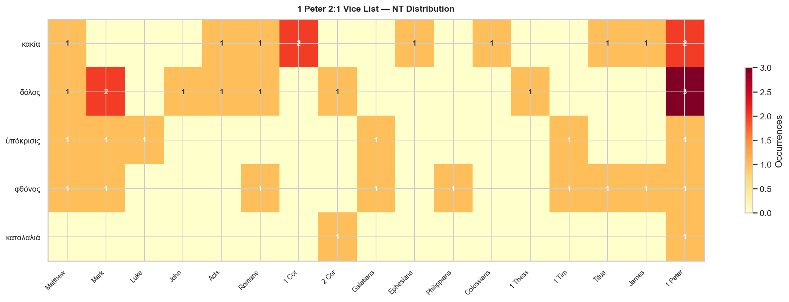

# 1 Peter 2:1 — The "Lay Aside" Vice List

**Anchor text:** 1 Peter 2:1 (KJV) — *"Wherefore laying aside all malice, and all guile, and hypocrisies, and envies, and all evil speakings"*

**Corpora:** NT Greek (TAGNT) · LXX Greek · Biblical Hebrew (TAHOT)

## Contents

- [Overview](#overview)
- [Key Observations](#key-observations)
- [κακία — malice](#κακία)
- [δόλος — deceit](#δόλος)
- [ὑπόκρισις — hypocrisy](#ὑπόκρισις)
- [φθόνος — envy](#φθόνος)
- [καταλαλιά — slander](#καταλαλιά)
- [Vice List Distribution Chart](#vice-list-distribution-chart)
- [Summary Table](#summary-table)

---

## Overview

1 Peter 2:1 opens with an aorist participle of command: **Ἀποθέμενοι** ("having laid aside" / "putting off") — from ἀποτίθημι, the same verb used in Eph 4:22 ("put off the old man"), Col 3:8 ("put off all these"), and Jas 1:21 ("lay apart all filthiness"). The aorist participle signals a decisive, prior action that accompanies the positive command of v. 2 ("desire the sincere milk of the word"). You lay these things aside *in order to* grow.

Five vices follow, structured as three pairs (κακία / δόλος; ὑπόκρισεις / φθόνους; then the closing καταλαλιάς). All five are nouns. The range is significant: they span inner disposition (κακία, φθόνος), deliberate deception (δόλος), performed religion (ὑπόκρισις), and destructive speech (καταλαλιά). Together they describe the social sins that fracture community — exactly the concern of a letter written to dispersed communities living under social pressure.

---

## Key Observations

- **κακία heads the list** as the broadest term, functioning as the genus of which the others are species. All four subsequent vices are forms of κακία in concrete expression.

- **δόλος reappears in Peter's Christology.** At 2:22 Peter quotes Isa 53:9 ("neither was any δόλος found in his mouth"), making Christ's freedom from guile the explicit model for the behavior commanded in 2:1.

- **ὑπόκρισις and φθόνος concern the interior life toward others.** Hypocrisy wears a false face; envy harbors secret hostility. Both sins become especially toxic in close communities under external pressure — exactly the situation of 1 Peter's recipients.

- **καταλαλιά is the rarest NT term** (only 2 occurrences), yet the related verb καταλαλέω recurs three times in 1 Peter itself, making "speaking against" a distinctive pastoral concern of the letter. The community's speech before outsiders is a recurring theme (2:12; 3:16).

- **LXX background is uneven.** κακία (110× canonical LXX) and δόλος (34× canonical LXX) have deep OT roots; ὑπόκρισις, φθόνος, and καταλαλιά are essentially NT-era terms with minimal LXX presence.

---

## κακία

**Strongs:** G2549  
**Gloss:** malice, evil, wickedness  
**NT occurrences:** 11  
**LXX occurrences (canonical):** 110  
**Hebrew background:** רַע / רָעָה (evil, wickedness) (662×)

**Etymology:** From κακός (bad, evil). The most general term in the list — covers all moral evil, both as inner disposition and outward act.

**Theological note:** In the NT κακία spans the range from specific "malice" toward others (Eph 4:31) to general "wickedness" (Acts 8:22) and even "trouble" (Matt 6:34). The LXX uses it 110× in canonical books to render Hebrew רַע / רָעָה — the broadest OT word for evil. Peter places it first, making it the root from which the other four grow.

**NT distribution:**

| Book | Count |
|---|---:|
| 1 Cor | 2 |
| 1 Peter | 2 |
| Acts | 1 |
| Colossians | 1 |
| Ephesians | 1 |
| James | 1 |
| Matthew | 1 |
| Romans | 1 |
| Titus | 1 |

**NT occurrences (KJV):**

| Reference | KJV text |
|---|---|
| 1 Cor 5:8 | Therefore let us keep the feast, not with old leaven, neither with the leaven of malice and wickedness; but with the unl… |
| 1 Cor 14:20 | Brethren, be not children in understanding: howbeit in malice be ye children, but in understanding be men. |
| 1 Peter 2:1 | Wherefore laying aside all malice, and all guile, and hypocrisies, and envies, and all evil speakings, |
| 1 Peter 2:16 | As free, and not using your liberty for a cloke of maliciousness, but as the servants of God. |
| Acts 8:22 | Repent therefore of this thy wickedness, and pray God, if perhaps the thought of thine heart may be forgiven thee. |
| Colossians 3:8 | But now ye also put off all these; anger, wrath, malice, blasphemy, filthy communication out of your mouth. |
| Ephesians 4:31 | Let all bitterness, and wrath, and anger, and clamour, and evil speaking, be put away from you, with all malice: |
| James 1:21 | Wherefore lay apart all filthiness and superfluity of naughtiness, and receive with meekness the engrafted word, which i… |
| Matthew 6:34 | Take therefore no thought for the morrow: for the morrow shall take thought for the things of itself. Sufficient unto th… |
| Romans 1:29 | Being filled with all unrighteousness, fornication, wickedness, covetousness, maliciousness; full of envy, murder, debat… |
| Titus 3:3 | For we ourselves also were sometimes foolish, disobedient, deceived, serving divers lusts and pleasures, living in malic… |

**LXX distribution (canonical, 110 total):**  
1 Samuel (15), Jeremiah (13), 1 Kings (10), Judges (8), Proverbs (8), 2 Samuel (6), Hosea (6), Psalms (5)

---

## δόλος

**Strongs:** G1388  
**Gloss:** deceit, guile, treachery  
**NT occurrences:** 11  
**LXX occurrences (canonical):** 34  
**Hebrew background:** מִרְמָה (deceit, fraud) (39×); רְמִיָּה (slackness, treachery) (15×)

**Etymology:** From δέλω (to trap). Originally meant bait or lure; extended to any cunning trick or deception.

**Theological note:** The LXX uses δόλος 34× in canonical books for Hebrew מִרְמָה (deceit, treachery) and רְמִיָּה (laxness, slackness — often with the sense of deliberate negligence). Both Hebrew nouns carry the idea of calculated dishonesty. In the NT δόλος appears in vice lists (Rom 1:29; Mark 7:22) and is used for the plot to arrest Jesus (Matt 26:4; Mark 14:1). Notably, Jesus calls Nathanael a man "in whom is no δόλος" (John 1:47) — echoing Ps 32:2 ("in whose spirit there is no deceit"). Peter himself quotes Ps 34:13 ("let him refrain his lips from speaking δόλον") just two verses later at 1 Pet 2:22, applying it to Christ's sinlessness.

**NT distribution:**

| Book | Count |
|---|---:|
| 1 Peter | 3 |
| Mark | 2 |
| 1 Thess | 1 |
| 2 Cor | 1 |
| Acts | 1 |
| John | 1 |
| Matthew | 1 |
| Romans | 1 |

**NT occurrences (KJV):**

| Reference | KJV text |
|---|---|
| 1 Peter 2:1 | Wherefore laying aside all malice, and all guile, and hypocrisies, and envies, and all evil speakings, |
| 1 Peter 2:22 | Who did no sin, neither was guile found in his mouth: |
| 1 Peter 3:10 | For he that will love life, and see good days, let him refrain his tongue from evil, and his lips that they speak no gui… |
| 1 Thess 2:3 | For our exhortation was not of deceit, nor of uncleanness, nor in guile: |
| 2 Cor 12:16 | But be it so, I did not burden you: nevertheless, being crafty, I caught you with guile. |
| Acts 13:10 | And said, O full of all subtilty and all mischief, thou child of the devil, thou enemy of all righteousness, wilt thou n… |
| John 1:47 | Jesus saw Nathanael coming to him, and saith of him, Behold an Israelite indeed, in whom is no guile! |
| Matthew 26:4 | And consulted that they might take Jesus by subtilty, and kill him. |
| Mark 7:22 | Thefts, covetousness, wickedness, deceit, lasciviousness, an evil eye, blasphemy, pride, foolishness: |
| Mark 14:1 | After two days was the feast of the passover, and of unleavened bread: and the chief priests and the scribes sought how … |
| Romans 1:29 | Being filled with all unrighteousness, fornication, wickedness, covetousness, maliciousness; full of envy, murder, debat… |

**LXX distribution (canonical, 34 total):**  
Psalms (8), Proverbs (7), Job (4), Jeremiah (3), Genesis (2), Isaiah (2), 2 Kings (1), Daniel (1)

---

## ὑπόκρισις

**Strongs:** G5272  
**Gloss:** hypocrisy, dissimulation, play-acting  
**NT occurrences:** 6  
**LXX occurrences (canonical):** 0  
**Hebrew background:** חֹנֶף (godlessness, profaneness) (1×)

**Etymology:** From ὑποκρίνομαι (to play a part on stage, to answer from under a mask). Classical Greek used it of actors; in the NT it denotes religious insincerity.

**Theological note:** The word appears in NT contexts of religious performance divorced from reality: Jesus' seven woes against the scribes and Pharisees (Matt 23), the testing of Jesus (Mark 12:15), and Paul's rebuke of Peter's "dissimulation" (Gal 2:13). The Hebrew חֹנֶף (godlessness, profanity) is only a partial equivalent — the theatrical dimension of ὑπόκρισις is distinctly Greek. In the NT ὑπόκρισις names the specific sin of performing piety for human approval rather than before God. In 1 Tim 4:2 "lies in hypocrisy" (ἐν ὑποκρίσει) describes the conscience-seared false teacher.

**NT distribution:**

| Book | Count |
|---|---:|
| 1 Peter | 1 |
| 1 Tim | 1 |
| Galatians | 1 |
| Luke | 1 |
| Matthew | 1 |
| Mark | 1 |

**NT occurrences (KJV):**

| Reference | KJV text |
|---|---|
| 1 Peter 2:1 | Wherefore laying aside all malice, and all guile, and hypocrisies, and envies, and all evil speakings, |
| 1 Tim 4:2 | Speaking lies in hypocrisy; having their conscience seared with a hot iron; |
| Galatians 2:13 | And the other Jews dissembled likewise with him; insomuch that Barnabas also was carried away with their dissimulation. |
| Luke 12:1 | In the mean time, when there were gathered together an innumerable multitude of people, insomuch that they trode one upo… |
| Matthew 23:28 | Even so ye also outwardly appear righteous unto men, but within ye are full of hypocrisy and iniquity. |
| Mark 12:15 | Shall we give, or shall we not give? But he, knowing their hypocrisy, said unto them, Why tempt ye me? bring me a penny,… |

---

## φθόνος

**Strongs:** G5355  
**Gloss:** envy, jealousy (malicious)  
**NT occurrences:** 9  
**LXX occurrences (canonical):** 0  
**Hebrew background:** קִנְאָה (jealousy, envy — noun) (43×); קָנָא (be jealous/envious — verb) (34×)

**Etymology:** Root uncertain; possibly related to φθείρω (to corrupt). Unlike ζῆλος (which can be positive), φθόνος always has a negative force — pain at another's good fortune.

**Theological note:** φθόνος is consistently negative in the NT — it is the motive for which the chief priests delivered Jesus (Matt 27:18; Mark 15:10). It appears in Galatians as a "work of the flesh" (5:21) and in Titus 3:3 as a descriptor of pre-conversion life. The Hebrew קִנְאָה covers both positive zeal and negative envy; the LXX uses φθόνος only 4× and almost entirely restricts the negative sense to it. The distinction from ζῆλος is important: ζῆλος can be righteous (John 2:17; Rom 10:2) but φθόνος never is. Peter pairs it with ὑπόκρισις — both involve a false interior orientation toward others.

**NT distribution:**

| Book | Count |
|---|---:|
| 1 Peter | 1 |
| 1 Tim | 1 |
| Galatians | 1 |
| James | 1 |
| Matthew | 1 |
| Mark | 1 |
| Philippians | 1 |
| Romans | 1 |
| Titus | 1 |

**NT occurrences (KJV):**

| Reference | KJV text |
|---|---|
| 1 Peter 2:1 | Wherefore laying aside all malice, and all guile, and hypocrisies, and envies, and all evil speakings, |
| 1 Tim 6:4 | He is proud, knowing nothing, but doting about questions and strifes of words, whereof cometh envy, strife, railings, ev… |
| Galatians 5:21 | Envyings, murders, drunkenness, revellings, and such like: of the which I tell you before, as I have also told you in ti… |
| James 4:5 | Do ye think that the scripture saith in vain, The spirit that dwelleth in us lusteth to envy? |
| Matthew 27:18 | For he knew that for envy they had delivered him. |
| Mark 15:10 | For he knew that the chief priests had delivered him for envy. |
| Philippians 1:15 | Some indeed preach Christ even of envy and strife; and some also of good will: |
| Romans 1:29 | Being filled with all unrighteousness, fornication, wickedness, covetousness, maliciousness; full of envy, murder, debat… |
| Titus 3:3 | For we ourselves also were sometimes foolish, disobedient, deceived, serving divers lusts and pleasures, living in malic… |

---

## καταλαλιά

**Strongs:** G2636  
**Gloss:** slander, evil speaking, defamation  
**NT occurrences:** 2  
**LXX occurrences (canonical):** 0  

**Etymology:** From κατά (against) + λαλέω (to speak). Literally "speaking against" someone.

**Theological note:** The rarest term in the list: only 2 NT occurrences (2 Cor 12:20; 1 Pet 2:1) and 1 LXX occurrence (deuterocanonical). The related verb καταλαλέω appears 4× in 1 Peter alone (2:12; 3:16 ×2; cf. Jas 4:11), making the καταλαλ- word-group particularly characteristic of the letter's concern with the community's reputation before outsiders. The compound structure (against + speak) emphasizes that this is directed, targeted speech — not mere gossip but speech designed to harm someone's standing. Peter returns to the theme at 2:12: "having your conversation honest among the Gentiles: that, whereas they speak against (καταλαλοῦσιν) you as evildoers, they may by your good works … glorify God."

**NT distribution:**

| Book | Count |
|---|---:|
| 1 Peter | 1 |
| 2 Cor | 1 |

**NT occurrences (KJV):**

| Reference | KJV text |
|---|---|
| 1 Peter 2:1 | Wherefore laying aside all malice, and all guile, and hypocrisies, and envies, and all evil speakings, |
| 2 Cor 12:20 | For I fear, lest, when I come, I shall not find you such as I would, and that I shall be found unto you such as ye would… |

---

## Vice List Distribution Chart

---

## Summary Table

| Term | Strongs | NT | LXX (canonical) | Hebrew background | Gloss |
|---|---|---:|---:|---|---|
| κακία | G2549 | 11 | 110 | רַע / רָעָה (evil, wickedness) | malice, evil, wickedness |
| δόλος | G1388 | 11 | 34 | מִרְמָה (deceit, fraud); רְמִיָּה (slackness, treachery) | deceit, guile, treachery |
| ὑπόκρισις | G5272 | 6 | 0 | חֹנֶף (godlessness, profaneness) | hypocrisy, dissimulation, play-acting |
| φθόνος | G5355 | 9 | 0 | קִנְאָה (jealousy, envy — noun); קָנָא (be jealous/envious — verb) | envy, jealousy (malicious) |
| καταλαλιά | G2636 | 2 | 0 | — | slander, evil speaking, defamation |

---

*Greek NT data: TAGNT (Byzantine/Textus Receptus, STEPBible CC BY 4.0).*  
*LXX data: CenterBLC LXX (CC BY 4.0).*  
*Hebrew data: TAHOT (STEPBible CC BY 4.0).*  
*Generated by [scripts/nt/lexicon/build_1pet2_vice_list.py](../../../../scripts/nt/lexicon/build_1pet2_vice_list.py).*