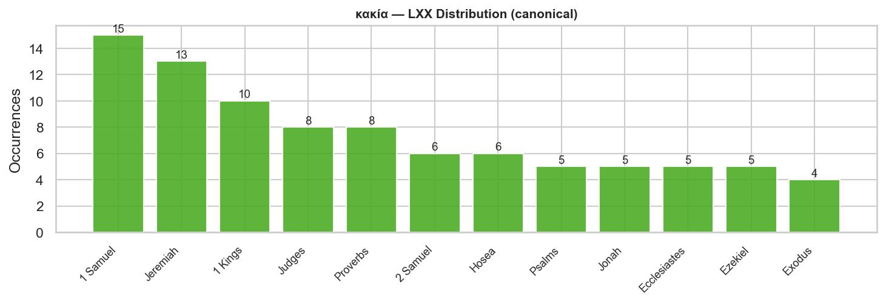
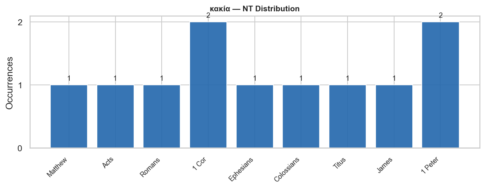

# κακία (G2549) — malice, evil, wickedness

*Part of the [1 Peter 2:1 Vice List study](../index.md)*

---

## Contents

- [Overview](#overview)
- [Etymology and Semantic Range](#etymology-and-semantic-range)
- [OT / LXX Background](#ot--lxx-background)
- [NT Distribution](#nt-distribution)
- [Theological Note](#theological-note)
- [NT Occurrences](#nt-occurrences)
- [LXX Occurrences (Canonical)](#lxx-occurrences-canonical)

---

## Overview

| Field | Value |
|---|---|
| Strong's | G2549 |
| Greek | κακία |
| Transliteration | kakia |
| Gloss | malice, evil, wickedness |
| 1 Pet 2:1 KJV | "malice" |
| NT occurrences | 11 (9 books) |
| LXX occurrences (canonical) | 110 |
| Hebrew background | רַע / רָעָה (evil) (662× OT) |

---

## Etymology and Semantic Range

From κακός (bad, evil). The most general term in the list, covering the full spectrum of moral evil — both as inner disposition and outward act. The underlying κακ- root is one of the oldest and most productive in Greek.

The NT deploys κακία across a wide range: from specific "malice" or ill-will toward others (Eph 4:31; Col 3:8) to general "wickedness" (Acts 8:22; Rom 1:29) and even "trouble / misfortune" (Matt 6:34, "sufficient unto the day is the evil thereof"). This breadth makes it the natural head of Peter's list: κακία is the root disposition from which the other four vices spring.

---

## OT / LXX Background

The LXX uses κακία 110× in canonical books — the second-most common rendering of Hebrew רַע / רָעָה (H7451, 662× in OT), the broadest Hebrew term for evil in all its forms. The LXX concentration is heaviest in narrative books (1 Sam 15×, 1 Kgs 10×, Judges 8×) where κακία describes the evil of apostasy, idolatry, and moral failure. The Hebrew root carries both the sense of moral evil and the consequent harm it produces — a fusion the Greek κακία preserves.

**Canonical LXX: 110 occurrences across 25 book(s)**

| Book | Count |
|---|---:|
| 1 Samuel | 15 |
| Jeremiah | 13 |
| 1 Kings | 10 |
| Judges | 8 |
| Proverbs | 8 |
| 2 Samuel | 6 |
| Hosea | 6 |
| Psalms | 5 |
| Jonah | 5 |
| Ecclesiastes | 5 |
| Ezekiel | 5 |
| Exodus | 4 |
| Job | 3 |
| 1 Chronicles | 2 |
| Genesis | 2 |
| 2 Kings | 2 |
| 2 Chronicles | 2 |
| Zechariah | 2 |
| Isaiah | 1 |
| Esther | 1 |
| Deuteronomy | 1 |
| Joel | 1 |
| Amos | 1 |
| Lamentations | 1 |
| Nah | 1 |

---

## NT Distribution

---

## Theological Note

Peter places κακία first, making it the genus from which the other four vices grow. Its position mirrors its function: malice is not one vice among equals but the soil in which all the others take root. The command to "lay aside" (ἀποθέμενοι) κακία is echoed verbatim in Eph 4:31, Col 3:8, and Jas 1:21 — a shared early-church baptismal formula for the moral break from the old life.

---

## NT Occurrences

| Reference | Greek form | KJV text |
|---|---|---|
| 1 Cor 5:8 | κακίας | Therefore let us keep the feast, not with old leaven, neither with the leaven of malice and wickedness; but with the unl… |
| 1 Cor 14:20 | κακίᾳ | Brethren, be not children in understanding: howbeit in malice be ye children, but in understanding be men. |
| 1 Peter 2:1 | κακίαν | Wherefore laying aside all malice, and all guile, and hypocrisies, and envies, and all evil speakings, |
| 1 Peter 2:16 | κακίας | As free, and not using your liberty for a cloke of maliciousness, but as the servants of God. |
| Acts 8:22 | κακίας | Repent therefore of this thy wickedness, and pray God, if perhaps the thought of thine heart may be forgiven thee. |
| Colossians 3:8 | κακίαν, | But now ye also put off all these; anger, wrath, malice, blasphemy, filthy communication out of your mouth. |
| Ephesians 4:31 | κακίᾳ. | Let all bitterness, and wrath, and anger, and clamour, and evil speaking, be put away from you, with all malice: |
| James 1:21 | κακίας | Wherefore lay apart all filthiness and superfluity of naughtiness, and receive with meekness the engrafted word, which i… |
| Matthew 6:34 | κακία | Take therefore no thought for the morrow: for the morrow shall take thought for the things of itself. Sufficient unto th… |
| Romans 1:29 | κακίᾳ, | Being filled with all unrighteousness, fornication, wickedness, covetousness, maliciousness; full of envy, murder, debat… |
| Titus 3:3 | κακίᾳ | For we ourselves also were sometimes foolish, disobedient, deceived, serving divers lusts and pleasures, living in malic… |
