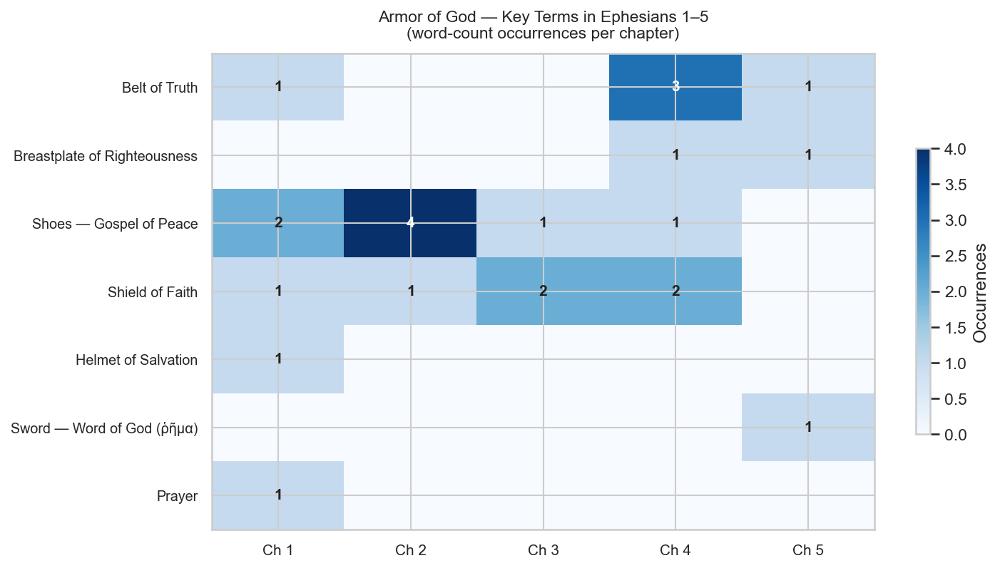

# The Armor of God — Ephesians 6:10–18 in Its Letter Context

**Focus passage:** Ephesians 6:10–18
**Corpus:** New Testament (TAGNT)
**Topic:** Each piece of the armor of God introduced in Eph 6:14–18 recapitulates a theme Paul has already developed earlier in Ephesians.
<!-- Build script: scripts/nt/lexicon/armor-of-god/build_armor_of_god_report.py (repo link omitted from web) -->

---

## Contents

1. [The Exegetical Observation](#the-exegetical-observation)
2. [Ephesians 6:10–18 — Text and Translation](#ephesians-61018-text-and-translation)
3. [The Armor Pieces and Their Earlier Occurrences](#the-armor-pieces-and-their-earlier-occurrences)
   - [Belt of Truth](#belt-of-truth-g0225)
   - [Breastplate of Righteousness](#breastplate-of-righteousness-g1343)
   - [Shoes — Gospel of Peace](#shoes-gospel-of-peace-g2098-g1515)
   - [Shield of Faith](#shield-of-faith-g4102)
   - [Helmet of Salvation](#helmet-of-salvation-g4991)
   - [Sword — Word of God](#sword-word-of-god-g4487)
   - [Prayer](#prayer-g4335)
4. [Frequency Heatmap](#frequency-heatmap)
5. [Summary Table](#summary-table)

---

## The Exegetical Observation

Ephesians 6:10–18 is one of the most recognized passages in Paul's letters, but its rhetorical power is deeper than a standalone metaphor. Every piece of armor Paul names in verses 14–18 is a word or concept he has already introduced and developed in the preceding five chapters.

Paul is not mixing theological metaphors on the fly. He is *recapitulating the letter*. By the time a reader reaches 6:14, each armor term carries the weight of everything Paul has already said about it:

- **Truth** has been defined as the content of the gospel and the character of Christ (1:13; 4:21)
- **Righteousness** is the quality of the new creation in Christ (4:24)
- **Peace** is not a disposition but a person — Christ himself (2:14)
- **Faith** is how sinners are saved (2:8) and how Christ dwells in the heart (3:17)
- **Salvation** is the gospel's content, received through hearing and believing (1:13)
- **The word (ῥῆμα)** is the instrument by which Christ sanctifies the church (5:26)
- **Prayer** is Paul's own practice throughout the letter (1:16; 3:14–21)

The armor passage is therefore not an appendix. It is a call to *wear* what Paul has been teaching. The image transforms doctrinal exposition into lived readiness.

---

## Ephesians 6:10–18 — Text and Translation

**v. 10**
> Τοῦ λοιποῦ, ἀδελφοί μου, ἐνδυναμοῦσθε ἐν κυρίῳ καὶ ἐν τῷ κράτει τῆς ἰσχύος αὐτοῦ.
>
> *Finally, my brethren, be strong in the Lord, and in the power of his might.*

**v. 11**
> ἐνδύσασθε τὴν πανοπλίαν τοῦ θεοῦ πρὸς τὸ δύνασθαι ὑμᾶς στῆναι πρὸς τὰς μεθοδείας τοῦ διαβόλου·
>
> *Put on the whole armour of God, that ye may be able to stand against the wiles of the devil.*

**v. 12**
> ὅτι οὐκ ἔστιν ἡμῖν ἡ πάλη πρὸς αἷμα καὶ σάρκα ἀλλὰ πρὸς τὰς ἀρχάς, πρὸς τὰς ἐξουσίας, πρὸς τοὺς κοσμοκράτορας τοῦ σκότους τοῦ αἰῶνος τούτου, πρὸς τὰ πνευματικὰ τῆς πονηρίας ἐν τοῖς ἐπουρανίοις.
>
> *For we wrestle not against flesh and blood, but against principalities, against powers, against the rulers of the darkness of this world, against spiritual wickedness in high places.*

**v. 13**
> διὰ τοῦτο ἀναλάβετε τὴν πανοπλίαν τοῦ θεοῦ, ἵνα δυνηθῆτε ἀντιστῆναι ἐν τῇ ἡμέρᾳ τῇ πονηρᾷ καὶ ἅπαντα κατεργασάμενοι στῆναι.
>
> *Wherefore take unto you the whole armour of God, that ye may be able to withstand in the evil day, and having done all, to stand.*

**v. 14** *(belt of truth; breastplate of righteousness)*
> στῆτε οὖν περιζωσάμενοι τὴν ὀσφὺν ὑμῶν ἐν ἀληθείᾳ καὶ ἐνδυσάμενοι τὸν θώρακα τῆς δικαιοσύνης
>
> *Stand therefore, having your loins girt about with truth, and having on the breastplate of righteousness;*

**v. 15** *(shoes of the gospel of peace)*
> καὶ ὑποδησάμενοι τοὺς πόδας ἐν ἑτοιμασίᾳ τοῦ εὐαγγελίου τῆς εἰρήνης·
>
> *And your feet shod with the preparation of the gospel of peace;*

**v. 16** *(shield of faith)*
> ἐν πᾶσιν ἀναλαβόντες τὸν θυρεὸν τῆς πίστεως, ἐν ᾧ δυνήσεσθε πάντα τὰ βέλη τοῦ πονηροῦ τὰ πεπυρωμένα σβέσαι·
>
> *Above all, taking the shield of faith, wherewith ye shall be able to quench all the fiery darts of the wicked.*

**v. 17** *(helmet of salvation; sword of the Spirit)*
> καὶ τὴν περικεφαλαίαν τοῦ σωτηρίου δέξασθε καὶ τὴν μάχαιραν τοῦ πνεύματος, ὅ ἐστιν ῥῆμα θεοῦ·
>
> *And take the helmet of salvation, and the sword of the Spirit, which is the word of God:*

**v. 18** *(prayer)*
> διὰ πάσης προσευχῆς καὶ δεήσεως προσευχόμενοι ἐν παντὶ καιρῷ ἐν πνεύματι, καὶ εἰς αὐτὸ τοῦτο ἀγρυπνοῦντες ἐν πάσῃ προσκαρτερήσει καὶ δεήσει περὶ πάντων τῶν ἁγίων
>
> *Praying always with all prayer and supplication in the Spirit, and watching thereunto with all perseverance and supplication for all saints;*

---

## The Armor Pieces and Their Earlier Occurrences

For each piece of armor, the key Greek term is identified along with every earlier occurrence in Ephesians and the exegetical connection to 6:14–18.

### Belt of Truth (ἀλήθεια, G0225)

Earlier in Ephesians, before it becomes a piece of armor in 14:

**Eph 1:13**
> τὸν λόγον τῆς ἀληθείας
> *"the word of truth"*
> Truth is the very substance of the gospel by which believers were sealed

**Eph 4:21**
> καθώς ἐστιν ἀλήθεια ἐν τῷ Ἰησοῦ
> *"truth is in Jesus"*
> Christ himself is the embodiment of truth — the foundation of the belt

**Eph 4:24**
> τὴν κατὰ θεὸν κτισθέντα ἐν δικαιοσύνῃ καὶ ὁσιότητι τῆς ἀληθείας
> *"created after the likeness of God in true righteousness and holiness"*
> Truth and righteousness appear together — the same pairing as in 6:14

**Eph 4:25**
> λαλεῖτε ἀλήθειαν
> *"speak truth"*
> Believers are called to live out the truth they have girded on

**Eph 5:9**
> ἐν … ἀληθείᾳ
> *"in … truth"*
> The fruit of light includes truth — a quality of the new life in Christ

### Breastplate of Righteousness (δικαιοσύνη, G1343)

Earlier in Ephesians, before it becomes a piece of armor in 14:

**Eph 4:24**
> ἐν δικαιοσύνῃ καὶ ὁσιότητι τῆς ἀληθείας
> *"in true righteousness and holiness"*
> The new self is created in righteousness — what the breastplate protects

**Eph 5:9**
> ἐν … δικαιοσύνῃ
> *"in … righteousness"*
> Righteousness is a characteristic of walking as children of light

### Shoes — Gospel of Peace (εὐαγγέλιον G2098 + εἰρήνη G1515)

Earlier in Ephesians, before it becomes a piece of armor in 15:

**Eph 1:13**
> τὸν λόγον τῆς ἀληθείας, τὸ εὐαγγέλιον τῆς σωτηρίας ὑμῶν
> *"the word of truth, the gospel of your salvation"*
> The gospel is the instrument of salvation and sealing with the Spirit

**Eph 3:6**
> συγκληρονόμα … διὰ τοῦ εὐαγγελίου
> *"fellow heirs … through the gospel"*
> The gospel unites Jew and Gentile — the peace the shoes proclaim

**Eph 1:2**
> χάρις ὑμῖν καὶ εἰρήνη
> *"grace to you and peace"*
> Peace is Paul's opening benediction for the whole letter

**Eph 2:14**
> αὐτὸς γάρ ἐστιν ἡ εἰρήνη ἡμῶν
> *"he himself is our peace"*
> Christ IS peace — the profoundest grounding of the shoes of peace

**Eph 2:15**
> ἵνα τοὺς δύο κτίσῃ ἐν αὑτῷ εἰς ἕνα καινὸν ἄνθρωπον, ποιῶν εἰρήνην
> *"that he might create in himself one new man in place of the two, so making peace"*
> Christ made peace between Jew and Gentile through the cross

**Eph 2:17**
> εὐηγγελίσατο εἰρήνην … καὶ εἰρήνην
> *"he preached peace … and peace"*
> The gospel IS the preaching of peace — shoes and gospel belong together

**Eph 4:3**
> τὸν σύνδεσμον τῆς εἰρήνης
> *"the bond of peace"*
> Peace must be maintained among believers — a calling before a weapon

### Shield of Faith (πίστις, G4102)

Earlier in Ephesians, before it becomes a piece of armor in 16:

**Eph 1:15**
> τὴν καθ᾽ ὑμᾶς πίστιν
> *"the faith that is among you"*
> Paul gives thanks for the Ephesians' faith — the shield that already works

**Eph 2:8**
> διὰ πίστεως … σεσῳσμένοι
> *"through faith … you have been saved"*
> The most famous faith verse in Ephesians — salvation itself came by this shield

**Eph 3:12**
> διὰ τῆς πίστεως αὐτοῦ
> *"through faith in him"*
> Access to God comes through faith — the same shield used in prayer (6:18)

**Eph 3:17**
> κατοικῆσαι τὸν Χριστὸν διὰ τῆς πίστεως
> *"Christ dwells in your hearts through faith"*
> Faith is the ground of Christ's indwelling — the shield is not external armor only

**Eph 4:5**
> μία πίστις
> *"one faith"*
> One faith belongs to the whole body — the shield is shared

**Eph 4:13**
> εἰς τὴν ἑνότητα τῆς πίστεως
> *"to the unity of the faith"*
> The goal of maturity is unified faith — the fully-equipped body

### Helmet of Salvation (σωτηρία, G4991)

Earlier in Ephesians, before it becomes a piece of armor in 17:

**Eph 1:13**
> τὸ εὐαγγέλιον τῆς σωτηρίας ὑμῶν
> *"the gospel of your salvation"*
> Salvation is the content of the gospel — what the helmet announces

### Sword — Word of God (ῥῆμα θεοῦ, G4487)

Earlier in Ephesians, before it becomes a piece of armor in 17:

**Eph 5:26**
> ἐν ῥήματι
> *"by the word"*
> Christ sanctifies the church through the word (ῥῆμα) — the same term as the sword

### Prayer (προσευχή, G4335)

Earlier in Ephesians, before it becomes a piece of armor in 18:

**Eph 1:16**
> μνείαν ποιούμενος ἐπὶ τῶν προσευχῶν μου
> *"making mention of you in my prayers"*
> Paul himself models the unceasing prayer he calls for in 6:18

---

## Frequency Heatmap

The chart below shows the word-count occurrences of each armor term across Ephesians chapters 1–5 (chapter 6 excluded). Chapters with higher counts reflect where Paul most developed that theme.

---

## Summary Table

| Armor Piece | Greek Term | Strong's | Earlier in Ephesians |
|-------------|-----------|----------|---------------------|
| Belt of Truth | ἀλήθεια | G0225 | Eph 1:13, Eph 4:21, Eph 4:24, Eph 4:25, Eph 5:9 |
| Breastplate of Righteousness | δικαιοσύνη | G1343 | Eph 4:24, Eph 5:9 |
| Shoes — Gospel | εὐαγγέλιον | G2098 | Eph 1:13, Eph 3:6 |
| Shoes — Peace | εἰρήνη | G1515 | Eph 1:2, Eph 2:14, Eph 2:15, Eph 2:17, Eph 4:3 |
| Shield of Faith | πίστις | G4102 | Eph 1:15, Eph 2:8, Eph 3:12, Eph 3:17, Eph 4:5, Eph 4:13 |
| Helmet of Salvation | σωτηρία | G4991 | Eph 1:13 |
| Sword — Word (ῥῆμα) | ῥῆμα θεοῦ | G4487 | Eph 5:26 |
| Prayer | προσευχή | G4335 | Eph 1:16 |

---

*The armor passage of Ephesians 6 is not a self-contained metaphor dropped into a letter. Every piece of armor names a reality Paul has already expounded: who Christ is, what he accomplished, and how believers are to walk. The call to "put on the whole armor" is a call to live in what has already been given.*
