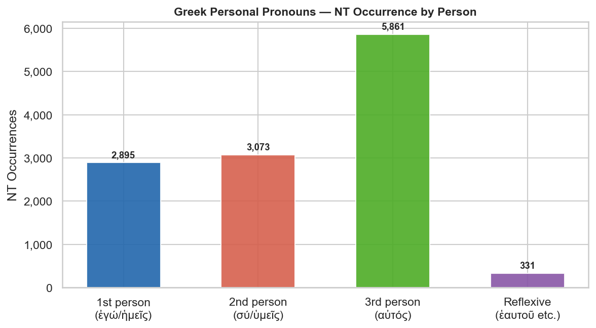
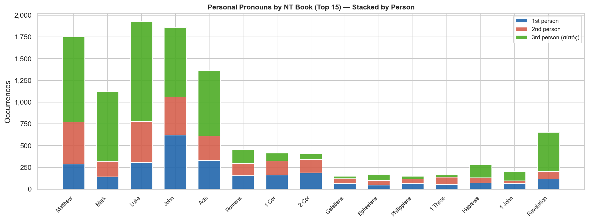
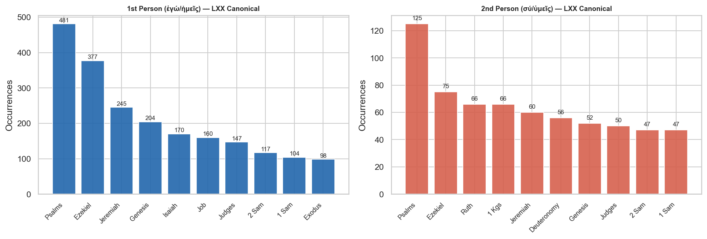
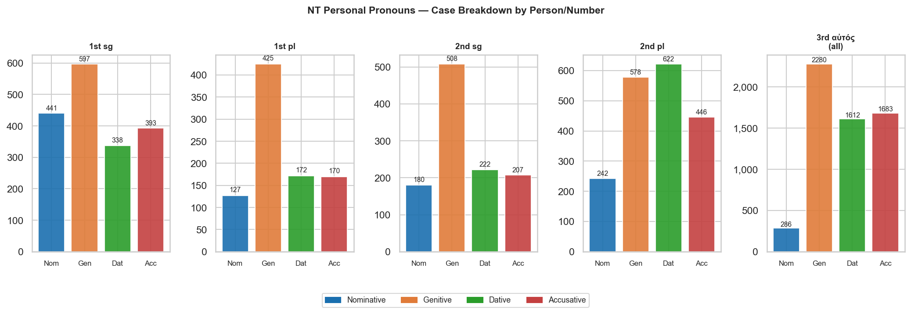

# Greek Personal Pronouns — NT and LXX Study

**Corpus:** NT Greek (TAGNT) · LXX Greek (canonical books)  
**Translation:** KJV

## Contents

- [Overview](#overview)
- [Key Observations](#key-observations)
- [Complete Paradigms](#complete-paradigms)
  - [1st Person — ἐγώ / ἡμεῖς](#1st-person--ἐγώ--ἡμεῖς)
  - [2nd Person — σύ / ὑμεῖς](#2nd-person--σύ--ὑμεῖς)
  - [3rd Person — αὐτός αὐτή αὐτό](#3rd-person--αὐτός-αὐτή-αὐτό)
  - [Reflexive Pronouns](#reflexive-pronouns)
- [Distribution Charts](#distribution-charts)
- [NT Occurrence by Book](#nt-occurrence-by-book)
- [LXX Distribution](#lxx-distribution)
- [Case Breakdown](#case-breakdown)
- [Key Passages](#key-passages)
- [Summary Table](#summary-table)

---

## Overview

Greek has a **rich personal pronoun system** covering three persons, two numbers (singular and plural), and — for the third person — three genders. Unlike Hebrew, Greek verbs already encode person/number in their endings, so personal pronouns are **used for emphasis, contrast, or disambiguation** rather than as a grammatical requirement. When an author writes ἐγὼ instead of simply using the verbal ending, the pronoun adds **rhetorical weight**.

**NT total personal pronoun tokens:** 12,160  
**LXX canonical (1st + 2nd person):** 3,890

---

## Key Observations

- **αὐτός dominates the NT** (5,861 tokens, 48% of all personal pronoun tokens). It functions as the standard 3rd-person pronoun across all genders and numbers. In its genitive and dative forms (αὐτοῦ, αὐτῷ, αὐτοῖς) it is the workhorse of narrative reference — especially in the Gospels.

- **2nd person σύ/ὑμεῖς** (3,073 NT tokens) appears more than 1st person (2,895) in absolute terms, reflecting the dialogical nature of the Gospels and Epistles. Jesus's direct address to disciples, crowds, and opponents drives the count.

- **Nominative case is emphatic.** Greek verbs already encode person; a pronoun in the nominative reinforces or contrasts the subject. John's "**ἐγώ** εἰμι" sayings (8:12, 8:58, 10:7, 11:25, 14:6, 15:1, 15:5, 18:5–6) are the most theologically charged uses of the 1st-person nominative in the NT.

- **Genitive is the most common case** for all personal pronouns — as possessives (μου, σου, αὐτοῦ) they modify nouns throughout the NT. The genitive of αὐτός alone (αὐτοῦ/αὐτῆς/αὐτῶν) accounts for over 2,000 tokens.

- **LXX 1st-person concentration in Psalms and the Prophets.** The Psalms have the highest density of 1st-person pronouns (prayer/lament idiom); Ezekiel and Jeremiah carry heavy divine 1st-person speech. This differs from the NT where the Gospels and Acts dominate.

- **ἑαυτοῦ (reflexive)** has 331 NT tokens and 655 LXX canonical tokens. In the NT it covers all three persons reflexively (himself/herself/itself/themselves). The specific first- and second-person reflexives (ἐμαυτοῦ, σεαυτοῦ) have negligible NT use but are attested in the LXX.

---

## Complete Paradigms

### 1st Person — ἐγώ / ἡμεῖς

The first-person pronoun has no gender distinction. The emphatic oblique forms (ἐμοῦ/ἐμοί/ἐμέ) are stressed alternatives to the enclitic forms (μου/μοι/με).

| Case | Singular | Emphatic sg | Plural |
|---|---|---|---|
| **Nominative** | ἐγώ | — | ἡμεῖς |
| **Genitive** | μου *(enclitic)* | ἐμοῦ *(emphatic)* | ἡμῶν |
| **Dative** | μοι *(enclitic)* | ἐμοί *(emphatic)* | ἡμῖν |
| **Accusative** | με *(enclitic)* | ἐμέ *(emphatic)* | ἡμᾶς |

**NT occurrence counts:**

| Form | Case | NT count |
|---|---|---:|
| ἐγὼ / κἀγὼ | Nominative sg | 441 |
| μου / μου | Genitive sg | 597 |
| μοι / ἐμοὶ | Dative sg | 338 |
| με / ἐμὲ | Accusative sg | 393 |
| ἡμεῖς / ἡμεῖς; | Nominative pl | 127 |
| ἡμῶν / ἡμῶν | Genitive pl | 425 |
| ἡμῖν / ἡμῖν | Dative pl | 172 |
| ἡμᾶς / ἡμᾶς | Accusative pl | 170 |

---

### 2nd Person — σύ / ὑμεῖς

The second-person pronoun also has no gender distinction. The forms σου/σοι/σε are enclitic (unstressed); they appear far more frequently than the nominative σύ since Greek verbs already mark 2nd person.

| Case | Singular | Plural |
|---|---|---|
| **Nominative** | σύ | ὑμεῖς |
| **Genitive** | σου | ὑμῶν |
| **Dative** | σοι | ὑμῖν |
| **Accusative** | σε | ὑμᾶς |

**NT occurrence counts:**

| Form | Case | NT count |
|---|---|---:|
| σὺ / σύ | Nominative sg | 180 |
| σου / σου | Genitive sg | 508 |
| σοι / σοὶ | Dative sg | 222 |
| σε / σὲ | Accusative sg | 207 |
| ὑμεῖς / ὑμεῖς | Nominative pl | 242 |
| ὑμῶν / ὑμῶν | Genitive pl | 578 |
| ὑμῖν / ὑμῖν | Dative pl | 622 |
| ὑμᾶς / ὑμᾶς | Accusative pl | 446 |

---

### 3rd Person — αὐτός αὐτή αὐτό

αὐτός is a **three-gender pronoun** with full case and number inflection. It serves three distinct functions in the NT:

1. **Personal pronoun** (most common) — "he/she/it/they" in oblique cases
2. **Intensive adjective** — nominative case, meaning "himself/herself/itself/themselves"
3. **Identical adjective** — attributive position, meaning "the same"

| Case | Masc. Sg | Fem. Sg | Neut. Sg | Masc. Pl | Fem. Pl | Neut. Pl |
|---|---|---|---|---|---|---|
| **Nominative** | αὐτός | αὐτή | αὐτό | αὐτοί | αὐταί | αὐτά |
| **Genitive** | αὐτοῦ | αὐτῆς | αὐτοῦ | αὐτῶν | αὐτῶν | αὐτῶν |
| **Dative** | αὐτῷ | αὐτῇ | αὐτῷ | αὐτοῖς | αὐταῖς | αὐτοῖς |
| **Accusative** | αὐτόν | αὐτήν | αὐτό | αὐτούς | αὐτάς | αὐτά |

> **Note:** Masc./Neut. share Gen/Dat forms; Gen/Pl is αὐτῶν for all genders.

**NT occurrence counts:**

| Form | Gender | Case | Number | NT count |
|---|---|---|---|---:|
| αὐτὸς | Masculine | Nominative | Singular | 178 |
| αὐτοῦ | Masculine | Genitive | Singular | 1,452 |
| αὐτῷ | Masculine | Dative | Singular | 873 |
| αὐτὸν | Masculine | Accusative | Singular | 1,007 |
| αὐτοὶ | Masculine | Nominative | Plural | 87 |
| αὐτῶν | Masculine | Genitive | Plural | 542 |
| αὐτοῖς | Masculine | Dative | Plural | 564 |
| αὐτοὺς | Masculine | Accusative | Plural | 365 |
| αὐτὴ | Feminine | Nominative | Singular | 11 |
| αὐτῆς | Feminine | Genitive | Singular | 176 |
| αὐτῇ | Feminine | Dative | Singular | 112 |
| αὐτὴν | Feminine | Accusative | Singular | 142 |
| αὐτῶν | Feminine | Genitive | Plural | 22 |
| αὐταῖς | Feminine | Dative | Plural | 21 |
| αὐτὰς | Feminine | Accusative | Plural | 12 |
| αὐτὸ | Neuter | Nominative | Singular | 9 |
| αὐτοῦ | Neuter | Genitive | Singular | 53 |
| αὐτῷ | Neuter | Dative | Singular | 22 |
| αὐτὸ | Neuter | Accusative | Singular | 101 |
| αὐτὰ | Neuter | Nominative | Plural | 1 |
| αὐτῶν | Neuter | Genitive | Plural | 35 |
| αὐτοῖς | Neuter | Dative | Plural | 20 |
| αὐτὰ | Neuter | Accusative | Plural | 56 |

---

### Reflexive Pronouns

Greek has dedicated reflexive pronouns for each person. In the NT, ἑαυτοῦ (3rd person) does duty for all three persons reflexively.

| Pronoun | Strongs | Meaning | NT | LXX (canonical) |
|---|---|---|---:|---:|
| ἐμαυτοῦ | G1683 | myself | 0 | 46 |
| σεαυτοῦ | G4572 | yourself | 0 | 197 |
| ἑαυτοῦ | G1438 | himself/herself/themselves | 331 | 494 |

> **ἑαυτοῦ paradigm:** Gen sg ἑαυτοῦ/ἑαυτῆς · Dat sg ἑαυτῷ/ἑαυτῇ · Acc sg ἑαυτόν/ἑαυτήν · Gen pl ἑαυτῶν · Dat pl ἑαυτοῖς · Acc pl ἑαυτούς/ἑαυτάς. No nominative exists (the reflexive always refers back to the subject).

---

## Distribution Charts

---

## NT Occurrence by Book

---

## LXX Distribution

---

## Case Breakdown

---

## Key Passages

### ἐγώ εἰμι — The "I am" Sayings of Jesus

The combination ἐγώ εἰμι carries enormous theological weight in John's Gospel. The emphatic nominative ἐγώ (rather than simply εἰμι alone) evokes the LXX rendering of Exodus 3:14 (ἐγώ εἰμι ὁ ὤν, "I am the one who is") and Isaiah 43:10 (ἐγώ εἰμι, "I am he").

| Reference | KJV |
|---|---|
| John 8:58 | Jesus said unto them, Verily, verily, I say unto you, Before Abraham was, I am. |
| John 6:35 | And Jesus said unto them, I am the bread of life: he that cometh to me shall never hunger; and he that believeth on… |
| John 8:12 | Then spake Jesus again unto them, saying, I am the light of the world: he that followeth me shall not walk in darkn… |
| John 10:7 | Then said Jesus unto them again, Verily, verily, I say unto you, I am the door of the sheep. |
| John 10:11 | I am the good shepherd: the good shepherd giveth his life for the sheep. |
| John 11:25 | Jesus said unto her, I am the resurrection, and the life: he that believeth in me, though he were dead, yet shall h… |
| John 14:6 | Jesus saith unto him, I am the way, the truth, and the life: no man cometh unto the Father, but by me. |
| John 15:1 | I am the true vine, and my Father is the husbandman. |

### αὐτός — Intensive Use

When αὐτός appears in the **nominative** case without a preceding article, it intensifies the subject: "he himself," "she herself."

| Reference | KJV |
|---|---|
| John 2:25 | And needed not that any should testify of man: for he knew what was in man. |
| Luke 24:36 | And as they thus spake, Jesus himself stood in the midst of them, and saith unto them, Peace be unto you. |
| Matthew 8:24 | And, behold, there arose a great tempest in the sea, insomuch that the ship was covered with the waves: but he was … |
| John 4:2 | (Though Jesus himself baptized not, but his disciples,) |
| 1 John 2:6 | He that saith he abideth in him ought himself also so to walk, even as he walked. |

### σύ/ὑμεῖς — Direct Address

| Reference | KJV |
|---|---|
| Matthew 16:15 | He saith unto them, But whom say ye that I am? |
| John 21:17 | He saith unto him the third time, Simon, son of Jonas, lovest thou me? Peter was grieved because he said unto him t… |
| Matthew 5:48 | Be ye therefore perfect, even as your Father which is in heaven is perfect. |
| Luke 22:70 | Then said they all, Art thou then the Son of God? And he said unto them, Ye say that I am. |
| John 10:30 | I and my Father are one. |

---

## Summary Table

| Pronoun | Strongs | Person | NT tokens | LXX (canonical) | Notes |
|---|---|---|---:|---:|---|
| ἐγώ | G1473 | 1st sg (nom) | 866 | 1,389 | Emphatic nominative |
| μου/μοι/με | G3165 | 1st sg+pl (obl) | 2,029 | 1,563 | Enclitic + plural forms |
| σύ/σου/σοι/σε | G4771 | 2nd sg+pl | 3,073 | 938 | All 2nd person forms |
| αὐτός | G0846 | 3rd (all genders) | 5,861 | — | Pronoun + intensive + identical |
| ἑαυτοῦ | G1438 | Reflexive (all persons) | 331 | 494 | No nominative form |

---

*Greek NT data: TAGNT (Byzantine/Textus Receptus, STEPBible CC BY 4.0).*  
*LXX data: CenterBLC LXX (CC BY 4.0).*  
*Generated by [scripts/nt/lexicon/build_greek_pronouns_report.py](../../../../scripts/nt/lexicon/build_greek_pronouns_report.py).*