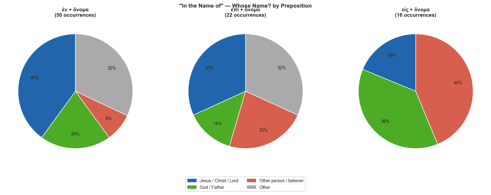

# "In the Name of" — Cross-Corpus Study

**Corpus:** NT Greek (TAGNT) · LXX Greek · Biblical Hebrew (TAHOT)

## Contents

- [Overview](#overview)
- [Key Observations](#key-observations)
- [The Three NT Constructions](#the-three-nt-constructions)
  - [ἐν (τῷ) ὀνόματι — Dative](#ἐν-τῷ-ὀνόματι--dative)
  - [ἐπὶ (τῷ) ὀνόματι — Dative](#ἐπὶ-τῷ-ὀνόματι--dative)
  - [εἰς τὸ ὄνομα — Accusative](#εἰς-τὸ-ὄνομα--accusative)
- [Whose Name?](#whose-name)
- [LXX Background](#lxx-background)
- [Hebrew Background](#hebrew-background)
- [Theological Analysis](#theological-analysis)
- [Distribution Charts](#distribution-charts)
- [Full NT Concordance](#full-nt-concordance)

---

## Overview

The phrase "in the name of" translates three distinct Greek constructions in the NT, each using a different preposition governing ὄνομα in a different case:

| Formula | Prep | Case | NT occurrences | Core sense |
|---|---|---|---:|---|
| ἐν (τῷ) ὀνόματι | ἐν | Dative | 50 | authority/sphere; acting within the realm of someone's name |
| ἐπὶ (τῷ) ὀνόματι | ἐπί | Dative | 22 | on the basis of; invoking a name as the ground for an action |
| εἰς τὸ ὄνομα | εἰς | Accusative | 16 | into the name; movement of allegiance or identification |

**Total NT "in the name of" constructions identified: 88**

These are not stylistic variants — the three formulas have meaningfully different backgrounds and functions, which the data below traces across the NT, LXX, and Hebrew scriptures.

---

## Key Observations

- **ἐν + dative dominates** (50 of 88 = 57%). It is the broadest construction, used for healing, exorcism, prayer, baptism, preaching, and Parousia-language. It reflects the LXX's standard rendering of the Hebrew בְּשֵׁם ("in/by the name").

- **ἐπί + dative** (22 occurrences) is concentrated in Acts (9 of 22 occurrences) and carries the sense of *invoking the name as legal/authoritative ground*. It appears especially for baptism (Acts 2:38) and for the prohibition on speaking "upon this name" (Acts 4:17–18; 5:28, 40). The LXX uses ἐπ᾿ ὀνόματος frequently for "enrolled/registered by name."

- **εἰς τὸ ὄνομα** (16 occurrences) is the specifically **baptismal** formula in Matthew and Paul. Matt 28:19 ("baptizing them εἰς τὸ ὄνομα of the Father and of the Son and of the Holy Spirit") and 1 Cor 1:13–15 show that εἰς expresses *transfer of allegiance* — the person being baptized is brought into the sphere of ownership and identity of the named one. This formula has no LXX precedent and appears to be distinctively early Christian.

- **The referent is overwhelmingly divine**: Jesus/Christ/Lord (30×) or God/Father (19×) together account for 49 of 88 constructions. Non-divine referents (39×) include: receiving a prophet "in a prophet's name" (Matt 10:41), prophesying "in my name" without authorization (Deu 18:20 pattern), and gathering "in my name" (Matt 18:20).

- **The LXX provides the bridge from Hebrew to Greek**. The canonical LXX has ~130 verses with ἐν ὀνόματι κυρίου — primarily in the historical books, Psalms, and Deuteronomy. The LXX never uses εἰς τὸ ὄνομα in this sense, confirming that construction is a NT innovation.

- **The Hebrew בְּשֵׁם יהוה** (in/by the name of YHWH) occurs throughout the OT in three functional contexts: (1) prophetic speech *in the name of* YHWH; (2) priestly blessing *in the name of* YHWH; (3) calling on/invoking the name of YHWH. These OT uses provide the semantic background for all three NT constructions.

---

## The Three NT Constructions

### ἐν (τῷ) ὀνόματι — Dative

**50 NT occurrences.** The most common and most semantically broad construction. The dative of ὄνομα with ἐν can express:

- **Authority/agency**: acting with the backing and authority of the named person. "In the name of Jesus Christ" = by Christ's authority (Acts 3:6; 4:10).
- **Sphere**: operating within the realm or domain defined by the name (1 Cor 5:4; 6:11).
- **Invocation/address**: prayers and petitions made by invoking the name (John 14:13–14; 15:16; 16:23–26).
- **Prophetic/messianic title**: quoting LXX Ps 117 ("Blessed is he who comes ἐν ὀνόματι κυρίου," Matt 21:9; 23:39).

> **Note on the article:** ἐν **τῷ** ὀνόματι (with article, particularizing the specific name) vs. ἐν **ὀνόματι** (anarthrous, characterizing the mode) — a distinction that appears in John's Gospel especially.

### ἐπὶ (τῷ) ὀνόματι — Dative

**22 NT occurrences.** ἐπί + dative with ὄνομα carries the sense of *resting on* or *invoking as legal ground*. Key uses:

- **Baptism formula**: Acts 2:38 "baptized ἐπὶ τῷ ὀνόματι Ἰησοῦ Χριστοῦ" — on the basis of/upon the name of Jesus Christ. This differs from εἰς τὸ ὄνομα; ἐπί stresses the name as the ground or authority for the act.
- **Prohibition formula**: Acts 4:17–18; 5:28, 40 — "no longer speak ἐπὶ τῷ ὀνόματι τούτῳ" = on the authority of / invoking this name.
- **Gathering formula**: Matt 18:5; Luk 9:48 — "receiving a child ἐπί + dative of my name" = on account of / because of my name.
- **LXX background**: ἐπ᾿ ὀνόματος frequently means "enrolled/listed by name" (1 Chr 4:41; 16:41) — the formal registration sense underlies the NT's legal/authoritative nuance.

### εἰς τὸ ὄνομα — Accusative

**16 NT occurrences.** εἰς + accusative with ὄνομα is the characteristically **Matthean and Pauline baptismal formula**.

- **Matt 28:19**: "baptizing them εἰς τὸ ὄνομα of the Father and of the Son and of the Holy Spirit." The triadic formula is unique.
- **1 Cor 1:13–15**: "Were you baptized εἰς τὸ ἐμὸν ὄνομα?" — Paul's rhetorical question implies that baptism εἰς a name constitutes belonging to, or transfer of allegiance to, that person.
- **Matt 10:41–42**: "Receiving a prophet εἰς ὄνομα of a prophet" — the anarthrous form suggesting characterization rather than a specific name.
- **John 1:12; 3:18**: "believing εἰς τὸ ὄνομα" — faith directed into and united with the name.

> **Semantic note**: The εἰς construction is unique to early Christianity. It has commercial/legal precedents in Greek papyri where "εἰς τὸ ὄνομα" means "to the account of" someone (transferring funds into someone's account). Baptism εἰς τὸ ὄνομα thus carries the sense of the baptized person being transferred into the ownership and account of the named one.

---

## Whose Name?

| Referent | ἐν | ἐπί | εἰς | Total |
|---|---:|---:|---:|---:|
| Jesus / Christ / Lord | 20 | 7 | 3 | 30 |
| God / Father | 10 | 3 | 6 | 19 |
| Other person / believer | 4 | 5 | 7 | 16 |
| Other | 16 | 7 | 0 | 23 |

**Key "non-divine" referents:**

| Reference | Referent | KJV |
|---|---|---|
| Matt 10:41 | a prophet / a righteous man | "He that receiveth a prophet in the name of a prophet shall receive a prophet's reward" |
| Matt 18:5, 20; Luke 9:48 | a child / disciples | "Whoso shall receive one such little child in my name receiveth me" |
| Acts 2:38 | the community | "Repent and be baptized every one of you in the name of Jesus Christ" |
| Jas 5:14 | church elders | "Let them pray over him, anointing him with oil in the name of the Lord" |
| 1 Cor 1:13 | Paul | "Were ye baptized in the name of Paul?" (rhetorical: impossible) |

---

## LXX Background

The LXX establishes the Greek vocabulary that the NT inherits. ἐν ὀνόματι κυρίου (the standard LXX rendering of בְּשֵׁם יהוה) appears in ~130 verses of the canonical LXX — the primary preposition is ἐν, not ἐπί or εἰς.

**Key LXX functional categories:**

1. **Prophetic speech** — speaking "ἐν ὀνόματι κυρίου" (= in the name of the LORD) is the authenticating formula for the biblical prophet (Deu 18:20 LXX: "the prophet who presumes to speak **ἐπὶ τῷ ὀνόματί** μου — notably ἐπί here — a word I have not commanded"). Compare Jer 11:21: "Prophesy not **ἐν ὀνόματι** κυρίου."

2. **Priestly blessing** — "to stand to minister **ἐν ὀνόματι** κυρίου" (Deu 18:5; 1 Chr 16:2) — the priest acts as YHWH's authorized representative.

3. **Battle cry / invocation** — "In the name of the LORD will I destroy them" (Ps 118:10–12 LXX) — the divine name as the source of power in the conflict.

4. **Enrollment/registration** — "those enrolled **ἐπ᾿ ὀνόματος**" (1 Chr 4:41; 16:41) — the ἐπί + genitive formula for official listing by name, the administrative background of the NT ἐπί usage.

**Key LXX passages:**

| Reference | LXX Greek | KJV |
|---|---|---|
| Deuteronomy 18:5 | ὅτι αὐτὸν ἐξελέξατο κύριος ὁ θεός σου ἐκ πασῶν τῶν φυλῶν σου παρεστάναι ἔναντι κ… | For the Lord thy God hath chosen him out of all thy tribes, to stand to minister in the name of the Lord, him and his so… |
| Deuteronomy 18:20 | πλὴν ὁ προφήτης ὃς ἂν ἀσεβήσῃ λαλῆσαι ἐπὶ τῷ ὀνόματί μου ῥῆμα ὃ οὐ προσέταξα λαλ… | But the prophet, which shall presume to speak a word in my name, which I have not commanded him to speak, or that shall … |
| 1 Sam 17:45 | καὶ εἰπεν Δαυιδ πρὸς τὸν ἀλλόφυλον σὺ ἔρχῃ πρός με ἐν ῥομφαίᾳ καὶ ἐν δόρατι καὶ … |  |
| 1 Kgs 8:44 | ὅτι ἐξελεύσεται ὁ λαός σου εἰς πόλεμον ἐπὶ τοὺς ἐχθροὺς αὐτοῦ ἐν ὁδῷ ᾗ ἐπιστρέψε… |  |
| Psalms 118:10 | ἐν ὅλῃ καρδίᾳ μου ἐξεζήτησά σε μὴ ἀπώσῃ με ἀπὸ τῶν ἐντολῶν σου | All nations compassed me about: but in the name of the Lord will I destroy them. |
| 1 Chr 16:2 | καὶ συνετέλεσεν Δαυιδ ἀναφέρων ὁλοκαυτώματα καὶ σωτηρίου καὶ εὐλόγησεν τὸν λαὸν … |  |

---

## Hebrew Background

The Hebrew שֵׁם (H8034, "name") occurs 864 times in the OT. With prepositions it forms three main constructions relevant to "in the name of":

| Hebrew | Transliteration | Meaning | Frequency |
|---|---|---|---|
| בְּשֵׁם | b'šēm | in/by the name of | ~70× |
| לְשֵׁם | l'šēm | to/for the name of; for the honor of | ~30× |
| עַל-שֵׁם | ʿal-šēm | upon the name; in the name of (attribution) | ~15× |

**בְּשֵׁם יהוה** is the foundational OT formula and covers the full range of contexts the NT inherits:

| Context | Key OT texts | NT parallel |
|---|---|---|
| Prophetic authorization | Deu 18:20; Jer 11:21 | Acts 3:6; 4:10 (healing by authority) |
| Priestly ministry | Deu 10:8; 18:5 | Jas 5:14 (anointing in the name) |
| Battle/deliverance | 1 Sam 17:45; Ps 118:10–12 | Acts 3:16 (healing through faith in the name) |
| Calling on God | Gen 12:8; 21:33 | John 14:13–14 (prayer in the name) |
| Blessing | 2 Sam 6:18; 1 Chr 16:2 | Matt 18:5, 20 (gathered in the name) |
| Naming/enrollment | Ruth 4:11; 1 Chr 4:41 | Acts 1:15 (120 persons by name) |

**The name as participation in the person.** In Hebrew thought the שֵׁם is not merely a label — it is the person's character, authority, and presence made available. To act "in the name of" YHWH is to act as his authorized agent, with his power and character as the operative reality. This is the concept the NT applies to Jesus: "in the name of Jesus Christ" carries all the weight that "in the name of YHWH" carried in the OT.

---

## Theological Analysis

### Three Formulas — Three Aspects of One Reality

The three NT prepositions access the same reality from different angles:

| Formula | Greek image | What it emphasizes |
|---|---|---|
| ἐν ὀνόματι | *within* the sphere of the name | The name as authoritative domain — the agent acts inside Christ's authority |
| ἐπὶ τῷ ὀνόματι | *upon* the name as ground | The name as legal basis — the act rests on Christ's name as its foundation |
| εἰς τὸ ὄνομα | *into* the name | The name as destination — the person is transferred into the identity/ownership of the named one |

### Christological Intensification

The NT's application of the "name" formula to Jesus is its most theologically significant feature. In the OT, בְּשֵׁם יהוה consistently refers to YHWH alone. The NT applies the identical formula — in Greek, ἐν τῷ ὀνόματι — to Jesus (Acts 3:6; 4:10, 12; 1 Cor 5:4; 6:11; Eph 5:20; Col 3:17). This parallelism is not accidental: the NT authors are identifying Jesus with the YHWH of the OT formula.

### The Name in Prayer (ἐν ὀνόματι in John 14–16)

John 14:13–14; 15:16; 16:23–26 contain the most concentrated NT theology of prayer "in the name of" Jesus. The formula here means something more than using Jesus' name as a conclusion to prayer. It means praying in alignment with Jesus' own will and purposes, drawing on his authority and relationship with the Father. The "name" represents the full person in his character and mission.

### Baptism: εἰς vs. ἐν vs. ἐπί

The three formulas appear in NT baptismal contexts, creating a classic exegetical puzzle:

- Matt 28:19 — **εἰς** τὸ ὄνομα (Father, Son, Holy Spirit) — transfer of allegiance into the triune name
- Acts 2:38 — **ἐπί** τῷ ὀνόματι Ἰησοῦ Χριστοῦ — on the ground/basis of the name of Jesus Christ
- Acts 8:16; 10:48; 19:5 — **ἐν** τῷ ὀνόματι — within the authority of the Lord Jesus

These are not contradictory formulae but complementary aspects: baptism brings the believer *into* the name (transfer), *upon* the name (ground), and *within* the name (sphere). Acts' usage is not a competing formula to Matt 28:19 but a different prepositional emphasis on the same christological reality.

---

## Distribution Charts

---

## Full NT Concordance

### ἐν + ὄνομα (50 occurrences)

| Reference | Referent | KJV text |
|---|---|---|
| 1 Cor 5:4 | Jesus / Christ / Lord | In the name of our Lord Jesus Christ, when ye are gathered together, and my spirit, with the power of our Lord Jesus Chr… |
| 1 Cor 6:11 | Jesus / Christ / Lord | And such were some of you: but ye are washed, but ye are sanctified, but ye are justified in the name of the Lord Jesus,… |
| 1 Peter 4:14 | Jesus / Christ / Lord | If ye be reproached for the name of Christ, happy are ye; for the spirit of glory and of God resteth upon you: on their … |
| 1 Peter 4:16 | Jesus / Christ / Lord | Yet if any man suffer as a Christian, let him not be ashamed; but let him glorify God on this behalf. |
| 2 Thess 3:6 | Jesus / Christ / Lord | Now we command you, brethren, in the name of our Lord Jesus Christ, that ye withdraw yourselves from every brother that … |
| Acts 3:6 | Jesus / Christ / Lord | Then Peter said, Silver and gold have I none; but such as I have give I thee: In the name of Jesus Christ of Nazareth ri… |
| Acts 4:7 | Other | And when they had set them in the midst, they asked, By what power, or by what name, have ye done this? |
| Acts 4:10 | Jesus / Christ / Lord | Be it known unto you all, and to all the people of Israel, that by the name of Jesus Christ of Nazareth, whom ye crucifi… |
| Acts 5:34 | Other | Then stood there up one in the council, a Pharisee, named Gamaliel, a doctor of the law, had in reputation among all the… |
| Acts 9:10 | Jesus / Christ / Lord | And there was a certain disciple at Damascus, named Ananias; and to him said the Lord in a vision, Ananias. And he said,… |
| Acts 9:11 | Jesus / Christ / Lord | And the Lord said unto him, Arise, and go into the street which is called Straight, and enquire in the house of Judas fo… |
| Acts 9:12 | Other | And hath seen in a vision a man named Ananias coming in, and putting his hand on him, that he might receive his sight. |
| Acts 9:27 | Jesus / Christ / Lord | But Barnabas took him, and brought him to the apostles, and declared unto them how he had seen the Lord in the way, and … |
| Acts 10:1 | Other | There was a certain man in Cesarea called Cornelius, a centurion of the band called the Italian band, |
| Acts 10:48 | Jesus / Christ / Lord | And he commanded them to be baptized in the name of the Lord. Then prayed they him to tarry certain days. |
| Acts 16:18 | Jesus / Christ / Lord | And this did she many days. But Paul, being grieved, turned and said to the spirit, I command thee in the name of Jesus … |
| Colossians 3:17 | God / Father | And whatsoever ye do in word or deed, do all in the name of the Lord Jesus, giving thanks to God and the Father by him. |
| Ephesians 5:20 | Jesus / Christ / Lord | Giving thanks always for all things unto God and the Father in the name of our Lord Jesus Christ; |
| James 5:10 | Jesus / Christ / Lord | Take, my brethren, the prophets, who have spoken in the name of the Lord, for an example of suffering affliction, and of… |
| James 5:14 | Other | Is any sick among you? let him call for the elders of the church; and let them pray over him, anointing him with oil in … |
| John 5:43 | God / Father | I am come in my Father’s name, and ye receive me not: if another shall come in his own name, him ye will receive. |
| John 10:25 | God / Father | Jesus answered them, I told you, and ye believed not: the works that I do in my Father’s name, they bear witness of me. |
| John 12:13 | Other | Took branches of palm trees, and went forth to meet him, and cried, Hosanna: Blessed is the King of Israel that cometh i… |
| John 14:13 | God / Father | And whatsoever ye shall ask in my name, that will I do, that the Father may be glorified in the Son. |
| John 14:14 | Other person / believer | If ye shall ask any thing in my name, I will do it. |
| John 14:26 | God / Father | But the Comforter, which is the Holy Ghost, whom the Father will send in my name, he shall teach you all things, and bri… |
| John 15:16 | Other | Ye have not chosen me, but I have chosen you, and ordained you, that ye should go and bring forth fruit, and that your f… |
| John 16:23 | God / Father | And in that day ye shall ask me nothing. Verily, verily, I say unto you, Whatsoever ye shall ask the Father in my name, … |
| John 16:24 | Other person / believer | Hitherto have ye asked nothing in my name: ask, and ye shall receive, that your joy may be full. |
| John 16:26 | God / Father | At that day ye shall ask in my name: and I say not unto you, that I will pray the Father for you: |
| John 17:11 | God / Father | And now I am no more in the world, but these are in the world, and I come to thee. Holy Father, keep through thine own n… |
| John 17:12 | Other | While I was with them in the world, I kept them in thy name: those that thou gavest me I have kept, and none of them is … |
| John 20:31 | Jesus / Christ / Lord | But these are written, that ye might believe that Jesus is the Christ, the Son of God; and that believing ye might have … |
| Luke 2:25 | Other | And, behold, there was a man in Jerusalem, whose name was Simeon; and the same man was just and devout, waiting for the … |
| Luke 9:49 | Other | And John answered and said, Master, we saw one casting out devils in thy name; and we forbad him, because he followeth n… |
| Luke 10:17 | Jesus / Christ / Lord | And the seventy returned again with joy, saying, Lord, even the devils are subject unto us through thy name. |
| Luke 13:35 | Other | Behold, your house is left unto you desolate: and verily I say unto you, Ye shall not see me, until the time come when y… |
| Luke 19:38 | Jesus / Christ / Lord | Saying, Blessed be the King that cometh in the name of the Lord: peace in heaven, and glory in the highest. |
| Matthew 12:21 | Other person / believer | And in his name shall the Gentiles trust. |
| Matthew 21:9 | Other | And the multitudes that went before, and that followed, cried, saying, Hosanna to the Son of David: Blessed is he that c… |
| Matthew 23:39 | Jesus / Christ / Lord | For I say unto you, Ye shall not see me henceforth, till ye shall say, Blessed is he that cometh in the name of the Lord… |
| Mark 9:38 | Other | And John answered him, saying, Master, we saw one casting out devils in thy name, and he followeth not us: and we forbad… |
| Mark 9:41 | Jesus / Christ / Lord | For whosoever shall give you a cup of water to drink in my name, because ye belong to Christ, verily I say unto you, he … |
| Mark 11:9 | Other | And they that went before, and they that followed, cried, saying, Hosanna; Blessed is he that cometh in the name of the … |
| Mark 11:10 | God / Father | Blessed be the kingdom of our father David, that cometh in the name of the Lord: Hosanna in the highest. |
| Mark 16:17 | Other person / believer | And these signs shall follow them that believe; In my name shall they cast out devils; they shall speak with new tongues… |
| Philippians 2:10 | Jesus / Christ / Lord | That at the name of Jesus every knee should bow, of things in heaven, and things in earth, and things under the earth; |
| Revelation 9:11 | Other | And they had a king over them, which is the angel of the bottomless pit, whose name in the Hebrew tongue is Abaddon, but… |
| Revelation 11:13 | Other | And the same hour was there a great earthquake, and the tenth part of the city fell, and in the earthquake were slain of… |
| Romans 15:9 | God / Father | And that the Gentiles might glorify God for his mercy; as it is written, For this cause I will confess to thee among the… |

### ἐπί + ὄνομα (22 occurrences)

| Reference | Referent | KJV text |
|---|---|---|
| Acts 2:38 | Jesus / Christ / Lord | Then Peter said unto them, Repent, and be baptized every one of you in the name of Jesus Christ for the remission of sin… |
| Acts 3:16 | Other person / believer | And his name through faith in his name hath made this man strong, whom ye see and know: yea, the faith which is by him h… |
| Acts 4:17 | Other | But that it spread no further among the people, let us straitly threaten them, that they speak henceforth to no man in t… |
| Acts 4:18 | Jesus / Christ / Lord | And they called them, and commanded them not to speak at all nor teach in the name of Jesus. |
| Acts 5:28 | Other | Saying, Did not we straitly command you that ye should not teach in this name? and, behold, ye have filled Jerusalem wit… |
| Acts 5:40 | Other | And to him they agreed: and when they had called the apostles, and beaten them, they commanded that they should not spea… |
| Acts 15:14 | God / Father | Simeon hath declared how God at the first did visit the Gentiles, to take out of them a people for his name. |
| Acts 15:17 | Jesus / Christ / Lord | That the residue of men might seek after the Lord, and all the Gentiles, upon whom my name is called, saith the Lord, wh… |
| Luke 1:59 | God / Father | And it came to pass, that on the eighth day they came to circumcise the child; and they called him Zacharias, after the … |
| Luke 9:48 | Other person / believer | And said unto them, Whosoever shall receive this child in my name receiveth me: and whosoever shall receive me receiveth… |
| Luke 21:8 | Jesus / Christ / Lord | And he said, Take heed that ye be not deceived: for many shall come in my name, saying, I am Christ; and the time drawet… |
| Luke 24:47 | Other person / believer | And that repentance and remission of sins should be preached in his name among all nations, beginning at Jerusalem. |
| Matthew 18:5 | Other person / believer | And whoso shall receive one such little child in my name receiveth me. |
| Matthew 24:5 | Jesus / Christ / Lord | For many shall come in my name, saying, I am Christ; and shall deceive many. |
| Mark 9:37 | Other person / believer | Whosoever shall receive one of such children in my name, receiveth me: and whosoever shall receive me, receiveth not me,… |
| Mark 9:39 | Jesus / Christ / Lord | But Jesus said, Forbid him not: for there is no man which shall do a miracle in my name, that can lightly speak evil of … |
| Mark 13:6 | Jesus / Christ / Lord | For many shall come in my name, saying, I am Christ; and shall deceive many. |
| Revelation 2:17 | Other | He that hath an ear, let him hear what the Spirit saith unto the churches; To him that overcometh will I give to eat of … |
| Revelation 3:12 | God / Father | Him that overcometh will I make a pillar in the temple of my God, and he shall go no more out: and I will write upon him… |
| Revelation 13:1 | Other | And I stood upon the sand of the sea, and saw a beast rise up out of the sea, having seven heads and ten horns, and upon… |
| Revelation 17:5 | Other | And upon her forehead was a name written, MYSTERY, BABYLON THE GREAT, THE MOTHER OF HARLOTS AND ABOMINATIONS OF THE EART… |
| Revelation 21:14 | Other | And the wall of the city had twelve foundations, and in them the names of the twelve apostles of the Lamb. |

### εἰς + ὄνομα (16 occurrences)

| Reference | Referent | KJV text |
|---|---|---|
| 1 Cor 1:13 | Jesus / Christ / Lord | Is Christ divided? was Paul crucified for you? or were ye baptized in the name of Paul? |
| 1 Cor 1:15 | Other person / believer | Lest any should say that I had baptized in mine own name. |
| 1 John 5:13 | God / Father | These things have I written unto you that believe on the name of the Son of God; that ye may know that ye have eternal l… |
| Acts 8:16 | Jesus / Christ / Lord | (For as yet he was fallen upon none of them: only they were baptized in the name of the Lord Jesus.) |
| Acts 18:7 | God / Father | And he departed thence, and entered into a certain man’s house, named Justus, one that worshipped God, whose house joine… |
| Acts 19:5 | Jesus / Christ / Lord | When they heard this, they were baptized in the name of the Lord Jesus. |
| Hebrews 6:10 | God / Father | For God is not unrighteous to forget your work and labour of love, which ye have shewed toward his name, in that ye have… |
| John 1:12 | God / Father | But as many as received him, to them gave he power to become the sons of God, even to them that believe on his name: |
| John 2:23 | Other person / believer | Now when he was in Jerusalem at the passover, in the feast day, many believed in his name, when they saw the miracles wh… |
| John 3:18 | God / Father | He that believeth on him is not condemned: but he that believeth not is condemned already, because he hath not believed … |
| John 15:21 | Other person / believer | But all these things will they do unto you for my name’s sake, because they know not him that sent me. |
| Matthew 10:41 | Other person / believer | He that receiveth a prophet in the name of a prophet shall receive a prophet’s reward; and he that receiveth a righteous… |
| Matthew 10:42 | Other person / believer | And whosoever shall give to drink unto one of these little ones a cup of cold water only in the name of a disciple, veri… |
| Matthew 18:20 | Other person / believer | For where two or three are gathered together in my name, there am I in the midst of them. |
| Matthew 28:19 | God / Father | Go ye therefore, and teach all nations, baptizing them in the name of the Father, and of the Son, and of the Holy Ghost: |
| Mark 14:32 | Other person / believer | And they came to a place which was named Gethsemane: and he saith to his disciples, Sit ye here, while I shall pray. |

---

*Greek NT data: TAGNT (Byzantine/Textus Receptus, STEPBible CC BY 4.0).*  
*LXX data: CenterBLC LXX (CC BY 4.0).*  
*Hebrew data: TAHOT (STEPBible CC BY 4.0).*  
*Generated by [scripts/nt/lexicon/build_in_the_name_of_report.py](../../../../scripts/nt/lexicon/build_in_the_name_of_report.py).*