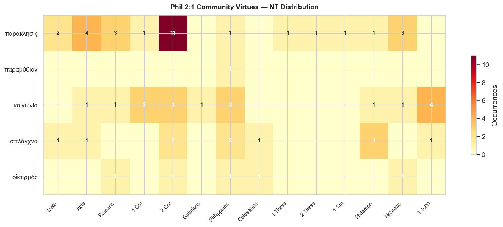
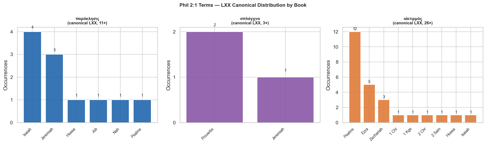

# Phil 2:1 — Community Virtues Word Study

**Anchor text:** Philippians 2:1 (KJV) — *"If there be therefore any consolation in Christ, if any comfort of love, if any fellowship of the Spirit, if any bowels and mercies"*

**Greek text:**
> Εἴ τις οὖν **παράκλησις** ἐν Χριστῷ, εἴ τι **παραμύθιον** ἀγάπης, εἴ τις **κοινωνία** πνεύματος, εἴ τις **σπλάγχνα** καὶ **οἰκτιρμοί**

**Corpora:** NT Greek (TAGNT) · LXX Greek · Biblical Hebrew (TAHOT)

## Contents

- [Overview](#overview)
- [Key Observations](#key-observations)
- [παράκλησις — consolation](#παράκλησις)
- [παραμύθιον — comfort](#παραμύθιον)
- [κοινωνία — fellowship](#κοινωνία)
- [σπλάγχνα — bowels](#σπλάγχνα)
- [οἰκτιρμός — mercy](#οἰκτιρμός)
- [Distribution Charts](#distribution-charts)
- [Cross-Term Connections](#cross-term-connections)
- [Summary Table](#summary-table)

---

## Overview

Philippians 2:1 opens with a rhetorical masterpiece: four conditional clauses, each beginning εἴ τις/τι ("if there is any…"). Paul is not expressing doubt — he is employing a *conditional of certainty* to draw out the consequences of what the Philippians already possess. The structure is: *"Since all of these things are true of you — and they are — then let your community life reflect it."*

The verse names five nouns across the four clauses:

| Clause | Greek | KJV | Paul's qualifier |
|---|---|---|---|
| 1 | παράκλησις | consolation | ἐν Χριστῷ (in Christ) |
| 2 | παραμύθιον | comfort | ἀγάπης (of love) |
| 3 | κοινωνία | fellowship | πνεύματος (of the Spirit) |
| 4a | σπλάγχνα | bowels | — (paired with οἰκτιρμοί) |
| 4b | οἰκτιρμοί | mercies | — (paired with σπλάγχνα) |

Each term is anchored to a source: the first three have explicitly theological genitives (Christ, love, Spirit); the fourth pair stands alone — the bare visceral reality of compassionate mercy.

---

## Key Observations

- **παράκλησις (29 NT occurrences) is Paul's dominant comfort term**, concentrated in 2 Corinthians (11×) where he develops a full theology of suffering and consolation. Its pairing with ἐν Χριστῷ grounds all community encouragement in union with the risen Lord.

- **παραμύθιον is a NT hapax** — appearing only here. Its rareness is likely deliberate: Paul reaches for an intimate, non-technical word for the gentle comfort that love alone provides, distinct from the more "official" encouragement of παράκλησις.

- **κοινωνία (18 NT occurrences) carries both vertical and horizontal dimensions**: participation *in* Christ/Spirit (vertical, Phil 2:1; 1 Cor 1:9) and the shared common life of the community (horizontal, Acts 2:42). The Phil 2:1 qualifier πνεύματος links community to its divine source — fellowship is possible only because the Spirit creates it.

- **σπλάγχνα and οἰκτιρμοί are paired here and in Col 3:12**, suggesting this was a fixed Pauline dyad for "deeply felt compassion." Both words are also used of God (2 Cor 1:3; Luke 1:78), making the community's compassion a reflection of the divine character.

- **The Hebrew backgrounds reveal the depth of the imagery**: נָחַם (comfort), רַחֲמִים (womb-love), and חֶסֶד (covenant loyalty) are among the most theologically rich OT terms — all pointing to God's character as the ultimate ground for human community.

---

## παράκλησις

**Strongs:** G3874  
**Transliteration:** paraklēsis  
**Gloss:** consolation, exhortation, encouragement  
**Phil 2:1 KJV:** "consolation"  
**Phil 2:1 position:** Clause 1  
**NT occurrences:** 29  
**LXX canonical:** 11

**NT distribution:**  
2 Cor (11), Acts (4), Hebrews (3), Romans (3), Luke (2), 1 Cor (1), 1 Thess (1), 1 Tim (1), 2 Thess (1), Philemon (1), Philippians (1)

---

### Etymology and Semantic Range

From παρακαλέω (παρά + καλέω, "call alongside"). The noun covers a broad range: urgent appeal/exhortation, comfort in distress, and encouragement. The same root produces παράκλητος (the Paraclete/Advocate, John 14:16).

In the NT παράκλησις carries two primary senses that overlap: (1) *exhortation* — earnest appeal or urging toward action (Acts 13:15; 1 Tim 4:13; Heb 12:5); (2) *consolation/comfort* — the encouragement given to the suffering (2 Cor 1:3–7, where it appears 10 times in five verses; Luke 2:25 — Simeon awaiting "the consolation of Israel"). Paul's usage in Phil 2:1 ("consolation in Christ") leans toward the comfort-sense: *if the believer has experienced any encouragement that comes from being in Christ*.

---

### OT / LXX Background

The LXX uses παράκλησις 11 times in canonical books, primarily rendering Hebrew **נֶחָמָה/תַּנְחוּמִים** — derivatives of נָחַם (H5162, 108× OT), the core OT word for divine or human comfort. Isa 40:1 ("Comfort, comfort my people") uses the verb נָחַם; the LXX uses παρακαλέω. The noun appears in Isa 66:11 (LXX παράκλησις for תַּנְחוּמִים). Isa 57:18 and Jer 16:7 are key LXX occurrences. The Psalms of consolation (Ps 94 MT) and the "Book of Comfort" (Jer 30–31) supply the OT background for this vocabulary.

| Hebrew root | Transliteration | Gloss | OT occurrences |
|---|---|---|---:|
| H5162 | נָחַם | to comfort, console; Niphal = be comforted | 108 |
| H8575 | תַּנְחוּמִים | consolations, comforts (pl noun) | 5 |
| H5165 | נֶחָמָה | comfort, consolation (noun) | 2 |

**LXX canonical distribution:** Isaiah (4), Jeremiah (3), Hosea (1), Job (1), Nah (1), Psalms (1)

---

### Theological Note

Paul places παράκλησις first — and qualifies it "in Christ" (ἐν Χριστῷ). The consolation is not generic; it is the specific encouragement that flows from union with the risen Lord. The πάρα- prefix ("alongside") is significant: this is comfort that comes *to* someone in their need, not merely an abstract quality. Cf. 2 Cor 1:3–7, where Paul constructs a whole theology of suffering and comfort around this word group: God is the "Father of mercies and God of all παράκλησις," who comforts us so that we may comfort others.

---

### NT Occurrences (KJV)

| Reference | KJV text |
|---|---|
| 1 Cor 14:3 | But he that prophesieth speaketh unto men to edification, and exhortation, and comfort. |
| 1 Thess 2:3 | For our exhortation was not of deceit, nor of uncleanness, nor in guile: |
| 1 Tim 4:13 | Till I come, give attendance to reading, to exhortation, to doctrine. |
| 2 Cor 1:3 | Blessed be God, even the Father of our Lord Jesus Christ, the Father of mercies, and the God of all comfort; |
| 2 Cor 1:4 | Who comforteth us in all our tribulation, that we may be able to comfort them which are in any trouble, by the comfort w… |
| 2 Cor 1:5 | For as the sufferings of Christ abound in us, so our consolation also aboundeth by Christ. |
| 2 Cor 1:6 | And whether we be afflicted, it is for your consolation and salvation, which is effectual in the enduring of the same su… |
| 2 Cor 1:7 | And our hope of you is stedfast, knowing, that as ye are partakers of the sufferings, so shall ye be also of the consola… |
| 2 Cor 7:4 | Great is my boldness of speech toward you, great is my glorying of you: I am filled with comfort, I am exceeding joyful … |
| 2 Cor 7:7 | And not by his coming only, but by the consolation wherewith he was comforted in you, when he told us your earnest desir… |
| 2 Cor 7:13 | Therefore we were comforted in your comfort: yea, and exceedingly the more joyed we for the joy of Titus, because his sp… |
| 2 Cor 8:4 | Praying us with much intreaty that we would receive the gift, and take upon us the fellowship of the ministering to the … |
| 2 Cor 8:17 | For indeed he accepted the exhortation; but being more forward, of his own accord he went unto you. |
| 2 Thess 2:16 | Now our Lord Jesus Christ himself, and God, even our Father, which hath loved us, and hath given us everlasting consolat… |
| Acts 4:36 | And Joses, who by the apostles was surnamed Barnabas, (which is, being interpreted, The son of consolation,) a Levite, a… |
| Acts 9:31 | Then had the churches rest throughout all Judea and Galilee and Samaria, and were edified; and walking in the fear of th… |
| Acts 13:15 | And after the reading of the law and the prophets the rulers of the synagogue sent unto them, saying, Ye men and brethre… |
| Acts 15:31 | Which when they had read, they rejoiced for the consolation. |
| Hebrews 6:18 | That by two immutable things, in which it was impossible for God to lie, we might have a strong consolation, who have fl… |
| Hebrews 12:5 | And ye have forgotten the exhortation which speaketh unto you as unto children, My son, despise not thou the chastening … |
| Hebrews 13:22 | And I beseech you, brethren, suffer the word of exhortation: for I have written a letter unto you in few words. |
| Luke 2:25 | And, behold, there was a man in Jerusalem, whose name was Simeon; and the same man was just and devout, waiting for the … |
| Luke 6:24 | But woe unto you that are rich! for ye have received your consolation. |
| Philemon 1:7 | For we have great joy and consolation in thy love, because the bowels of the saints are refreshed by thee, brother. |
| Philippians 2:1 | If there be therefore any consolation in Christ, if any comfort of love, if any fellowship of the Spirit, if any bowels … |
| Romans 12:8 | Or he that exhorteth, on exhortation: he that giveth, let him do it with simplicity; he that ruleth, with diligence; he … |
| Romans 15:4 | For whatsoever things were written aforetime were written for our learning, that we through patience and comfort of the … |
| Romans 15:5 | Now the God of patience and consolation grant you to be likeminded one toward another according to Christ Jesus: |

---

## παραμύθιον

**Strongs:** G3890  
**Transliteration:** paramythion  
**Gloss:** comfort, consolation, encouragement  
**Phil 2:1 KJV:** "comfort"  
**Phil 2:1 position:** Clause 2  
**NT occurrences:** 1  
**LXX canonical:** 0

**NT distribution:**  
Philippians (1)

---

### Etymology and Semantic Range

From παραμυθέομαι (παρά + μῦθος, "speak alongside, address gently"). The word denotes warm, gentle consolation — comfort that comes through personal address and presence rather than theological declaration. It is softer and more intimate than παράκλησις.

παραμύθιον is extremely rare: this is its **only NT occurrence**. The related verb παραμυθέομαι appears 4× (John 11:19, 31; 1 Thess 2:11; 1 Thess 5:14), always in contexts of personal consolation to the bereaved or discouraged. Paul pairs it with ἀγάπης (genitive: "comfort of love") — the consolation that love gives, or perhaps the consolation that only love can give. The pairing contrasts with the preceding clause: παράκλησις is "in Christ" (objective, positional); παραμύθιον is "of love" (relational, interpersonal).

---

### OT / LXX Background

παραμύθιον has no canonical LXX occurrences. The related verb παραμυθέομαι appears occasionally in the LXX deuterocanon (e.g., Job 2:11 in some traditions), but the noun itself is essentially a NT coinage. The concept is covered in Hebrew by נָחַם (H5162) and נִחוּם (H5150, "comfort/compassion"). The intimacy implied by the Greek word finds its Hebrew parallel in the consolation scenes of Ruth, Lamentations, and Job's comforters — the human act of sitting with and speaking to the suffering (Job 2:11).

| Hebrew root | Transliteration | Gloss | OT occurrences |
|---|---|---|---:|
| H5162 | נָחַם | to comfort, console (primary root) | 108 |
| H5150 | נִחוּם | comfort, compassion (noun) | 3 |

---

### Theological Note

The hapax nature of παραμύθιον is significant. Paul reaches for a word that appears nowhere else in the NT to name a quality of community life that is almost impossible to legislate: the gentle, love-motivated consolation that believers bring to one another simply by being present and speaking words of warmth. Alongside the churchly/liturgical resonance of παράκλησις, παραμύθιον names the small, private, relational comfort — the word of a friend, not a sermon.

---

### NT Occurrences (KJV)

| Reference | KJV text |
|---|---|
| Philippians 2:1 | If there be therefore any consolation in Christ, if any comfort of love, if any fellowship of the Spirit, if any bowels … |

---

## κοινωνία

**Strongs:** G2842  
**Transliteration:** koinōnia  
**Gloss:** fellowship, participation, sharing, communion  
**Phil 2:1 KJV:** "fellowship"  
**Phil 2:1 position:** Clause 3  
**NT occurrences:** 18  
**LXX canonical:** 1

**NT distribution:**  
1 John (4), 1 Cor (3), 2 Cor (3), Philippians (3), Acts (1), Galatians (1), Hebrews (1), Philemon (1), Romans (1)

---

### Etymology and Semantic Range

From κοινωνός (sharer, partner) → κοινός (common, shared). The word-group covers everything held or experienced in common: financial partnership (Phil 4:15), participation in sacraments (1 Cor 10:16), the church's common life (Acts 2:42), and shared suffering or ministry (Phil 3:10; Phm 6).

κοινωνία is one of Paul's most theologically dense terms. Its 18 NT occurrences cluster in Paul (especially 2 Cor and Phil) and 1 John. The full semantic range: (1) *participation in* something — "fellowship of his Son" (1 Cor 1:9), "fellowship of the Spirit" (Phil 2:1), "fellowship of his sufferings" (Phil 3:10); (2) *contribution/sharing of resources* — "contribution for the poor saints" (Rom 15:26); (3) *ecclesial community* — "they continued in the fellowship" (Acts 2:42); (4) *sacramental participation* — "communion of the blood/body of Christ" (1 Cor 10:16). In Phil 2:1 the genitive πνεύματος is ambiguous: "fellowship *with* the Spirit" (subjective) or "fellowship *produced by* the Spirit" (source).

---

### OT / LXX Background

κοινωνία has minimal LXX presence (1 canonical occurrence, Lev 14:37 in a technical sense). The concept is largely Hellenistic — the Greek business and philosophical vocabulary of partnership (κοινωνός = business partner). In Hebrew the nearest concepts are expressed through: חָבַר (H2266, "join/associate," 29× OT — Ps 94:20 "partnership with wickedness") and יַחַד (H3162, "togetherness/unity"). The OT develops the *content* of covenant community without a single term for it: Israel's shared life before YHWH, expressed in the cult, Sabbath, and covenant meals.

| Hebrew root | Transliteration | Gloss | OT occurrences |
|---|---|---|---:|
| H2266 | חָבַר | to join, associate; partner (noun חָבֵר) | 29 |
| H3162 | יַחַד | togetherness, unity, all together | 141 |

**LXX canonical distribution:** Leviticus (1)

---

### Theological Note

κοινωνία in Paul is never mere social togetherness. It is always grounded in a shared *object* — the Son, the Spirit, the gospel, suffering, or sacrament. The phrase "fellowship of the Spirit" (Phil 2:1) became foundational for trinitarian liturgy: 2 Cor 13:14 pairs "the grace of the Lord Jesus Christ, the love of God, and the fellowship of the Holy Spirit" — possibly the earliest triadic benediction in the NT. This gives the term in Phil 2:1 its weight: Paul is not merely asking whether the Philippians have experienced religious community, but whether they have truly participated in the Spirit who makes such community possible.

---

### NT Occurrences (KJV)

| Reference | KJV text |
|---|---|
| 1 Cor 1:9 | God is faithful, by whom ye were called unto the fellowship of his Son Jesus Christ our Lord. |
| 1 Cor 10:16 | The cup of blessing which we bless, is it not the communion of the blood of Christ? The bread which we break, is it not … |
| 1 John 1:3 | That which we have seen and heard declare we unto you, that ye also may have fellowship with us: and truly our fellowshi… |
| 1 John 1:6 | If we say that we have fellowship with him, and walk in darkness, we lie, and do not the truth: |
| 1 John 1:7 | But if we walk in the light, as he is in the light, we have fellowship one with another, and the blood of Jesus Christ h… |
| 2 Cor 6:14 | Be ye not unequally yoked together with unbelievers: for what fellowship hath righteousness with unrighteousness? and wh… |
| 2 Cor 8:4 | Praying us with much intreaty that we would receive the gift, and take upon us the fellowship of the ministering to the … |
| 2 Cor 9:13 | Whiles by the experiment of this ministration they glorify God for your professed subjection unto the gospel of Christ, … |
| Acts 2:42 | And they continued stedfastly in the apostles’ doctrine and fellowship, and in breaking of bread, and in prayers. |
| Galatians 2:9 | And when James, Cephas, and John, who seemed to be pillars, perceived the grace that was given unto me, they gave to me … |
| Hebrews 13:16 | But to do good and to communicate forget not: for with such sacrifices God is well pleased. |
| Philemon 1:6 | That the communication of thy faith may become effectual by the acknowledging of every good thing which is in you in Chr… |
| Philippians 1:5 | For your fellowship in the gospel from the first day until now; |
| Philippians 2:1 | If there be therefore any consolation in Christ, if any comfort of love, if any fellowship of the Spirit, if any bowels … |
| Philippians 3:10 | That I may know him, and the power of his resurrection, and the fellowship of his sufferings, being made conformable unt… |
| Romans 15:26 | For it hath pleased them of Macedonia and Achaia to make a certain contribution for the poor saints which are at Jerusal… |

---

## σπλάγχνα

**Strongs:** G4698  
**Transliteration:** splanchna  
**Gloss:** bowels, tender mercies, deep compassion (pl)  
**Phil 2:1 KJV:** "bowels"  
**Phil 2:1 position:** Clause 4 (paired with οἰκτιρμοί)  
**NT occurrences:** 11  
**LXX canonical:** 3

**NT distribution:**  
Philemon (3), 2 Cor (2), Philippians (2), 1 John (1), Acts (1), Colossians (1), Luke (1)

---

### Etymology and Semantic Range

Plural of σπλάγχνον (the inward parts, viscera). In the ancient world the viscera — especially the lower abdominal organs — were the seat of the deepest emotions, just as the heart is in modern English. The verb σπλαγχνίζομαι ("to be moved with compassion") is used exclusively of Jesus in the Synoptics (Matt 9:36; 14:14; 15:32; 20:34; Mark 1:41; 6:34; Luke 7:13; 10:33; 15:20).

In the NT σπλάγχνα shifts from anatomical to emotional meaning. It denotes the deepest, most visceral compassion — love felt in the gut. Paul uses it 7× (2 Cor 6:12; 7:15; Php 1:8; 2:1; Col 3:12; Phm 7, 12, 20). In Php 1:8 Paul says he longs for the Philippians "in the σπλάγχνα of Jesus Christ" — the most tender expression in his letters. In Phm 12 Onesimus himself is Paul's σπλάγχνα. In Phil 2:1, paired with οἰκτιρμοί, σπλάγχνα points to the deeply felt, not merely socially expressed, dimension of Christian affection.

---

### OT / LXX Background

The LXX uses σπλάγχνα sparingly in canonical books (3 occurrences: Prov 12:10; 26:22; Jer 31:20). The Hebrew background is רַחֲמִים (H7356, "mercy/womb-love," 45×) and the verb רָחַם (H7355, "to show mercy/love tenderly," 47×). Both derive from the root רֶחֶם (womb) — making the anatomical dimension explicit in Hebrew as well: God's mercy is womb-love, the love of a mother for the child she bore (cf. Isa 49:15). LXX more often renders רַחֲמִים with ἔλεος or οἰκτιρμός; σπλάγχνα is the more vivid Greek equivalent of the physical feeling implied by the Hebrew root.

| Hebrew root | Transliteration | Gloss | OT occurrences |
|---|---|---|---:|
| H7356 | רַחֲמִים | mercy, tender love, womb-compassion (pl) | 45 |
| H7355 | רָחַם | to show mercy, have compassion; related to רֶחֶם (womb) | 47 |

**LXX canonical distribution:** Proverbs (2), Jeremiah (1)

---

### Theological Note

The NT's use of σπλαγχνίζομαι exclusively for Jesus' compassion (never for human compassion in the Synoptics) and Paul's use of σπλάγχνα to describe both Christ's affection (Phil 1:8) and the community's desired affection (Phil 2:1; Col 3:12) creates a striking connection: believers are called to embody the very gut-level compassion that characterizes Jesus. Col 3:12 makes this explicit: "Put on, as God's chosen ones, σπλάγχνα οἰκτιρμοῦ" — the same pairing as Phil 2:1, presented there as a christological imperative.

---

### NT Occurrences (KJV)

| Reference | KJV text |
|---|---|
| 1 John 3:17 | But whoso hath this world’s good, and seeth his brother have need, and shutteth up his bowels of compassion from him, ho… |
| 2 Cor 6:12 | Ye are not straitened in us, but ye are straitened in your own bowels. |
| 2 Cor 7:15 | And his inward affection is more abundant toward you, whilst he remembereth the obedience of you all, how with fear and … |
| Acts 1:18 | Now this man purchased a field with the reward of iniquity; and falling headlong, he burst asunder in the midst, and all… |
| Colossians 3:12 | Put on therefore, as the elect of God, holy and beloved, bowels of mercies, kindness, humbleness of mind, meekness, long… |
| Luke 1:78 | Through the tender mercy of our God; whereby the dayspring from on high hath visited us, |
| Philemon 1:7 | For we have great joy and consolation in thy love, because the bowels of the saints are refreshed by thee, brother. |
| Philemon 1:12 | Whom I have sent again: thou therefore receive him, that is, mine own bowels: |
| Philemon 1:20 | Yea, brother, let me have joy of thee in the Lord: refresh my bowels in the Lord. |
| Philippians 1:8 | For God is my record, how greatly I long after you all in the bowels of Jesus Christ. |
| Philippians 2:1 | If there be therefore any consolation in Christ, if any comfort of love, if any fellowship of the Spirit, if any bowels … |

---

## οἰκτιρμός

**Strongs:** G3628  
**Transliteration:** oiktirmos  
**Gloss:** mercy, compassion, pity (often plural)  
**Phil 2:1 KJV:** "mercies"  
**Phil 2:1 position:** Clause 4 (paired with σπλάγχνα)  
**NT occurrences:** 5  
**LXX canonical:** 26

**NT distribution:**  
2 Cor (1), Colossians (1), Hebrews (1), Philippians (1), Romans (1)

---

### Etymology and Semantic Range

From οἰκτίρω ("to pity, feel compassion"), related to οἶκτος ("pity, compassion for suffering"). The word denotes the outward movement of compassion — pity that responds to visible suffering. It often appears in plural (οἰκτιρμοί) in the LXX and NT, matching the Hebrew tendency to use רַחֲמִים in plural.

οἰκτιρμός appears 5× in the NT, always in contexts emphasizing God's character as the ground for human behavior: Rom 12:1 ("by the mercies of God … present your bodies"); 2 Cor 1:3 ("Father of mercies and God of all comfort"); Phil 2:1 (paired with σπλάγχνα); Col 3:12 ("Put on σπλάγχνα οἰκτιρμοῦ"); Heb 10:28 (mercy withheld under Moses' law). The LXX has 26 canonical occurrences, concentrated in Psalms (12×) where it renders Hebrew רַחֲמִים and חֶסֶד — God's covenant love and tender compassion toward Israel.

---

### OT / LXX Background

The LXX uses οἰκτιρμός to render primarily רַחֲמִים (H7356) and occasionally חֶסֶד (H2617, 247× OT). The distinction matters: חֶסֶד is covenantal loyalty/steadfast love (translated ἔλεος, "mercy/lovingkindness" in the LXX); רַחֲמִים is visceral, womb-love compassion. Ps 25:6 LXX: "Remember, O LORD, your οἰκτιρμοί and your ἔλεος." Ps 51:1 LXX: "Have mercy on me, O God, according to your ἔλεος; according to the fullness of your οἰκτιρμῶν, blot out my transgressions." The pairing is standard: covenant loyalty (חֶסֶד/ἔλεος) + compassionate mercy (רַחֲמִים/οἰκτιρμός).

| Hebrew root | Transliteration | Gloss | OT occurrences |
|---|---|---|---:|
| H7356 | רַחֲמִים | mercy, compassion (pl of רֶחֶם, womb) | 45 |
| H2617 | חֶסֶד | steadfast love, covenant loyalty (LXX ἔλεος) | 247 |

**LXX canonical distribution:** Psalms (12), Ezra (5), Zechariah (3), 1 Chr (1), 1 Kgs (1), 2 Chr (1), 2 Sam (1), Hosea (1), Isaiah (1)

---

### Theological Note

2 Cor 1:3 is the key theological location: Paul calls God "the Father of οἰκτιρμοί and God of all παράκλησις." This verse ties together two of the four Phil 2:1 terms and grounds them in the divine character. The logic of Phil 2:1 follows: *because* believers have experienced God's compassionate mercy (οἰκτιρμοί), they are now called to embody it toward one another. Col 3:12 makes this explicit as christological imperative: "clothe yourselves with σπλάγχνα οἰκτιρμοῦ" — the compassion that is as visceral as the inner organs, as outward-moving as pity. Both words together capture the full range: felt deeply (σπλάγχνα) and expressed actively (οἰκτιρμός).

---

### NT Occurrences (KJV)

| Reference | KJV text |
|---|---|
| 2 Cor 1:3 | Blessed be God, even the Father of our Lord Jesus Christ, the Father of mercies, and the God of all comfort; |
| Colossians 3:12 | Put on therefore, as the elect of God, holy and beloved, bowels of mercies, kindness, humbleness of mind, meekness, long… |
| Hebrews 10:28 | He that despised Moses’ law died without mercy under two or three witnesses: |
| Philippians 2:1 | If there be therefore any consolation in Christ, if any comfort of love, if any fellowship of the Spirit, if any bowels … |
| Romans 12:1 | I beseech you therefore, brethren, by the mercies of God, that ye present your bodies a living sacrifice, holy, acceptab… |

---

## Distribution Charts

---

## Cross-Term Connections

### The σπλάγχνα + οἰκτιρμοί Dyad

These two terms appear together in both Phil 2:1 and Col 3:12 ("σπλάγχνα οἰκτιρμοῦ, kindness, humility…"). The pairing is likely a fixed Pauline formula for the complete expression of compassion: felt viscerally (σπλάγχνα) and expressed outwardly toward others (οἰκτιρμός). 2 Cor 1:3 titles God as "Father of mercies (οἰκτιρμῶν) and God of all comfort (παράκλησις)," linking two of the five Phil 2:1 terms in a divine epithet.

### The Triadic Structure of Clauses 1–3

The qualifiers reveal a Pauline triad: *in Christ* (παράκλησις) · *of love* (παραμύθιον) · *of the Spirit* (κοινωνία). This is not a formal trinitarian formula, but it anticipates the structure of 2 Cor 13:14 ("grace of the Lord Jesus Christ, love of God, fellowship of the Holy Spirit") — suggesting that for Paul the resources of community life are inseparably christological, agapic, and pneumatological.

### Paul and Philippians

Four of the five terms recur elsewhere in Philippians itself:

| Term | Other Phil reference |
|---|---|
| παράκλησις | Phil 2:1 only in Phil |
| κοινωνία | Phil 1:5; 3:10; 4:15 (3× more in Phil) |
| σπλάγχνα | Phil 1:8 ("σπλάγχνα of Jesus Christ") |
| οἰκτιρμός | Phil 2:1 only in Phil |

---

## Summary Table

| Term | Strongs | NT | LXX (canonical) | Hebrew background | Phil 2:1 qualifier |
|---|---|---:|---:|---|---|
| παράκλησις | G3874 | 29 | 11 | H5162 נָחַם; H8575 תַּנְחוּמִים; H5165 נֶחָמָה | ἐν Χριστῷ |
| παραμύθιον | G3890 | 1 | 0 | H5162 נָחַם; H5150 נִחוּם | ἀγάπης |
| κοινωνία | G2842 | 18 | 1 | H2266 חָבַר; H3162 יַחַד | πνεύματος |
| σπλάγχνα | G4698 | 11 | 3 | H7356 רַחֲמִים; H7355 רָחַם | — (paired w/ οἰκτιρμοί) |
| οἰκτιρμός | G3628 | 5 | 26 | H7356 רַחֲמִים; H2617 חֶסֶד | — (paired w/ σπλάγχνα) |

---

*Greek NT data: TAGNT (Byzantine/Textus Receptus, STEPBible CC BY 4.0).*  
*LXX data: CenterBLC LXX (CC BY 4.0).*  
*Hebrew data: TAHOT (STEPBible CC BY 4.0).*  
*Generated by [scripts/nt/lexicon/build_phil2_community_virtues.py](../../../../scripts/nt/lexicon/build_phil2_community_virtues.py).*