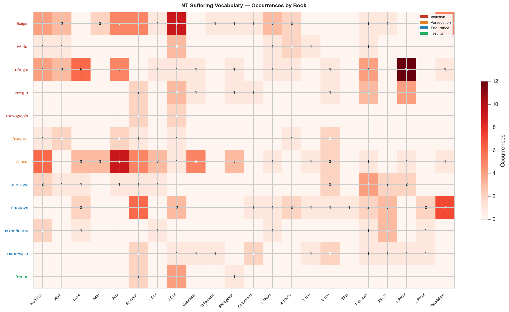
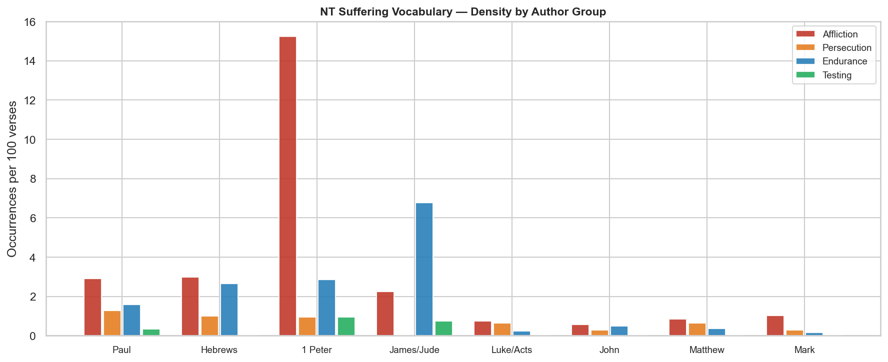

# Suffering in the Life of the Believer — NT Word Study

**Corpus:** Greek NT (TAGNT, Byzantine/Textus Receptus)  
**Translation:** KJV

## Contents

- [Overview](#overview)
- [Key Observations](#key-observations)
- [Vocabulary of Suffering](#vocabulary-of-suffering)
  - [θλῖψις — Tribulation and Affliction](#θλῖψις--tribulation-and-affliction)
  - [πάσχω / πάθημα — To Suffer / Suffering](#πάσχω--πάθημα--to-suffer--suffering)
  - [διωγμός / διώκω — Persecution](#διωγμός--διώκω--persecution)
  - [ὑπομονή / ὑπομένω — Endurance](#ὑπομονή--ὑπομένω--endurance)
  - [πειρασμός / δοκιμή — Trial and Proven Character](#πειρασμός--δοκιμή--trial-and-proven-character)
- [Christ as the Pattern and Ground of Suffering](#christ-as-the-pattern-and-ground-of-suffering)
- [Suffering as Participation in Christ](#suffering-as-participation-in-christ)
- [The Purpose of Suffering in the NT](#the-purpose-of-suffering-in-the-nt)
- [Key Passages by Author](#key-passages-by-author)
- [Distribution Charts](#distribution-charts)
- [Summary Table](#summary-table)

---

## Overview

The NT does not treat suffering as an anomaly in the Christian life but as an expected, even appointed, feature of it. Four interlocking themes organize the NT's teaching:

1. **Christ's own sufferings were divinely ordained** — the servant of Isa 53 who was "bruised for our iniquities," the Son who "learned obedience by the things which he suffered" (Heb 5:8).
2. **Believers are called into a pattern of suffering that mirrors Christ's own** — "if we suffer with him, that we may be also glorified together" (Rom 8:17).
3. **Suffering is purposive, not punitive** — it produces endurance, proven character, and hope (Rom 5:3–4); it conforms believers to Christ (Phil 3:10); it glorifies God (1 Pet 4:16).
4. **The suffering of the present age stands in deliberate contrast to the coming glory** — "the sufferings of this present time are not worth comparing with the glory which shall be revealed" (Rom 8:18).

---

## Key Observations

- **θλῖψις (44 NT occurrences)** is the dominant noun for affliction. It literally means "pressure" or "crushing." The term covers external opposition (persecution, hardship) and internal distress. Jesus himself predicts it as the normal lot of his disciples (John 16:33: "In the world ye shall have tribulation").

- **πάσχω (42 occurrences)** is distributed almost equally between Christ's own sufferings and those of believers — a deliberate lexical link. In 1 Peter πάσχω appears 12 times, more than any other NT book, and almost always Christ's suffering serves as the explicit ground or pattern for the believer's.

- **πάθημα (16 occurrences)** appears in two key Pauline texts that explicitly connect the believer's sufferings with Christ's: Rom 8:18 ("the sufferings of this present time") and 2 Cor 1:5 ("as the sufferings of Christ abound in us").

- **ὑπομονή (32 occurrences)** is the characteristic NT response to suffering — active, purposeful endurance rather than passive resignation. It appears in every major author who addresses suffering: Paul, James, Peter, Hebrews, and Revelation.

- **The suffering–glory axis** (e.g. Rom 8:17–18; 1 Pet 5:10; 2 Cor 4:17; Rev 7:14) is the most consistent structural feature of NT suffering theology. The same pattern appears in Christ himself: "the sufferings of Christ and the glory that should follow" (1 Pet 1:11).

- **1 Peter and 2 Corinthians** are the two densest loci of NT suffering theology. 1 Peter addresses communities under social ostracism and possible state persecution; 2 Corinthians is Paul's most autobiographical account of apostolic suffering as evidence of divine power.

---

## Vocabulary of Suffering

### θλῖψις — Tribulation and Affliction

**G2347 θλῖψις, -εως, ἡ** | 44 NT occurrences

The root meaning is physical pressure or constriction (from θλίβω, to press). In the NT it is the primary word for the affliction that characterizes life in a fallen age. It is never accidental — Jesus promises it (John 16:33), Paul says "we must through much tribulation enter into the kingdom of God" (Acts 14:22), and the Thessalonian letters treat it as the appointed lot of the called (1 Thess 3:3–4).

**Distribution by book:**

| Book | Count |
|---|---:|
| 2 Cor | 9 |
| Acts | 5 |
| Revelation | 5 |
| Romans | 5 |
| Matthew | 4 |
| 1 Thess | 3 |
| Mark | 3 |
| 2 Thess | 2 |
| John | 2 |
| 1 Cor | 1 |
| Colossians | 1 |
| Ephesians | 1 |
| Hebrews | 1 |
| James | 1 |
| Philippians | 1 |

**Key texts:**

| Reference | KJV |
|---|---|
| John 16:33 | These things I have spoken unto you, that in me ye might have peace. In the world ye shall have tribulation: but be of g… |
| Acts 14:22 | Confirming the souls of the disciples, and exhorting them to continue in the faith, and that we must through much tribul… |
| Romans 5:3 | And not only so, but we glory in tribulations also: knowing that tribulation worketh patience; |
| Romans 8:35 | Who shall separate us from the love of Christ? shall tribulation, or distress, or persecution, or famine, or nakedness, … |
| 2 Cor 1:4 | Who comforteth us in all our tribulation, that we may be able to comfort them which are in any trouble, by the comfort w… |
| 1 Thess 3:3 | That no man should be moved by these afflictions: for yourselves know that we are appointed thereunto. |
| Revelation 7:14 | And I said unto him, Sir, thou knowest. And he said to me, These are they which came out of great tribulation, and have … |

---

### πάσχω / πάθημα — To Suffer / Suffering

**G3958 πάσχω** (verb) | 42 NT occurrences  
**G3804 πάθημα, -ατος, τό** (noun) | 16 NT occurrences

πάσχω means to experience or undergo something — usually painful. What is theologically significant is how the NT **distributes** its usage: roughly half the occurrences refer to Christ's own sufferings, and half to believers'. This is not coincidental. Peter explicitly structures his argument on the pattern: Christ suffered → you will suffer → suffer as he suffered (1 Pet 2:21–23; 3:17–18; 4:1).

πάθημα (the noun) is especially important in Paul. In 2 Cor 1:5 he speaks of "the sufferings of Christ" (παθήματα τοῦ Χριστοῦ) overflowing into the apostle — a sharing in the ongoing significance of Christ's suffering-pattern, not a supplement to the atonement.

**Key texts:**

| Reference | KJV |
|---|---|
| Luke 24:26 | Ought not Christ to have suffered these things, and to enter into his glory? |
| Acts 17:3 | Opening and alleging, that Christ must needs have suffered, and risen again from the dead; and that this Jesus, whom I p… |
| Romans 8:17 | And if children, then heirs; heirs of God, and joint-heirs with Christ; if so be that we suffer with him, that we may be… |
| 2 Cor 1:5 | For as the sufferings of Christ abound in us, so our consolation also aboundeth by Christ. |
| Philippians 1:29 | For unto you it is given in the behalf of Christ, not only to believe on him, but also to suffer for his sake; |
| Philippians 3:10 | That I may know him, and the power of his resurrection, and the fellowship of his sufferings, being made conformable unt… |
| 1 Peter 2:21 | For even hereunto were ye called: because Christ also suffered for us, leaving us an example, that ye should follow his … |
| 1 Peter 4:1 | Forasmuch then as Christ hath suffered for us in the flesh, arm yourselves likewise with the same mind: for he that hath… |
| Hebrews 5:8 | Though he were a Son, yet learned he obedience by the things which he suffered; |

---

### διωγμός / διώκω — Persecution

**G1375 διωγμός, -οῦ, ὁ** | 10 NT occurrences  
**G1377 διώκω** | 45 NT occurrences

διωγμός refers specifically to active, hostile pursuit — persecution by opponents. Jesus lists it alongside θλῖψις in the parable of the sower (Matt 13:21) as the pressure that causes the word to be abandoned. Paul catalogues his own persecutions in 2 Cor 12:10 and 2 Tim 3:11, and in 2 Tim 3:12 states the broadest principle: "All that will live godly in Christ Jesus shall suffer persecution."

**Key texts:**

| Reference | KJV |
|---|---|
| Matthew 5:10 | Blessed are they which are persecuted for righteousness’ sake: for theirs is the kingdom of heaven. |
| Matthew 13:21 | Yet hath he not root in himself, but dureth for a while: for when tribulation or persecution ariseth because of the word… |
| Romans 8:35 | Who shall separate us from the love of Christ? shall tribulation, or distress, or persecution, or famine, or nakedness, … |
| 2 Cor 12:10 | Therefore I take pleasure in infirmities, in reproaches, in necessities, in persecutions, in distresses for Christ’s sak… |
| 2 Tim 3:12 | Yea, and all that will live godly in Christ Jesus shall suffer persecution. |
| Hebrews 10:33 | Partly, whilst ye were made a gazingstock both by reproaches and afflictions; and partly, whilst ye became companions of… |

---

### ὑπομονή / ὑπομένω — Endurance

**G5281 ὑπομονή, -ῆς, ἡ** | 32 NT occurrences  
**G5278 ὑπομένω** | 17 NT occurrences

ὑπομονή is often translated "patience" in the KJV, but the word carries the force of **active perseverance under pressure** — staying under a load, not running from it. It is distinct from μακροθυμία (patience toward people) and always has a forward, hopeful orientation: "tribulation worketh patience; and patience, experience; and experience, hope" (Rom 5:3–4). The letter of James opens with this logic (Jas 1:3–4), as does Hebrews (Heb 12:1).

| Reference | KJV |
|---|---|
| Romans 5:3 | And not only so, but we glory in tribulations also: knowing that tribulation worketh patience; |
| Romans 5:4 | And patience, experience; and experience, hope: |
| Hebrews 10:36 | For ye have need of patience, that, after ye have done the will of God, ye might receive the promise. |
| Hebrews 12:1 | Wherefore seeing we also are compassed about with so great a cloud of witnesses, let us lay aside every weight, and the … |
| James 1:3 | Knowing this, that the trying of your faith worketh patience. |
| Revelation 13:10 | He that leadeth into captivity shall go into captivity: he that killeth with the sword must be killed with the sword. He… |

---

### πειρασμός / δοκιμή — Trial and Proven Character

**G3986 πειρασμός, -οῦ, ὁ** | 0 NT occurrences  
**G1382 δοκιμή, -ῆς, ἡ** | 7 NT occurrences

πειρασμός covers both temptation (internal moral solicitation) and external trial or testing. In contexts of suffering the focus is the latter: the fire that tests the gold (1 Pet 1:7). The result of endured trial is δοκιμή — proven, tested character. The word is used in metallurgy for metal that has passed the refiner's test. Paul's chain in Rom 5:3–4 (tribulation → endurance → proven character → hope) and James's parallel in Jas 1:3–4 both move from suffering through testing to a productive end.

| Reference | KJV |
|---|---|
| James 1:2 | My brethren, count it all joy when ye fall into divers temptations; |
| James 1:12 | Blessed is the man that endureth temptation: for when he is tried, he shall receive the crown of life, which the Lord ha… |
| 1 Peter 1:6 | Wherein ye greatly rejoice, though now for a season, if need be, ye are in heaviness through manifold temptations: |
| 1 Peter 1:7 | That the trial of your faith, being much more precious than of gold that perisheth, though it be tried with fire, might … |
| Romans 5:4 | And patience, experience; and experience, hope: |
| 2 Cor 8:2 | How that in a great trial of affliction the abundance of their joy and their deep poverty abounded unto the riches of th… |

---

## Christ as the Pattern and Ground of Suffering

The NT is unanimous that Christ's sufferings were not merely biographical events but **divinely ordained** and **theologically constitutive** for what follows. Several texts establish this:

**The necessity of Christ's suffering (ἔδει):**

| Reference | KJV |
|---|---|
| Luke 24:26 | Ought not Christ to have suffered these things, and to enter into his glory? |
| Luke 24:46 | And said unto them, Thus it is written, and thus it behoved Christ to suffer, and to rise from the dead the third day: |
| Acts 17:3 | Opening and alleging, that Christ must needs have suffered, and risen again from the dead; and that this Jesus, whom I p… |
| Acts 3:18 | But those things, which God before had shewed by the mouth of all his prophets, that Christ should suffer, he hath so fu… |
| Hebrews 2:10 | For it became him, for whom are all things, and by whom are all things, in bringing many sons unto glory, to make the ca… |
| Hebrews 5:8 | Though he were a Son, yet learned he obedience by the things which he suffered; |
| 1 Peter 1:11 | Searching what, or what manner of time the Spirit of Christ which was in them did signify, when it testified beforehand … |
| 1 Peter 2:21 | For even hereunto were ye called: because Christ also suffered for us, leaving us an example, that ye should follow his … |

> **Note:** Luke 24:26 ("Ought not Christ to have suffered these things, and to enter into his glory?") uses ἔδει — the imperfect of necessity. This is not regret but divine necessity: the suffering was the appointed path to the glory. The identical structure (suffering → glory) is then applied to believers in Rom 8:17, 1 Pet 5:10, and Rev 7:14.

Hebrews 5:8 makes a remarkable claim: "though he were a Son, yet learned he obedience by the things which he suffered." The sinless Son did not need moral correction; he underwent suffering as the instrument by which full human obedience — the costly, tested kind — was exercised and completed. This establishes why suffering is the path for believers too: it is the same path the Son himself walked.

---

## Suffering as Participation in Christ

Perhaps the NT's most distinctive contribution is the concept of **solidarity in suffering** — the believer's suffering as participation in Christ's own:

| Text | Theme |
|---|---|
| Rom 8:17 | "If we suffer with him (συμπάσχομεν), that we may be also glorified together" |
| 2 Cor 1:5 | "The sufferings of Christ abound in us" (παθήματα τοῦ Χριστοῦ) |
| Phil 3:10 | "The fellowship of his sufferings" (κοινωνία παθημάτων αὐτοῦ) |
| Col 1:24 | "Fill up what is lacking in the afflictions of Christ in my flesh" |
| 1 Pet 4:13 | "Partakers of Christ's sufferings" (κοινωνεῖτε τοῖς τοῦ Χριστοῦ παθήμασιν) |
| Heb 13:13 | "Let us go forth to him outside the camp, bearing his reproach" |

> **Note on Col 1:24:** This is the most frequently misread suffering text. Paul does not say the atonement is incomplete. The "afflictions of Christ" (θλίψεων τοῦ Χριστοῦ) is a distinct phrase from "the sufferings of Christ" in 1 Pet 1:11. Paul's point is that the messianic community's appointed share of eschatological tribulation is something Paul, as apostle to the Gentiles, is filling up on their behalf — a representative role, not a soteriological supplement.

---

## The Purpose of Suffering in the NT

The NT is explicit that God's purposes in the suffering of believers are productive, not merely permissive:

| Purpose | Key Text |
|---|---|
| Produces endurance and proven character | Rom 5:3–4; Jas 1:3–4 |
| Conforms believers to Christ | Rom 8:29; Phil 3:10 |
| Manifests divine power in weakness | 2 Cor 12:9–10; 4:7–12 |
| Trains in holiness | Heb 12:10–11 |
| Prepares eternal weight of glory | 2 Cor 4:17 |
| Glorifies God, causes praise | 1 Pet 4:16; 2 Thess 1:4–5 |
| Witnesses to the truth of the gospel | Phil 1:29; Acts 5:41 |
| Leads to final vindication and glory | 1 Pet 5:10; Rev 7:14–17 |

**The suffering–glory contrast** is the NT's controlling framework: "our light and momentary troubles are achieving for us an eternal glory that far outweighs them all" (2 Cor 4:17, NIV). The KJV's "exceeding and eternal weight of glory" renders βάρος αἰώνιον — an eschatological heaviness that dwarfs the πρόσκαιρον (momentary) affliction.

---

## Key Passages by Author

### Paul

| Reference | KJV |
|---|---|
| Romans 5:3 | And not only so, but we glory in tribulations also: knowing that tribulation worketh patience; |
| Romans 8:17 | And if children, then heirs; heirs of God, and joint-heirs with Christ; if so be that we suffer with him, that we may be… |
| Romans 8:18 | For I reckon that the sufferings of this present time are not worthy to be compared with the glory which shall be reveal… |
| 2 Cor 1:5 | For as the sufferings of Christ abound in us, so our consolation also aboundeth by Christ. |
| 2 Cor 4:17 | For our light affliction, which is but for a moment, worketh for us a far more exceeding and eternal weight of glory; |
| 2 Cor 12:9 | And he said unto me, My grace is sufficient for thee: for my strength is made perfect in weakness. Most gladly therefore… |
| Philippians 1:29 | For unto you it is given in the behalf of Christ, not only to believe on him, but also to suffer for his sake; |
| Philippians 3:10 | That I may know him, and the power of his resurrection, and the fellowship of his sufferings, being made conformable unt… |
| Colossians 1:24 | Who now rejoice in my sufferings for you, and fill up that which is behind of the afflictions of Christ in my flesh for … |
| 2 Tim 3:12 | Yea, and all that will live godly in Christ Jesus shall suffer persecution. |

### Hebrews

| Reference | KJV |
|---|---|
| Hebrews 2:10 | For it became him, for whom are all things, and by whom are all things, in bringing many sons unto glory, to make the ca… |
| Hebrews 5:8 | Though he were a Son, yet learned he obedience by the things which he suffered; |
| Hebrews 10:36 | For ye have need of patience, that, after ye have done the will of God, ye might receive the promise. |
| Hebrews 12:1 | Wherefore seeing we also are compassed about with so great a cloud of witnesses, let us lay aside every weight, and the … |
| Hebrews 12:10 | For they verily for a few days chastened us after their own pleasure; but he for our profit, that we might be partakers … |
| Hebrews 12:11 | Now no chastening for the present seemeth to be joyous, but grievous: nevertheless afterward it yieldeth the peaceable f… |

### 1 Peter

| Reference | KJV |
|---|---|
| 1 Peter 1:6 | Wherein ye greatly rejoice, though now for a season, if need be, ye are in heaviness through manifold temptations: |
| 1 Peter 1:7 | That the trial of your faith, being much more precious than of gold that perisheth, though it be tried with fire, might … |
| 1 Peter 2:21 | For even hereunto were ye called: because Christ also suffered for us, leaving us an example, that ye should follow his … |
| 1 Peter 3:17 | For it is better, if the will of God be so, that ye suffer for well doing, than for evil doing. |
| 1 Peter 4:1 | Forasmuch then as Christ hath suffered for us in the flesh, arm yourselves likewise with the same mind: for he that hath… |
| 1 Peter 4:13 | But rejoice, inasmuch as ye are partakers of Christ’s sufferings; that, when his glory shall be revealed, ye may be glad… |
| 1 Peter 4:16 | Yet if any man suffer as a Christian, let him not be ashamed; but let him glorify God on this behalf. |
| 1 Peter 5:10 | But the God of all grace, who hath called us unto his eternal glory by Christ Jesus, after that ye have suffered a while… |

### James

| Reference | KJV |
|---|---|
| James 1:2 | My brethren, count it all joy when ye fall into divers temptations; |
| James 1:3 | Knowing this, that the trying of your faith worketh patience. |
| James 1:4 | But let patience have her perfect work, that ye may be perfect and entire, wanting nothing. |
| James 1:12 | Blessed is the man that endureth temptation: for when he is tried, he shall receive the crown of life, which the Lord ha… |

---

## Distribution Charts

---

## Summary Table

| Term | Strongs | Occurrences | Gloss | Group |
|---|---|---:|---|---|
| θλῖψις | G2347 | 44 | tribulation, affliction, distress | Affliction |
| θλίβω | G2346 | 10 | to press, afflict, oppress | Affliction |
| πάσχω | G3958 | 42 | to suffer, experience | Affliction |
| πάθημα | G3804 | 16 | suffering, passion (n) | Affliction |
| πάθος | G3806 | 3 | passion, suffering (n) | Affliction |
| στενοχωρία | G4730 | 4 | distress, anguish | Affliction |
| κακοπαθέω | G2553 | 3 | to suffer hardship, endure evil | Affliction |
| κακοπαθής | G2552 | 1 | suffering hardship (adj) | Affliction |
| συγκακοπαθέω | G4777 | 2 | to suffer together, share in hardship | Affliction |
| συμπάσχω | G4841 | 2 | to suffer together with | Affliction |
| διωγμός | G1375 | 10 | persecution | Persecution |
| διώκω | G1377 | 45 | to persecute, pursue | Persecution |
| κακουχέω | G2558 | 2 | to mistreat, torment | Persecution |
| ὑπομένω | G5278 | 17 | to endure, remain under, persevere | Endurance |
| ὑπομονή | G5281 | 32 | endurance, steadfastness, patience | Endurance |
| μακροθυμέω | G3114 | 10 | to be patient, long-suffering | Endurance |
| μακροθυμία | G3115 | 14 | patience, long-suffering, forbearance | Endurance |
| δοκιμή | G1382 | 7 | proven character, proof (from testing) | Testing |
| δοκίμιον | G1383 | 2 | testing, means of proof | Testing |

---

*Greek NT data: TAGNT (Byzantine/Textus Receptus, STEPBible CC BY 4.0).*  
*Generated by [scripts/nt/lexicon/build_suffering_word_study.py](../../../../scripts/nt/lexicon/build_suffering_word_study.py).*