# Greek NT Prepositions — Case Binding Statistics

**Corpus:** Greek New Testament (TAGNT, Byzantine/TR)
**Focus:** Prepositions that govern more than one grammatical case, and the statistical distribution of those cases across the NT

---

## Contents

1. [Overview — All NT Prepositions](#overview-all-nt-prepositions)
2. [Multi-Case Prepositions — Case Distribution Heatmap](#multi-case-prepositions-case-distribution-heatmap)
3. [Detailed Analysis by Preposition](#detailed-analysis-by-preposition)
   - [ἐπί (epi)](#epi-on-upon-over-at-against-on-the-basis-of)
   - [παρά (para)](#para-beside-from-with-contrary-to)
   - [διά (dia)](#dia-through-by-means-of-because-of-on-account-of)
   - [κατά (kata)](#kata-according-to-against-throughout-down-from)
   - [μετά (meta)](#meta-with-association-after-sequence)
   - [περί (peri)](#peri-concerning-about-around-for)
   - [ὑπό (hypo)](#hypo-under-by-agent)
   - [ὑπέρ (hyper)](#hyper-on-behalf-of-above-beyond-more-than)
   - [πρός (pros)](#pros-to-toward-with-against)
   - [ἀνά (ana)](#ana-up-each-among)
4. [Single-Case Prepositions — Reference Table](#single-case-prepositions-reference-table)
5. [Grammar Notes](#grammar-notes)

---

## Key Observations

- **9 of the 18 most common NT prepositions govern multiple cases.**
  Case choice is not free variation — each case activates a distinct   meaning stream for the preposition.
- **ἐπί is the most complex**, using all three oblique cases   (accusative 53 %, genitive 25 %, dative 20 %) with meaningfully   different senses in each.
- **παρά has the most even three-way split**   (genitive 42 %, accusative 31 %, dative 27 %),   making correct case identification especially important for exegesis.
- **διά and μετά have clean binary splits** —   each case maps to a distinct semantic function   (means vs. cause for διά; association vs. sequence for μετά).
- **πρός is effectively single-case in the NT** (98 % accusative),   though it retains rare dative and genitive forms.
- **ὑπέρ + genitive** is the prepositional expression of NT substitutionary   and intercessory theology (e.g. Christ dying "for us").

---

## Overview — All NT Prepositions

Total preposition occurrences in the NT (TAGNT). Multi-case prepositions are marked ✦.

| Preposition | Gloss | NT Count | % of all preps | Cases |
|---|---|---|---|---|
| ✦ἐν | en — in/among | 2,743 | 25.1% | Dative / Genitive |
| ✦εἰς | eis — into/for | 1,766 | 16.2% | Accusative / Genitive |
| ✦ἐκ | ek — out of/from | 913 | 8.4% | Genitive / Accusative |
| ✦ἐπί | on | 886 | 8.1% | Accusative / Genitive / Dative |
| ✦πρός | to | 700 | 6.4% | Accusative / Dative / Genitive |
| ✦διά | through | 667 | 6.1% | Genitive / Accusative |
| ✦ἀπό | apo — from/away from | 647 | 5.9% | Genitive / Nominative |
| ✦κατά | according to | 472 | 4.3% | Accusative / Genitive / Nominative |
| ✦μετά | with (association) | 470 | 4.3% | Genitive / Accusative |
| ✦περί | concerning | 333 | 3.1% | Genitive / Accusative |
| ✦ὑπό | under | 219 | 2.0% | Genitive / Accusative |
| ✦παρά | beside | 192 | 1.8% | Genitive / Accusative / Dative |
| ✦ὑπέρ | on behalf of | 150 | 1.4% | Genitive / Accusative / Nominative |
| σύν | syn — with/together | 128 | 1.2% | Dative |
| ἕως | heos — until/as far as | 108 | 1.0% | Genitive |
| ἐνώπιον | enopion — before/in the presence of | 94 | 0.9% | Genitive |
| πρό | pro — before | 47 | 0.4% | Genitive |
| ἔμπροσθεν | emprosthen — before/in front of | 44 | 0.4% | Genitive |
| ἄχρι | achri — until/as far as | 43 | 0.4% | Genitive |
| ✦χωρίς | choris — apart from/without | 40 | 0.4% | Genitive / Nominative |
| ὀπίσω |  | 26 | 0.2% | Genitive |
| ἕνεκα |  | 26 | 0.2% | Genitive |
| ἀντί |  | 22 | 0.2% | Genitive |
| ἔξω |  | 19 | 0.2% | Genitive |
| ἐπάνω |  | 17 | 0.2% | Genitive |
| μέχρι |  | 16 | 0.1% | Genitive |
| πέραν |  | 13 | 0.1% | Genitive |
| ✦ἀνά | up | 13 | 0.1% | Accusative / Nominative |
| ἐγγύς |  | 13 | 0.1% | Genitive |
| ὑποκάτω |  | 11 | 0.1% | Genitive |

✦ = governs multiple cases

---

## Multi-Case Prepositions — Case Distribution Heatmap

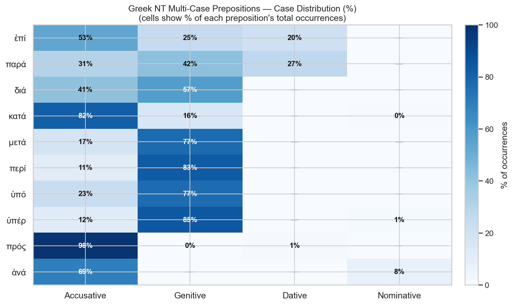

Each cell shows what percentage of that preposition's NT occurrences use that case. Blank (—) = that case is not used or statistically negligible.

---

## Detailed Analysis by Preposition

### ἐπί (epi) — on, upon, over, at, against, on the basis of

**Strong's:** G1909 | **Total NT occurrences:** 873

| Case | Count | % | Meaning with this case |
|---|---|---|---|
| Accusative | 472 | 53.3% | onto, over (motion toward); against; with respect to; for (purpose) |
| Genitive | 220 | 24.8% | on, upon (contact from above); in the time of; before (a judge) |
| Dative | 181 | 20.4% | on, at, near (rest/location); on the basis of; at/in response to |

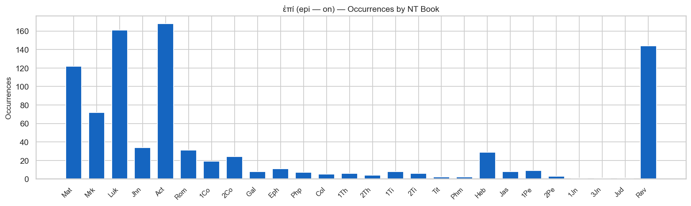

The most complex NT preposition: all three oblique cases occur with distinct meaning streams. Genitive stresses surface contact or temporal setting; dative stresses rest at a location or ground/basis; accusative stresses direction of motion or extent. The overlap is real — context and lexical semantics of the governing verb often determine sense more than case alone.

### παρά (para) — beside, from, with, contrary to

**Strong's:** G3844 | **Total NT occurrences:** 190

| Case | Count | % | Meaning with this case |
|---|---|---|---|
| Genitive | 80 | 41.7% | from (the side of); from the presence/authority of |
| Accusative | 59 | 30.7% | alongside, beside (motion or extent); contrary to; beyond |
| Dative | 51 | 26.6% | beside, in the presence of; with (possession) |

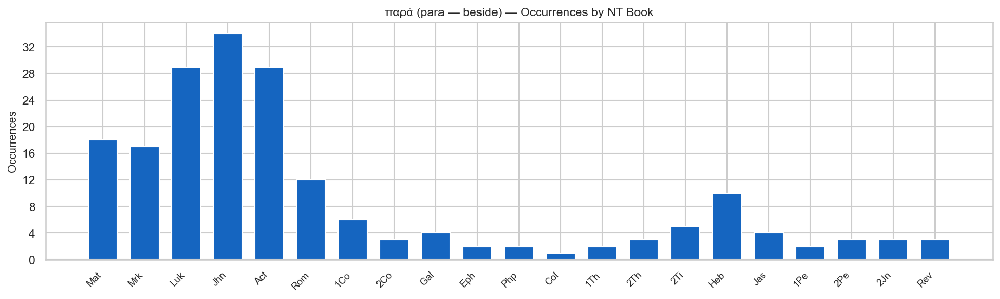

παρά with the genitive expresses source or origin ("from the side of"). The dative is locative ("at the side of", "in the presence of"). The accusative covers motion alongside something or extension beyond it, and in legal/ethical contexts "contrary to" (e.g. Rom 1:26 παρὰ φύσιν, "contrary to nature"). Roughly equal distribution across all three cases makes this the most evenly spread multi-case prep in the NT.

### διά (dia) — through, by means of, because of, on account of

**Strong's:** G1223 | **Total NT occurrences:** 657

| Case | Count | % | Meaning with this case |
|---|---|---|---|
| Genitive | 382 | 57.3% | through (spatial); by means of (agency/instrument); throughout (extent) |
| Accusative | 275 | 41.2% | because of, on account of, for the sake of (cause/reason) |

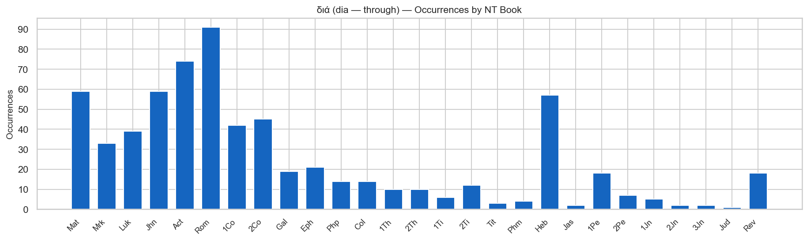

The case split is semantically sharp: genitive = means/channel ("through which something passes"), accusative = cause/reason ("on account of which something happens"). E.g. Eph 2:8 διὰ πίστεως (gen.) = "through faith" (the channel); Rom 4:25 διὰ τὰ παραπτώματα (acc.) = "on account of our trespasses" (cause). Genitive accounts for ~57 % of NT uses, accusative ~41 %.

### κατά (kata) — according to, against, throughout, down from

**Strong's:** G2596 | **Total NT occurrences:** 461

| Case | Count | % | Meaning with this case |
|---|---|---|---|
| Accusative | 386 | 81.8% | according to, in conformity with; throughout (distributive); for, as |
| Genitive | 73 | 15.5% | down from; against (hostile sense); throughout (swearing by) |
| Nominative | 2 | 0.4% | — |

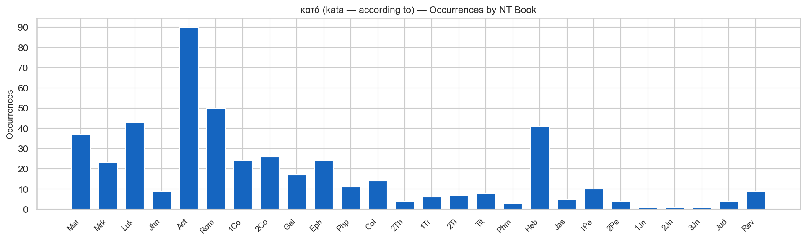

Genitive carries the original spatial sense ("down from") and the hostile extension ("against": κατὰ τοῦ προφήτου). Accusative (the large majority, ~82 %) has largely shed the spatial sense and functions as a norm marker: κατὰ σάρκα ("according to the flesh"), κατὰ νόμον ("in accordance with the law"). The distribution is highly skewed toward accusative in NT epistolary style.

### μετά (meta) — with (association), after (sequence)

**Strong's:** G3326 | **Total NT occurrences:** 443

| Case | Count | % | Meaning with this case |
|---|---|---|---|
| Genitive | 362 | 77.0% | with, in company with, in association with |
| Accusative | 81 | 17.2% | after (temporal or spatial sequence) |

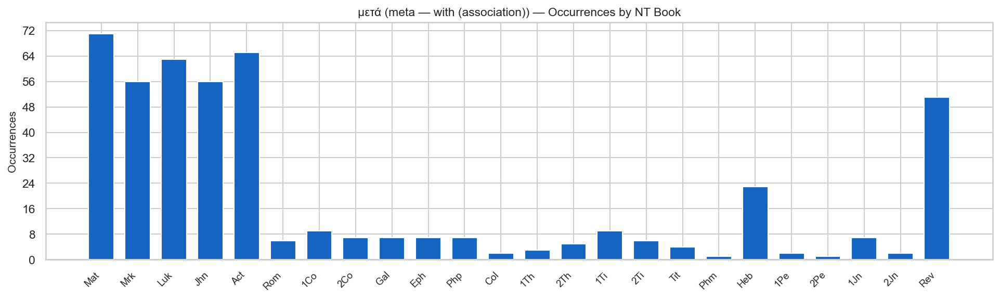

The case split is clean and consistent: genitive = accompaniment/association ("with"), accusative = sequence ("after"). E.g. μετὰ τοῦ Ἰησοῦ (gen.) = "with Jesus"; μετὰ τρεῖς ἡμέρας (acc.) = "after three days". Genitive predominates (~77 %) since much NT prose describes fellowship, discipleship, and community.

### περί (peri) — concerning, about, around, for

**Strong's:** G4012 | **Total NT occurrences:** 314

| Case | Count | % | Meaning with this case |
|---|---|---|---|
| Genitive | 277 | 83.2% | concerning, about, regarding; for (substitutionary) |
| Accusative | 37 | 11.1% | around (spatial); approximately (time/number) |

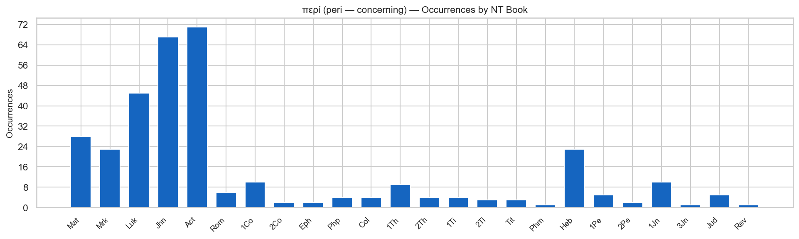

The dominant use (~83 %) is genitive with the sense "concerning, about" — the standard NT idiom for discourse topic (γράφω περί τινος, "I write concerning something"). The substitutionary sense (e.g. περὶ ἁμαρτίας, "for sin/as a sin offering") is important theologically in Hebrews and 1 John. Accusative is spatial ("around") and appears relatively rarely outside the Gospels and Acts.

### ὑπό (hypo) — under, by (agent)

**Strong's:** G5259 | **Total NT occurrences:** 219

| Case | Count | % | Meaning with this case |
|---|---|---|---|
| Genitive | 168 | 76.7% | by (the agent of a passive verb); under the authority of |
| Accusative | 51 | 23.3% | under (spatial, below); under (subordination) |

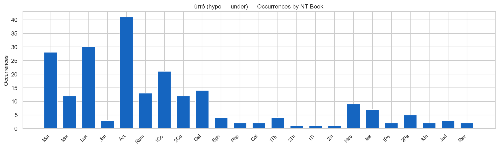

Genitive is the standard marker of the agent in passive constructions (ὑπό + genitive = "by someone/something"). Accusative expresses spatial position ("under") or subordinate status. In the NT, genitive dominates (~77 %) due to the high frequency of theological passive constructions ("raised by God", "taught by the Spirit").

### ὑπέρ (hyper) — on behalf of, above, beyond, more than

**Strong's:** G5228 | **Total NT occurrences:** 147

| Case | Count | % | Meaning with this case |
|---|---|---|---|
| Genitive | 127 | 84.7% | on behalf of, for the sake of; in place of (substitution) |
| Accusative | 18 | 12.0% | above (spatial); beyond, more than (comparison) |
| Nominative | 2 | 1.3% | — |

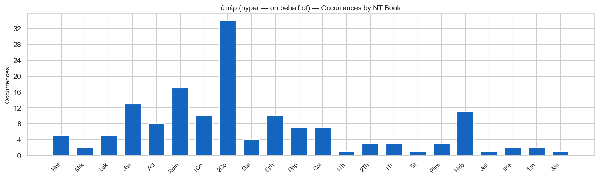

The genitive is the theologically freighted case: ὑπέρ + genitive expresses the substitutionary and intercessory senses central to NT soteriology (Χριστὸς ἀπέθανεν ὑπὲρ ἡμῶν, "Christ died for us", Rom 5:8). Accusative is used spatially and comparatively and appears much less frequently (~12 %).

### πρός (pros) — to, toward, with, against

**Strong's:** G4314 | **Total NT occurrences:** 695

| Case | Count | % | Meaning with this case |
|---|---|---|---|
| Accusative | 687 | 98.1% | to, toward, against (motion/direction); for (purpose) |
| Dative | 7 | 1.0% | near, at (rare; archaic/Attic locative) |
| Genitive | 1 | 0.1% | from (very rare) |

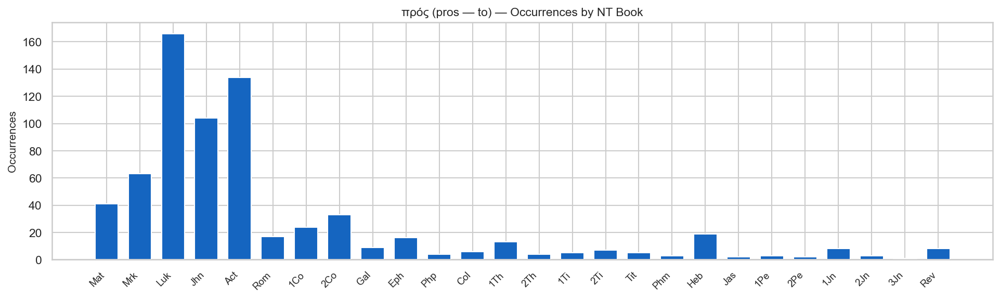

In the NT, πρός is almost exclusively accusative (~98 %). The dative and genitive uses are vestigial — a handful of instances each, reflecting literary archaism. The accusative sense covers both literal motion toward ("go to Jerusalem") and figurative direction ("pray toward God", "face to face with").

### ἀνά (ana) — up, each, among

**Strong's:** G0303 | **Total NT occurrences:** 10

| Case | Count | % | Meaning with this case |
|---|---|---|---|
| Accusative | 9 | 69.2% | up along; each/apiece (distributive) |
| Nominative | 1 | 7.7% | — |

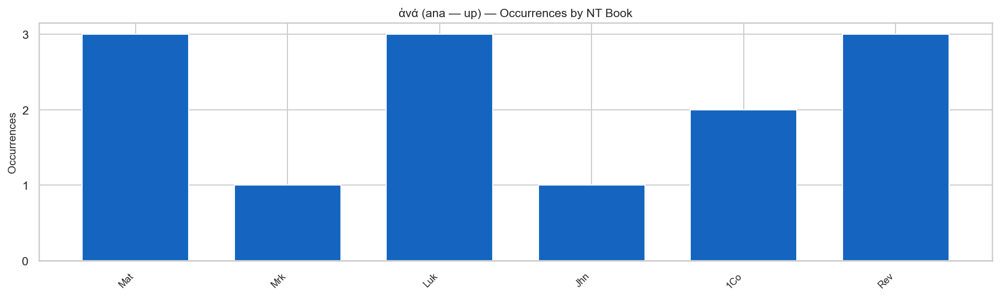

In classical Greek ἀνά took accusative (up along), genitive (upon), and dative (at). In the NT it survives almost exclusively with accusative in the distributive sense (ἀνὰ εἷς ἕκαστος, "each one"), and is rare overall (13 occurrences).

---

## Single-Case Prepositions — Reference Table

These prepositions govern only one case in NT usage. They are included for completeness.

| Preposition | Case | Gloss | NT Count |
|---|---|---|---|
| ἐν | Dative | in, among, by, with | 2,743 |
| εἰς | Accusative | into, to, for, toward | 1,766 |
| ἐκ | Genitive | out of, from | 913 |
| ἀπό | Genitive | from, away from, since | 647 |
| σύν | Dative | with, together with | 128 |
| πρό | Genitive | before (spatial/temporal) | 47 |

---

## Grammar Notes

### What is a "case-binding" preposition?

Greek prepositions are said to "govern" or "take" a particular case — the noun or pronoun following the preposition must appear in that case. The 18 proper prepositions (κύριαι προθέσεις) of classical Greek are traditionally divided by how many cases they govern:

| # of cases | Prepositions |
|---|---|
| One case | ἀντί, ἀπό, ἐκ, ἐν, εἰς, πρό, σύν (+ ἕως) |
| Two cases | διά, κατά, μετά, περί, ὑπό, ὑπέρ, ἀνά |
| Three cases | ἐπί, παρά, πρός (classical; NT πρός is effectively single-case) |

### Why does case matter for exegesis?

When a preposition governs multiple cases, the case of the following noun changes the meaning of the preposition. Reading the case correctly is therefore essential for understanding the text:

- **διά + genitive** = *by means of* / *through* (the means or channel)
- **διά + accusative** = *because of* / *on account of* (the cause or reason)

Confusing these produces a different theological statement. For example, Rom 4:25:

> ὃς παρεδόθη διὰ τὰ παραπτώματα ἡμῶν (accusative — *because of* our trespasses)
> καὶ ἠγέρθη διὰ τὴν δικαίωσιν ἡμῶν (accusative — *for the sake of* our justification)

Both are accusative of cause/purpose, not genitive of means — Paul is explaining *why* Christ was delivered and raised, not the mechanism.

### How the case data is computed

The TAGNT morphological database tags each word with its grammatical form, including case. The case assigned to a preposition's object is determined by the inflected form of the following noun or pronoun. A small number of tokens carry no clear case tag (e.g. indeclinable words, elided forms); these are counted as "(none / unclear)" and excluded from the percentage calculations above.

---

*Report generated by [scripts/nt/prepositions/build_nt_prep_cases_report.py](../../../../scripts/nt/prepositions/build_nt_prep_cases_report.py). Source: STEPBible TAGNT (CC BY 4.0, Tyndale House Cambridge). KJV translation examples (public domain).*