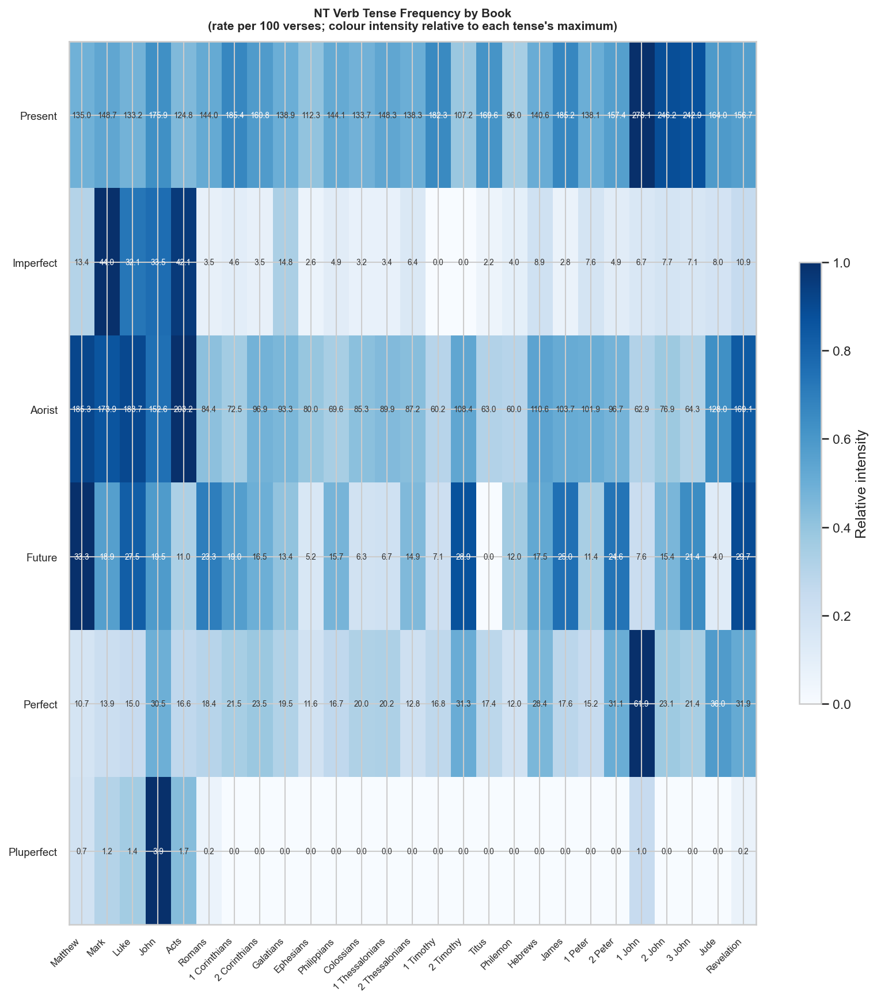
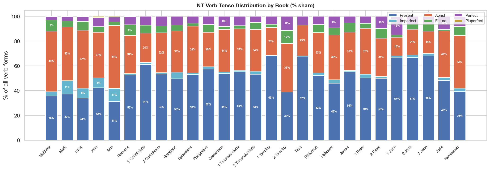
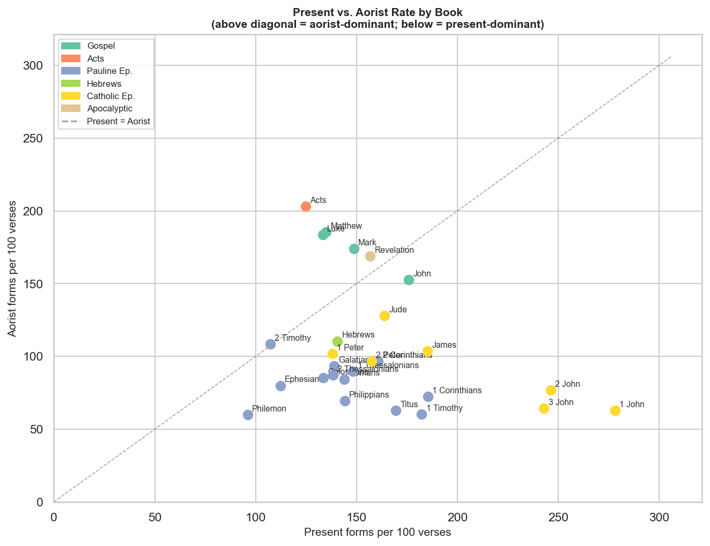
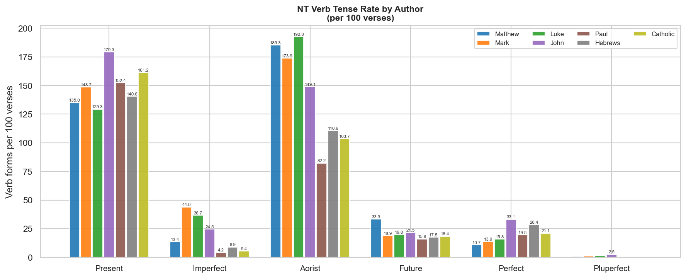
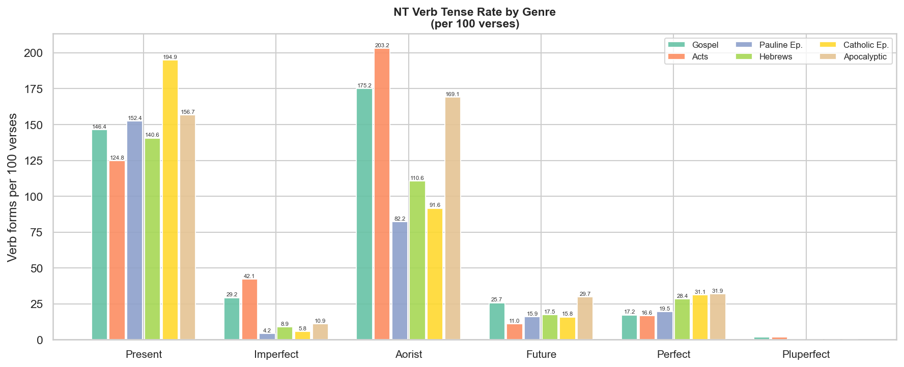
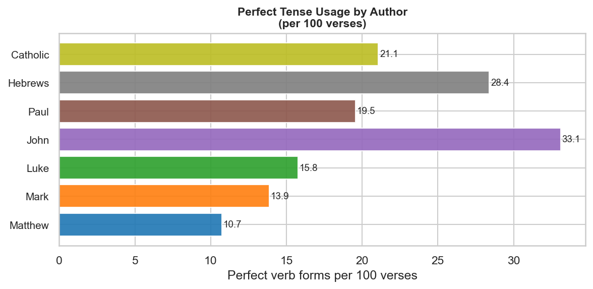

# NT Greek Verb Tense Distribution

**Text:** TAGNT (Byzantine/Textus Receptus) · **Scope:** All 27 NT books

## Contents

- [About This Report](#about-this-report)
- [Key Observations](#key-observations)
- [Tense Frequency Heatmap](#tense-frequency-heatmap)
- [Tense Share by Book](#tense-share-by-book)
- [Present vs. Aorist Scatter](#present-vs-aorist-scatter)
- [Tense Rate by Author](#tense-rate-by-author)
- [Tense Rate by Genre](#tense-rate-by-genre)
- [Perfect Tense by Author](#perfect-tense-by-author)
- [Per-Book Summary Table](#per-book-summary-table)
- [Per-Author Summary Table](#per-author-summary-table)
- [Per-Genre Summary Table](#per-genre-summary-table)

---

## About This Report

This report analyses the distribution of Greek verb tenses across every book of the NT, scaled by verse count so that books of different length are directly comparable. All verb forms are included — indicative, participle, infinitive, subjunctive, imperative, and optative — because tense in Greek carries aspect information in all moods and non-finite forms, not just the indicative.

**Tense consolidation** (TAGNT codes → display name):

| TAGNT code(s) | Tense | Aspectual force |
|---|---|---|
| Present | Present | Imperfective — ongoing, repeated, or habitual action |
| Imperfect | Imperfect | Imperfective in past time (indicative only) |
| Aorist, 2nd Aorist | Aorist | Perfective — action viewed as a whole |
| Future, 2nd Future | Future | Expectation of future completion |
| R, 2R, 2P | Perfect | Stative — completed action with present relevance |
| L, 2L | Pluperfect | State in past time; rarest tense in NT |

**Total verb forms analysed:** 28,523  
**Books:** 27  

---

## Key Observations

- **Present-dominant books** (present > aorist per verse): John, Romans, 1 Corinthians, 2 Corinthians, Galatians, Ephesians, Philippians, Colossians, 1 Thessalonians, 2 Thessalonians, 1 Timothy, Titus, Philemon, Hebrews, James, 1 Peter, 2 Peter, 1 John, 2 John, 3 John, Jude
- **Aorist-dominant books** (aorist > present per verse): Matthew, Mark, Luke, Acts, 2 Timothy, Revelation
- **Highest present rate:** 1 John (278.1 per 100 verses)
- **Highest aorist rate:** Acts (203.2 per 100 verses)
- **Highest imperfect rate:** Mark (44.0 per 100 verses) — imperfect is primarily a narrative tense
- **Highest perfect rate:** 1 John (61.9 per 100 verses)
- **Author with highest present rate:** John (179.3 per 100 verses)
- **Author with highest aorist rate:** Luke (192.8 per 100 verses)
- **Author with highest perfect rate:** John (33.1 per 100 verses) — the perfect signals completed action with present effect, theologically significant in Hebrews and Paul

---

## Tense Frequency Heatmap

Colour intensity for each tense is normalised relative to that tense's own maximum across all books — so each row (tense) has its own scale. Numbers show the raw rate per 100 verses.

---

## Tense Share by Book

Each bar is divided by tense share (% of all verb forms in that book). This reveals whether a book's overall verbal style is present-heavy, aorist-heavy, or balanced.

---

## Present vs. Aorist Scatter

Each point is a book. Points **above** the dashed diagonal are aorist-dominant; points **below** are present-dominant. Genre is colour-coded.

---

## Tense Rate by Author

Rates are per 100 verses, pooling all books attributed to each author. Author attributions follow the traditional/canonical view.

---

## Tense Rate by Genre

Rates are per 100 verses. Genre groupings: Gospels (Matthew–John), Acts, Pauline Epistles, Hebrews, Catholic Epistles (James, 1–2 Peter, 1–3 John, Jude), Apocalyptic (Revelation).

---

## Perfect Tense by Author

The perfect is theologically loaded in the NT: it asserts that a past action has abiding present consequence. Its distribution across authors is more varied than the present or aorist.

---

## Per-Book Summary Table

> Rates are verb forms per 100 verses. "Verses" = verse count in TAGNT.

| Book | Verses | Present | Imperfect | Aorist | Future | Perfect | Pluperfect |
|---|---:|---:|---:|---:|---:|---:|---:|
| Matthew | 1071 | 135.0 | 13.4 | 185.3 | 33.3 | 10.7 | 0.7 |
| Mark | 678 | 148.7 | 44.0 | 173.9 | 18.9 | 13.9 | 1.2 |
| Luke | 1151 | 133.2 | 32.1 | 183.7 | 27.5 | 15.0 | 1.4 |
| John | 878 | 175.9 | 33.5 | 152.6 | 19.5 | 30.5 | 3.9 |
| Acts | 1007 | 124.8 | 42.1 | 203.2 | 11.0 | 16.6 | 1.7 |
| Romans | 430 | 144.0 | 3.5 | 84.4 | 23.3 | 18.4 | 0.2 |
| 1 Corinthians | 437 | 185.4 | 4.6 | 72.5 | 19.0 | 21.5 | 0.0 |
| 2 Corinthians | 255 | 160.8 | 3.5 | 96.9 | 16.5 | 23.5 | 0.0 |
| Galatians | 149 | 138.9 | 14.8 | 93.3 | 13.4 | 19.5 | 0.0 |
| Ephesians | 155 | 112.3 | 2.6 | 80.0 | 5.2 | 11.6 | 0.0 |
| Philippians | 102 | 144.1 | 4.9 | 69.6 | 15.7 | 16.7 | 0.0 |
| Colossians | 95 | 133.7 | 3.2 | 85.3 | 6.3 | 20.0 | 0.0 |
| 1 Thessalonians | 89 | 148.3 | 3.4 | 89.9 | 6.7 | 20.2 | 0.0 |
| 2 Thessalonians | 47 | 138.3 | 6.4 | 87.2 | 14.9 | 12.8 | 0.0 |
| 1 Timothy | 113 | 182.3 | 0.0 | 60.2 | 7.1 | 16.8 | 0.0 |
| 2 Timothy | 83 | 107.2 | 0.0 | 108.4 | 28.9 | 31.3 | 0.0 |
| Titus | 46 | 169.6 | 2.2 | 63.0 | 0.0 | 17.4 | 0.0 |
| Philemon | 25 | 96.0 | 4.0 | 60.0 | 12.0 | 12.0 | 0.0 |
| Hebrews | 303 | 140.6 | 8.9 | 110.6 | 17.5 | 28.4 | 0.0 |
| James | 108 | 185.2 | 2.8 | 103.7 | 25.0 | 17.6 | 0.0 |
| 1 Peter | 105 | 138.1 | 7.6 | 101.9 | 11.4 | 15.2 | 0.0 |
| 2 Peter | 61 | 157.4 | 4.9 | 96.7 | 24.6 | 31.1 | 0.0 |
| 1 John | 105 | 278.1 | 6.7 | 62.9 | 7.6 | 61.9 | 1.0 |
| 2 John | 13 | 246.2 | 7.7 | 76.9 | 15.4 | 23.1 | 0.0 |
| 3 John | 14 | 242.9 | 7.1 | 64.3 | 21.4 | 21.4 | 0.0 |
| Jude | 25 | 164.0 | 8.0 | 128.0 | 4.0 | 36.0 | 0.0 |
| Revelation | 404 | 156.7 | 10.9 | 169.1 | 29.7 | 31.9 | 0.2 |

---

## Per-Author Summary Table

| Author | Books | Verses | Present | Imperfect | Aorist | Future | Perfect | Pluperfect |
|---|---|---:|---:|---:|---:|---:|---:|---:|
| Matthew | Matthew | 1071 | 135.0 | 13.4 | 185.3 | 33.3 | 10.7 | 0.7 |
| Mark | Mark | 678 | 148.7 | 44.0 | 173.9 | 18.9 | 13.9 | 1.2 |
| Luke | Luke, Acts | 2158 | 129.3 | 36.7 | 192.8 | 19.8 | 15.8 | 1.5 |
| John | John, 1 John, 2 John, 3 John, Revelation | 1414 | 179.3 | 24.5 | 149.1 | 21.5 | 33.1 | 2.5 |
| Paul | Romans, 1 Corinthians, 2 Corinthians, Galatians, Ephesians, Philippians, Colossians, 1 Thessalonians, 2 Thessalonians, 1 Timothy, 2 Timothy, Titus, Philemon | 2026 | 152.4 | 4.2 | 82.2 | 15.9 | 19.5 | 0.0 |
| Hebrews | Hebrews | 303 | 140.6 | 8.9 | 110.6 | 17.5 | 28.4 | 0.0 |
| Catholic | James, 1 Peter, 2 Peter, Jude | 299 | 161.2 | 5.4 | 103.7 | 18.4 | 21.1 | 0.0 |

---

## Per-Genre Summary Table

| Genre | Books | Verses | Present | Imperfect | Aorist | Future | Perfect | Pluperfect |
|---|---|---:|---:|---:|---:|---:|---:|---:|
| Gospel | Mat, Mrk, Luk, Jhn | 3778 | 146.4 | 29.2 | 175.2 | 25.7 | 17.2 | 1.7 |
| Acts | Act | 1007 | 124.8 | 42.1 | 203.2 | 11.0 | 16.6 | 1.7 |
| Pauline Ep. | Rom, 1Co, 2Co, Gal, Eph, Php, Col, 1Th, 2Th, 1Ti, 2Ti, Tit, Phm | 2026 | 152.4 | 4.2 | 82.2 | 15.9 | 19.5 | 0.0 |
| Hebrews | Heb | 303 | 140.6 | 8.9 | 110.6 | 17.5 | 28.4 | 0.0 |
| Catholic Ep. | Jas, 1Pe, 2Pe, 1Jn, 2Jn, 3Jn, Jud | 431 | 194.9 | 5.8 | 91.6 | 15.8 | 31.1 | 0.2 |
| Apocalyptic | Rev | 404 | 156.7 | 10.9 | 169.1 | 29.7 | 31.9 | 0.2 |

---

*Greek text: TAGNT (Byzantine/Textus Receptus tradition, STEPBible CC BY 4.0, Tyndale House Cambridge).*
 *Verb tense data covers all moods and non-finite forms.*
 *Generated by [scripts/nt/verbs/build_nt_tense_distribution.py](../../../../scripts/nt/verbs/build_nt_tense_distribution.py).*