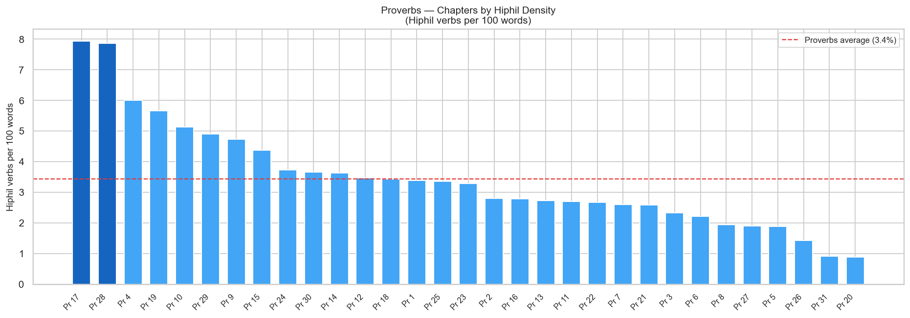
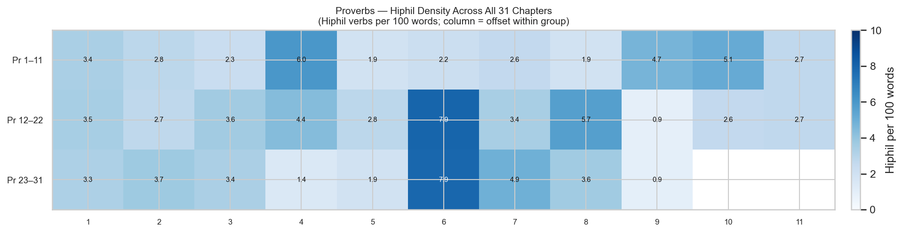
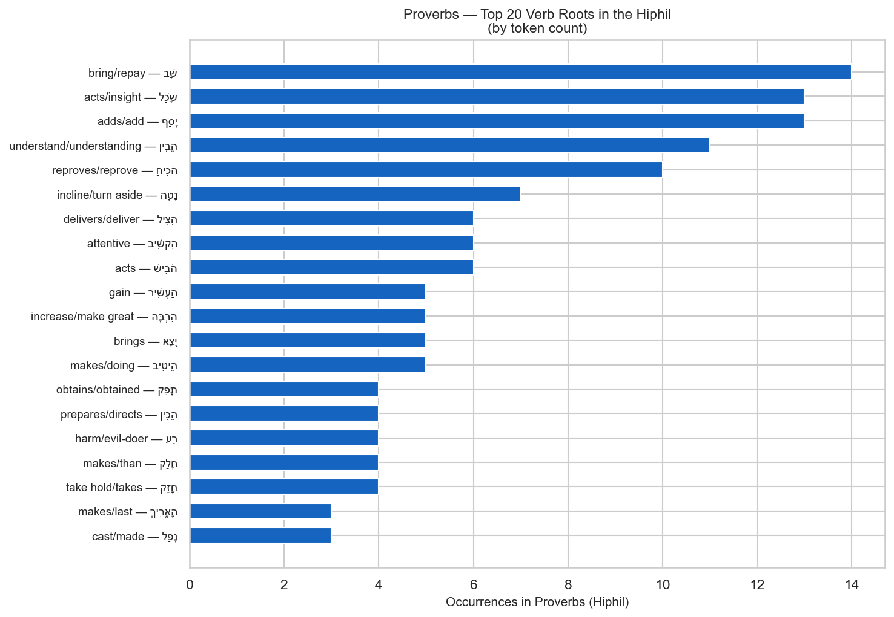

# Hiphil Verb Density in Proverbs

**Corpus:** Hebrew Old Testament (MACULA/WLC)
**Book:** Proverbs (31 chapters)
**Focus:** Which chapters are most Hiphil-dense, and which verb roots most commonly appear in the Hiphil

---

## Contents

1. [Overview](#overview)
2. [Chapter Density — All 31 Proverbs Chapters](#chapter-density-all-31-proverbs-chapters)
3. [Full Density Map — All 31 Chapters](#full-density-map-all-31-chapters)
4. [Top Verb Roots in the Hiphil](#top-verb-roots-in-the-hiphil)
5. [Detailed Chapter Table](#detailed-chapter-table)
6. [Grammar Note — The Hiphil Stem](#grammar-note-the-hiphil-stem)

---

## Key Observations

- **Proverbs contains 238 Hiphil verb tokens** across 31 of 31 chapters (0 chapters have none).
- **Overall Proverbs Hiphil rate: 3.4 per 100 words.** 12 chapters exceed this baseline.
- **Most Hiphil-dense chapter: Proverbs 17** (7.9 per 100 words, 18 tokens in 227 words).
- **Top 5 densest chapters:** Pr 17 (7.9%), Pr 28 (7.9%), Pr 4 (6.0%), Pr 19 (5.7%), Pr 10 (5.1%).
- **Most common Hiphil root:** שָׁב ("bring/repay") — 14 tokens.
- **Top 5 roots:** שָׁב "bring/repay" (14), שָׂכַל "acts/insight" (13), יָסַף "adds/add" (13), הֵבִין "understand/understanding" (11), הֹכִיחַ "reproves/reprove" (10).
- **Theologically notable:** the Hiphil of שׁוּב ("return/restore") is the most frequent root — encompassing restoration, repayment, and moral reversal, themes woven throughout Proverbs' view of consequences.

---

## Overview

The Hiphil is Hebrew's **causative stem**: it turns an intransitive root into a transitive action, or expresses declarative and factitive meanings (see the grammar note at the end of this report). In wisdom literature, the Hiphil frequently appears in contexts of instruction and correction — "cause to understand," "make wise," "bring to shame," "incline the heart."

This report measures Hiphil density two ways:

- **Per 100 words** — controls for chapter length; the most useful cross-chapter comparison.
- **Per verse** — useful for a feel of how Hiphil-saturated the instruction is at the verse level.

The **Proverbs-wide baseline** is **3.4 Hiphil verbs per 100 words** (238 tokens / 6,915 total words).

---

## Chapter Density — All 31 Proverbs Chapters

Bars in **dark blue** exceed twice the Proverbs average. The **red dashed line** marks the Proverbs-wide baseline (3.4 per 100 words).

| Rank | Chapter | Hiphil tokens | Total words | Per 100 words | Per verse |
|---|---|---|---|---|---|
| 1 | Proverbs 17 | 18 | 227 | 7.93 | 0.64 |
| 2 | Proverbs 28 | 18 | 229 | 7.86 | 0.64 |
| 3 | Proverbs 4 | 12 | 200 | 6.00 | 0.44 |
| 4 | Proverbs 19 | 13 | 230 | 5.65 | 0.45 |
| 5 | Proverbs 10 | 12 | 234 | 5.13 | 0.38 |
| 6 | Proverbs 29 | 10 | 204 | 4.90 | 0.37 |
| 7 | Proverbs 9 | 6 | 127 | 4.72 | 0.33 |
| 8 | Proverbs 15 | 11 | 252 | 4.37 | 0.33 |
| 9 | Proverbs 24 | 10 | 269 | 3.72 | 0.29 |
| 10 | Proverbs 30 | 11 | 301 | 3.65 | 0.33 |
| 11 | Proverbs 14 | 9 | 248 | 3.63 | 0.26 |
| 12 | Proverbs 12 | 7 | 202 | 3.47 | 0.25 |
| 13 | Proverbs 18 | 6 | 175 | 3.43 | 0.25 |
| 14 | Proverbs 1 | 8 | 237 | 3.38 | 0.24 |
| 15 | Proverbs 25 | 8 | 239 | 3.35 | 0.29 |
| 16 | Proverbs 23 | 9 | 274 | 3.28 | 0.26 |
| 17 | Proverbs 2 | 4 | 143 | 2.80 | 0.18 |
| 18 | Proverbs 16 | 7 | 252 | 2.78 | 0.21 |
| 19 | Proverbs 13 | 5 | 183 | 2.73 | 0.20 |
| 20 | Proverbs 11 | 6 | 223 | 2.69 | 0.19 |

---

## Full Density Map — All 31 Chapters

Each cell is one chapter. The number is Hiphil verbs per 100 words. Darker = more Hiphil-dense. "—" = no Hiphil in that chapter.

**Chapters with no Hiphil verbs (0):** none.

---

## Top Verb Roots in the Hiphil

| Rank | Root | Gloss | Hiphil tokens |
|---|---|---|---|
| 1 | שָׁב | bring/repay | 14 |
| 2 | שָׂכַל | acts/insight | 13 |
| 3 | יָסַף | adds/add | 13 |
| 4 | הֵבִין | understand/understanding | 11 |
| 5 | הֹכִיחַ | reproves/reprove | 10 |
| 6 | נָטָה | incline/turn aside | 7 |
| 7 | הִצִּיל | delivers/deliver | 6 |
| 8 | הִקְשִׁיב | attentive | 6 |
| 9 | הֹבִישׁ | acts | 6 |
| 10 | הַעֲשִׁיר | gain | 5 |
| 11 | הִרְבָּה | increase/make great | 5 |
| 12 | יָצָא | brings | 5 |
| 13 | הֵיטִיב | makes/doing | 5 |
| 14 | תָּפֵק | obtains/obtained | 4 |
| 15 | הֵכִין | prepares/directs | 4 |
| 16 | רַע | harm/evil-doer | 4 |
| 17 | חָלַק | makes/than | 4 |
| 18 | חָזַק | take hold/takes | 4 |
| 19 | הֶאֱרִיךְ | makes/last | 3 |
| 20 | נָפַל | cast/made | 3 |
| 21 | אַבִּיעָה | pours/pour | 3 |
| 22 | רָחַק | put far/make far | 3 |
| 23 | הִכָּה | strike/than | 3 |
| 24 | מֵלִיץ | mocks | 3 |
| 25 | סָר | remove/turn aside | 3 |

**Notes on the top roots:**

- **שׁוּב (return/restore/repay):** The Hiphil expresses causative return — "bring back," "restore," "repay." Its breadth spans relational restoration, divine discipline, and moral consequence, making it the most frequent Hiphil root in Proverbs.
- **שָׂכַל (act wisely/prudently):** The Hiphil expresses the causative of insight — to make someone wise, to instruct with understanding. The signature verb of the wisdom tradition.
- **יָסַף (add/increase):** The Hiphil "cause to add" appears repeatedly in Proverbs in contexts of gaining wisdom, words, and days — "the wise will increase learning" (Pr 1:5).
- **הֵבִין (understand/discern):** The Hiphil expresses causing someone to understand — the teacher's goal in wisdom instruction.
- **הֹכִיחַ (rebuke/reprove):** The Hiphil "cause to be reproved" is the verb of correction, appearing in the famous Proverbs sayings about accepting discipline and reproof.

---

## Detailed Chapter Table

All 31 chapters, sorted by chapter number.

| Chapter | Hiphil tokens | Total words | Per 100 words | Per verse |
|---|---|---|---|---|
| 1 | 8 | 237 | 3.38 | 0.24 |
| 2 | 4 | 143 | 2.80 | 0.18 |
| 3 | 6 | 258 | 2.33 | 0.17 |
| 4 | 12 | 200 | 6.00 | 0.44 |
| 5 | 3 | 160 | 1.88 | 0.13 |
| 6 | 6 | 271 | 2.21 | 0.17 |
| 7 | 5 | 193 | 2.59 | 0.19 |
| 8 | 5 | 258 | 1.94 | 0.14 |
| 9 | 6 | 127 | 4.72 | 0.33 |
| 10 | 12 | 234 | 5.13 | 0.38 |
| 11 | 6 | 223 | 2.69 | 0.19 |
| 12 | 7 | 202 | 3.47 | 0.25 |
| 13 | 5 | 183 | 2.73 | 0.20 |
| 14 | 9 | 248 | 3.63 | 0.26 |
| 15 | 11 | 252 | 4.37 | 0.33 |
| 16 | 7 | 252 | 2.78 | 0.21 |
| 17 | 18 | 227 | 7.93 ✦ | 0.64 |
| 18 | 6 | 175 | 3.43 | 0.25 |
| 19 | 13 | 230 | 5.65 | 0.45 |
| 20 | 2 | 226 | 0.88 | 0.07 |
| 21 | 6 | 233 | 2.58 | 0.19 |
| 22 | 6 | 225 | 2.67 | 0.21 |
| 23 | 9 | 274 | 3.28 | 0.26 |
| 24 | 10 | 269 | 3.72 | 0.29 |
| 25 | 8 | 239 | 3.35 | 0.29 |
| 26 | 3 | 211 | 1.42 | 0.11 |
| 27 | 4 | 212 | 1.89 | 0.15 |
| 28 | 18 | 229 | 7.86 ✦ | 0.64 |
| 29 | 10 | 204 | 4.90 | 0.37 |
| 30 | 11 | 301 | 3.65 | 0.33 |
| 31 | 2 | 219 | 0.91 | 0.06 |

✦ = more than twice the Proverbs average (3.4 per 100 words)

---

## Grammar Note — The Hiphil Stem

The **Hiphil** (הִפְעִיל) is one of the seven main Hebrew verb stems. It is most often **causative**: it takes an action or state expressed by the Qal and causes it to happen.

| Qal | Hiphil | Meaning shift |
|---|---|---|
| בּוֹא — to come | הֵבִיא — to bring | cause to come |
| יָצָא — to go out | הוֹצִיא — to bring out | cause to go out |
| שָׁמַע — to hear | הִשְׁמִיעַ — to proclaim | cause to hear |
| גָּדַל — to be great | הִגְדִּיל — to magnify | cause to be great |
| יָשַׁע — to be saved | הוֹשִׁיעַ — to save | cause to be saved |

In Proverbs, the Hiphil is especially prominent in wisdom and instruction contexts:

- **Wisdom verbs:** שִׂכֵּל (make wise), הֵבִין (cause to understand), הוֹדִיעַ (make known)
- **Correction verbs:** הוֹכִיחַ (rebuke), הֵשִׁיב (bring back/restore)
- **Behavioral outcomes:** הֵבִישׁ (bring shame), הֵיטִיב (do good), הִרְבָּה (increase)

The relatively high Hiphil density in Proverbs compared with other wisdom books reflects its didactic intent: Proverbs is a book of causation — parents and teachers causing children to become wise, and wisdom causing outcomes in those who embrace or reject it.

---

*Report generated by [scripts/ot/verbs/build_hiphil_proverbs_report.py](../../../../../scripts/ot/verbs/build_hiphil_proverbs_report.py).* *Source: MACULA Hebrew (WLC morphology, CC BY 4.0).*