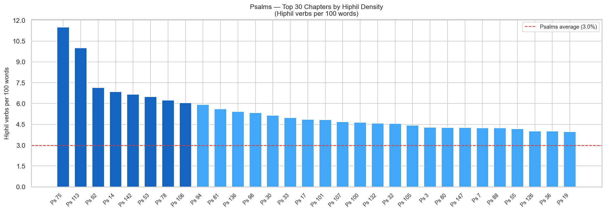
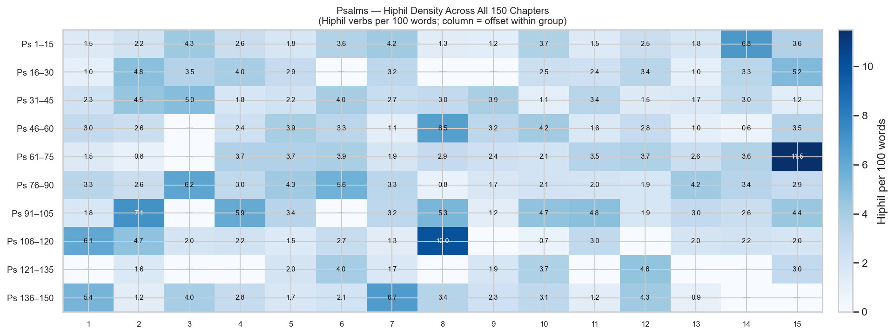
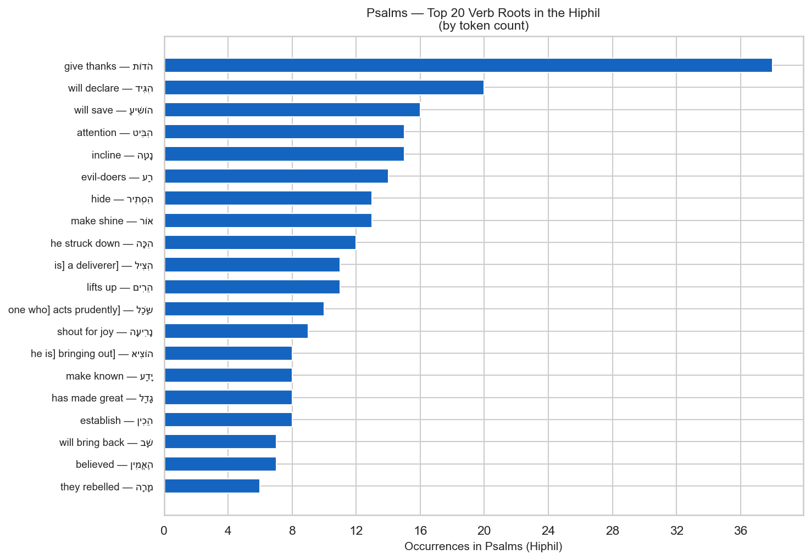

# Hiphil Verb Density in the Psalms

**Corpus:** Hebrew Old Testament (MACULA/WLC)
**Book:** Psalms (150 chapters)
**Focus:** Which chapters are most Hiphil-dense, and which verb roots most commonly appear in the Hiphil

---

## Contents

1. [Overview](#overview)
2. [Chapter Density — Top 30 Psalms](#chapter-density-top-30-psalms)
3. [Full Density Map — All 150 Psalms](#full-density-map-all-150-psalms)
4. [Top Verb Roots in the Hiphil](#top-verb-roots-in-the-hiphil)
5. [Detailed Chapter Table](#detailed-chapter-table)
6. [Grammar Note — The Hiphil Stem](#grammar-note-the-hiphil-stem)

---

## Key Observations

- **Psalms contains 582 Hiphil verb tokens** across 132 of 150 chapters (18 chapters have none).
- **Overall Psalms Hiphil rate: 3.0 per 100 words.** 65 chapters exceed this baseline.
- **Most Hiphil-dense chapter: Psalm 75** (11.5 per 100 words, 10 tokens in 87 words).
- **Top 5 densest chapters:** Ps 75 (11.5%), Ps 113 (10.0%), Ps 92 (7.1%), Ps 14 (6.8%), Ps 142 (6.7%).
- **Most common Hiphil root:** הֹדוֹת ("give thanks") — 38 tokens.
- **Top 5 roots:** הֹדוֹת "give thanks" (38), הִגִּיד "will declare" (20), הוֹשִׁיעַ "will save" (16), הִבִּיט "attention" (15), נָטָה "incline" (15).
- **Theologically notable:** the Hiphil of הֹדוֹת ("give thanks") is the most frequent root — the very verb behind the תּוֹדָה (todah) thanksgiving genre that dominates Psalms.

---

## Overview

The Hiphil is Hebrew's **causative stem**: it turns an intransitive root into a transitive action, or expresses declarative and factitive meanings (see the grammar note at the end of this report). In poetry, the Hiphil is especially common in praise language — "cause to shine," "make great," "declare righteous," "save," "lift up."

This report measures Hiphil density two ways:

- **Per 100 words** — controls for chapter length; the most useful cross-chapter comparison.
- **Per verse** — useful for a feel of how Hiphil-saturated the poetry is at the verse level.

The **Psalms-wide baseline** is **3.0 Hiphil verbs per 100 words** (582 tokens / 19,595 total words).

---

## Chapter Density — Top 30 Psalms

Bars in **dark blue** exceed twice the Psalms average. The **red dashed line** marks the Psalms-wide baseline (3.0 per 100 words).

| Rank | Psalm | Hiphil tokens | Total words | Per 100 words | Per verse |
|---|---|---|---|---|---|
| 1 | Psalm 75 | 10 | 87 | 11.49 | 0.91 |
| 2 | Psalm 113 | 6 | 60 | 10.00 | 0.67 |
| 3 | Psalm 92 | 8 | 112 | 7.14 | 0.50 |
| 4 | Psalm 14 | 5 | 73 | 6.85 | 0.62 |
| 5 | Psalm 142 | 5 | 75 | 6.67 | 0.62 |
| 6 | Psalm 53 | 5 | 77 | 6.49 | 0.71 |
| 7 | Psalm 78 | 33 | 530 | 6.23 | 0.45 |
| 8 | Psalm 106 | 20 | 330 | 6.06 | 0.42 |
| 9 | Psalm 94 | 10 | 169 | 5.92 | 0.43 |
| 10 | Psalm 81 | 7 | 125 | 5.60 | 0.41 |
| 11 | Psalm 136 | 9 | 166 | 5.42 | 0.35 |
| 12 | Psalm 98 | 4 | 75 | 5.33 | 0.40 |
| 13 | Psalm 30 | 5 | 97 | 5.15 | 0.38 |
| 14 | Psalm 33 | 8 | 161 | 4.97 | 0.36 |
| 15 | Psalm 17 | 6 | 124 | 4.84 | 0.38 |
| 16 | Psalm 101 | 4 | 83 | 4.82 | 0.44 |
| 17 | Psalm 107 | 13 | 278 | 4.68 | 0.30 |
| 18 | Psalm 100 | 2 | 43 | 4.65 | 0.33 |
| 19 | Psalm 132 | 6 | 131 | 4.58 | 0.32 |
| 20 | Psalm 32 | 5 | 110 | 4.55 | 0.42 |

---

## Full Density Map — All 150 Psalms

Each cell is one psalm. The number is Hiphil verbs per 100 words. Darker = more Hiphil-dense. "—" = no Hiphil in that psalm.

**Psalms with no Hiphil verbs (18):** Ps 21, Ps 23, Ps 24, Ps 48, Ps 63, Ps 93, Ps 96, Ps 114, Ps 117, Ps 121, Ps 123, Ps 124, Ps 128, Ps 131, Ps 133, Ps 134, Ps 149, Ps 150.

---

## Top Verb Roots in the Hiphil

| Rank | Root | Gloss | Hiphil tokens |
|---|---|---|---|
| 1 | הֹדוֹת | give thanks | 38 |
| 2 | הִגִּיד | will declare | 20 |
| 3 | הוֹשִׁיעַ | will save | 16 |
| 4 | הִבִּיט | attention | 15 |
| 5 | נָטָה | incline | 15 |
| 6 | רַע | evil-doers | 14 |
| 7 | הִסְתִּיר | hide | 13 |
| 8 | אוֹר | make shine | 13 |
| 9 | הִכָּה | he struck down | 12 |
| 10 | הִצִּיל | [is] a deliverer | 11 |
| 11 | הֵרִים | lifts up | 11 |
| 12 | שָׂכַל | [one who] acts prudently | 10 |
| 13 | נָרִיעָה | shout for joy | 9 |
| 14 | הוֹצִיא | [he is] bringing out | 8 |
| 15 | יָדַע | make known | 8 |
| 16 | גָדַל | has made great | 8 |
| 17 | הֵכִין | establish | 8 |
| 18 | שָׁב | will bring back | 7 |
| 19 | הֶאֱמִין | believed | 7 |
| 20 | מָרָה | they rebelled | 6 |
| 21 | רָחַב | they have opened wide | 6 |
| 22 | הִשְׁלִיךְ | throw | 6 |
| 23 | הֵשִׁיב | repay | 6 |
| 24 | זָכַר | will bring to remembrance | 6 |
| 25 | צָץ | may people blossom | 5 |

**Notes on the top roots:**

- **הֹדוֹת (give thanks):** The Hiphil of this root is the standard Psalms verb for corporate and individual praise — "I will give thanks to the LORD." Its 38 occurrences top the list by a wide margin.
- **הִגִּיד (declare/proclaim):** The Hiphil expresses the act of making something known, particularly God's works and righteousness before the congregation.
- **הוֹשִׁיעַ (save):** The Hiphil expresses deliverance by God — the root behind יֵשׁוּעַ/יְשׁוּעָה (salvation). Central to the lament and praise genres alike.
- **הִבִּיט (look/pay attention):** Hiphil "cause to look," often used in petition ("look upon me") or accusation.
- **נָטָה (incline/stretch out):** Hiphil "incline (the ear)" — one of the most common Psalms petition idioms.

---

## Detailed Chapter Table

All 150 psalms, sorted by chapter number.

| Psalm | Hiphil tokens | Total words | Per 100 words | Per verse |
|---|---|---|---|---|
| 1 | 1 | 67 | 1.49 | 0.17 |
| 2 | 2 | 92 | 2.17 | 0.17 |
| 3 | 3 | 70 | 4.29 | 0.33 |
| 4 | 2 | 77 | 2.60 | 0.22 |
| 5 | 2 | 111 | 1.80 | 0.15 |
| 6 | 3 | 84 | 3.57 | 0.27 |
| 7 | 6 | 142 | 4.23 | 0.33 |
| 8 | 1 | 77 | 1.30 | 0.10 |
| 9 | 2 | 164 | 1.22 | 0.10 |
| 10 | 6 | 162 | 3.70 | 0.33 |
| 11 | 1 | 68 | 1.47 | 0.12 |
| 12 | 2 | 79 | 2.53 | 0.22 |
| 13 | 1 | 55 | 1.82 | 0.14 |
| 14 | 5 | 73 | 6.85 ✦ | 0.62 |
| 15 | 2 | 55 | 3.64 | 0.33 |
| 16 | 1 | 97 | 1.03 | 0.08 |
| 17 | 6 | 124 | 4.84 | 0.38 |
| 18 | 14 | 397 | 3.53 | 0.27 |
| 19 | 5 | 126 | 3.97 | 0.33 |
| 20 | 2 | 70 | 2.86 | 0.20 |
| 21 | 0 | 104 | 0.00 | 0.00 |
| 22 | 8 | 253 | 3.16 | 0.25 |
| 23 | 0 | 57 | 0.00 | 0.00 |
| 24 | 0 | 89 | 0.00 | 0.00 |
| 25 | 4 | 160 | 2.50 | 0.17 |
| 26 | 2 | 85 | 2.35 | 0.15 |
| 27 | 5 | 149 | 3.36 | 0.33 |
| 28 | 1 | 96 | 1.04 | 0.10 |
| 29 | 3 | 91 | 3.30 | 0.25 |
| 30 | 5 | 97 | 5.15 | 0.38 |
| 31 | 5 | 220 | 2.27 | 0.20 |
| 32 | 5 | 110 | 4.55 | 0.42 |
| 33 | 8 | 161 | 4.97 | 0.36 |
| 34 | 3 | 165 | 1.82 | 0.13 |
| 35 | 5 | 229 | 2.18 | 0.17 |
| 36 | 4 | 100 | 4.00 | 0.31 |
| 37 | 8 | 298 | 2.68 | 0.20 |
| 38 | 5 | 168 | 2.98 | 0.22 |
| 39 | 5 | 129 | 3.88 | 0.36 |
| 40 | 2 | 185 | 1.08 | 0.11 |
| 41 | 4 | 119 | 3.36 | 0.29 |
| 42 | 2 | 132 | 1.52 | 0.17 |
| 43 | 1 | 59 | 1.69 | 0.20 |
| 44 | 6 | 198 | 3.03 | 0.22 |
| 45 | 2 | 160 | 1.25 | 0.11 |
| 46 | 3 | 100 | 3.00 | 0.25 |
| 47 | 2 | 77 | 2.60 | 0.20 |
| 48 | 0 | 111 | 0.00 | 0.00 |
| 49 | 4 | 167 | 2.40 | 0.19 |
| 50 | 7 | 178 | 3.93 | 0.29 |
| 51 | 5 | 153 | 3.27 | 0.25 |
| 52 | 1 | 90 | 1.11 | 0.10 |
| 53 | 5 | 77 | 6.49 ✦ | 0.71 |
| 54 | 2 | 62 | 3.23 | 0.25 |
| 55 | 8 | 192 | 4.17 | 0.33 |
| 56 | 2 | 121 | 1.65 | 0.14 |
| 57 | 3 | 106 | 2.83 | 0.25 |
| 58 | 1 | 100 | 1.00 | 0.08 |
| 59 | 1 | 156 | 0.64 | 0.06 |
| 60 | 4 | 113 | 3.54 | 0.31 |
| 61 | 1 | 68 | 1.47 | 0.11 |
| 62 | 1 | 117 | 0.85 | 0.08 |
| 63 | 0 | 93 | 0.00 | 0.00 |
| 64 | 3 | 82 | 3.66 | 0.27 |
| 65 | 4 | 109 | 3.67 | 0.29 |
| 66 | 6 | 154 | 3.90 | 0.29 |
| 67 | 1 | 53 | 1.89 | 0.12 |
| 68 | 9 | 310 | 2.90 | 0.25 |
| 69 | 7 | 291 | 2.41 | 0.19 |
| 70 | 1 | 47 | 2.13 | 0.17 |
| 71 | 7 | 203 | 3.45 | 0.29 |
| 72 | 6 | 162 | 3.70 | 0.29 |
| 73 | 5 | 193 | 2.59 | 0.17 |
| 74 | 7 | 195 | 3.59 | 0.29 |
| 75 | 10 | 87 | 11.49 ✦ | 0.91 |
| 76 | 3 | 90 | 3.33 | 0.23 |
| 77 | 4 | 154 | 2.60 | 0.19 |
| 78 | 33 | 530 | 6.23 ✦ | 0.45 |
| 79 | 4 | 132 | 3.03 | 0.29 |
| 80 | 6 | 141 | 4.26 | 0.30 |
| 81 | 7 | 125 | 5.60 | 0.41 |
| 82 | 2 | 61 | 3.28 | 0.22 |
| 83 | 1 | 130 | 0.77 | 0.05 |
| 84 | 2 | 116 | 1.72 | 0.15 |
| 85 | 2 | 96 | 2.08 | 0.14 |
| 86 | 3 | 147 | 2.04 | 0.17 |
| 87 | 1 | 54 | 1.85 | 0.12 |
| 88 | 6 | 142 | 4.23 | 0.32 |
| 89 | 13 | 384 | 3.39 | 0.25 |
| 90 | 4 | 140 | 2.86 | 0.22 |
| 91 | 2 | 112 | 1.79 | 0.12 |
| 92 | 8 | 112 | 7.14 ✦ | 0.50 |
| 93 | 0 | 45 | 0.00 | 0.00 |
| 94 | 10 | 169 | 5.92 | 0.43 |
| 95 | 3 | 89 | 3.37 | 0.27 |
| 96 | 0 | 112 | 0.00 | 0.00 |
| 97 | 3 | 95 | 3.16 | 0.25 |
| 98 | 4 | 75 | 5.33 | 0.40 |
| 99 | 1 | 83 | 1.20 | 0.11 |
| 100 | 2 | 43 | 4.65 | 0.33 |
| 101 | 4 | 83 | 4.82 | 0.44 |
| 102 | 4 | 213 | 1.88 | 0.14 |
| 103 | 5 | 167 | 2.99 | 0.22 |
| 104 | 7 | 271 | 2.58 | 0.20 |
| 105 | 13 | 294 | 4.42 | 0.29 |
| 106 | 20 | 330 | 6.06 ✦ | 0.42 |
| 107 | 13 | 278 | 4.68 | 0.30 |
| 108 | 2 | 99 | 2.02 | 0.14 |
| 109 | 5 | 227 | 2.20 | 0.16 |
| 110 | 1 | 65 | 1.54 | 0.12 |
| 111 | 2 | 74 | 2.70 | 0.20 |
| 112 | 1 | 79 | 1.27 | 0.10 |
| 113 | 6 | 60 | 10.00 ✦ | 0.67 |
| 114 | 0 | 52 | 0.00 | 0.00 |
| 115 | 1 | 135 | 0.74 | 0.06 |
| 116 | 4 | 131 | 3.05 | 0.21 |
| 117 | 0 | 17 | 0.00 | 0.00 |
| 118 | 4 | 198 | 2.02 | 0.14 |
| 119 | 23 | 1064 | 2.16 | 0.13 |
| 120 | 1 | 51 | 1.96 | 0.12 |
| 121 | 0 | 56 | 0.00 | 0.00 |
| 122 | 1 | 62 | 1.61 | 0.10 |
| 123 | 0 | 41 | 0.00 | 0.00 |
| 124 | 0 | 57 | 0.00 | 0.00 |
| 125 | 1 | 49 | 2.04 | 0.17 |
| 126 | 2 | 50 | 4.00 | 0.29 |
| 127 | 1 | 60 | 1.67 | 0.17 |
| 128 | 0 | 47 | 0.00 | 0.00 |
| 129 | 1 | 54 | 1.85 | 0.11 |
| 130 | 2 | 54 | 3.70 | 0.22 |
| 131 | 0 | 33 | 0.00 | 0.00 |
| 132 | 6 | 131 | 4.58 | 0.32 |
| 133 | 0 | 40 | 0.00 | 0.00 |
| 134 | 0 | 25 | 0.00 | 0.00 |
| 135 | 5 | 167 | 2.99 | 0.24 |
| 136 | 9 | 166 | 5.42 | 0.35 |
| 137 | 1 | 84 | 1.19 | 0.11 |
| 138 | 3 | 76 | 3.95 | 0.33 |
| 139 | 5 | 177 | 2.82 | 0.20 |
| 140 | 2 | 116 | 1.72 | 0.14 |
| 141 | 2 | 95 | 2.11 | 0.18 |
| 142 | 5 | 75 | 6.67 ✦ | 0.62 |
| 143 | 4 | 117 | 3.42 | 0.31 |
| 144 | 3 | 130 | 2.31 | 0.19 |
| 145 | 5 | 159 | 3.14 | 0.23 |
| 146 | 1 | 85 | 1.18 | 0.10 |
| 147 | 6 | 141 | 4.26 | 0.30 |
| 148 | 1 | 111 | 0.90 | 0.07 |
| 149 | 0 | 64 | 0.00 | 0.00 |
| 150 | 0 | 37 | 0.00 | 0.00 |

✦ = more than twice the Psalms average (3.0 per 100 words)

---

## Grammar Note — The Hiphil Stem

The **Hiphil** (הִפְעִיל) is one of the seven main Hebrew verb stems. It is most often **causative**: it takes an action or state expressed by the Qal and causes it to happen.

| Qal | Hiphil | Meaning shift |
|---|---|---|
| בּוֹא — to come | הֵבִיא — to bring | cause to come |
| יָצָא — to go out | הוֹצִיא — to bring out | cause to go out |
| שָׁמַע — to hear | הִשְׁמִיעַ — to proclaim | cause to hear |
| גָּדַל — to be great | הִגְדִּיל — to magnify | cause to be great |
| יָשַׁע — to be saved | הוֹשִׁיעַ — to save | cause to be saved |

In Psalms, the Hiphil frequently appears in:

- **Praise verbs:** הוֹדָה (give thanks), הִגִּיד (declare), הִשְׁמִיעַ (proclaim)
- **Petition verbs:** הַצִּילָה (deliver!), הוֹשִׁיעָה (save!), הַטֵּה (incline your ear!)
- **Narrative of God's acts:** הוֹצִיא (brought out), הֵבִיא (brought), הִכָּה (struck down)

The high Hiphil density in psalms of praise and petition — compared with psalms of instruction or lament — reflects this functional pattern: the Hiphil is the verb of agency, and Psalms is full of appeals to God's agency on behalf of his people.

---

*Report generated by [scripts/ot/verbs/build_hiphil_psalms_report.py](../../../../../scripts/ot/verbs/build_hiphil_psalms_report.py).* *Source: MACULA Hebrew (WLC morphology, CC BY 4.0).*