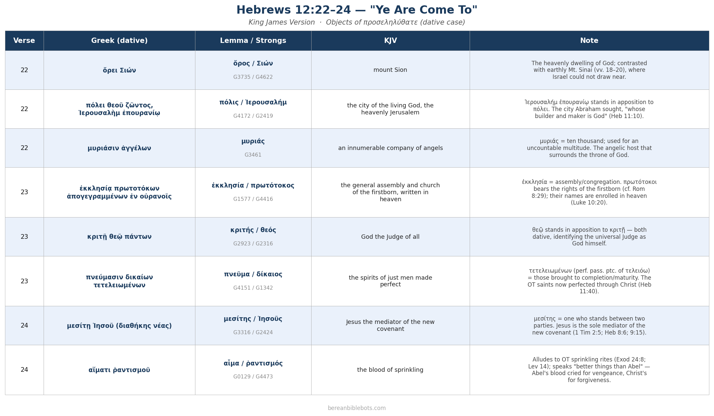

# Hebrews 12:22–24 — "Ye Are Come To"

**Text:** KJV · **Passage:** Hebrews 12:22–24

In verse 22 the author writes, *"But **ye are come** unto…"* (ἀλλὰ **προσεληλύθατε**…). The verb is a 2nd-person perfect active indicative, emphasizing a completed approach with present effect. What follows is a series of eight dative objects — the realities believers have already come to under the new covenant. Each is listed below with its Greek form, head lemma(ta), Strongs number(s), KJV rendering, and a brief explanatory note.

---

| Verse | Greek (dative) | Lemma | Strongs | KJV | Note |
|---|---|---|---|---|---|
| 22 | ὄρει Σιών | ὄρος / Σιών | G3735 / G4622 | mount Sion | The heavenly dwelling of God; contrasted with earthly Mt. Sinai (vv. 18–20), where Israel could not draw near. |
| 22 | πόλει θεοῦ ζῶντος, Ἰερουσαλὴμ ἐπουρανίῳ | πόλις / Ἰερουσαλήμ | G4172 / G2419 | the city of the living God, the heavenly Jerusalem | Ἰερουσαλήμ ἐπουρανίῳ stands in apposition to πόλει. The city Abraham sought, "whose builder and maker is God" (Heb 11:10). |
| 22 | μυριάσιν ἀγγέλων | μυριάς | G3461 | an innumerable company of angels | μυριάς = ten thousand; used for an uncountable multitude. The angelic host that surrounds the throne of God. |
| 23 | ἐκκλησίᾳ πρωτοτόκων ἀπογεγραμμένων ἐν οὐρανοῖς | ἐκκλησία / πρωτότοκος | G1577 / G4416 | the general assembly and church of the firstborn, written in heaven | ἐκκλησία = assembly/congregation. πρωτότοκοι bears the rights of the firstborn (cf. Rom 8:29); their names are enrolled in heaven (Luke 10:20). |
| 23 | κριτῇ θεῷ πάντων | κριτής / θεός | G2923 / G2316 | God the Judge of all | θεῷ stands in apposition to κριτῇ — both dative, identifying the universal Judge as God himself. |
| 23 | πνεύμασιν δικαίων τετελειωμένων | πνεῦμα / δίκαιος | G4151 / G1342 | the spirits of just men made perfect | τετελειωμένων (perf. pass. ptc. of τελειόω) = those brought to completion/maturity. The OT saints now perfected through Christ (Heb 11:40). |
| 24 | μεσίτῃ Ἰησοῦ (διαθήκης νέας) | μεσίτης / Ἰησοῦς | G3316 / G2424 | Jesus the mediator of the new covenant | μεσίτης = one who stands between two parties. Jesus is the sole mediator of the new covenant (1 Tim 2:5; Heb 8:6; 9:15). |
| 24 | αἵματι ῥαντισμοῦ | αἷμα / ῥαντισμός | G0129 / G4473 | the blood of sprinkling | Alludes to OT sprinkling rites (Exod 24:8; Lev 14); speaks "better things than Abel" — Abel's blood cried for vengeance, Christ's for forgiveness. |

---

## Downloadable Chart

Right-click the image below and choose **Save image as…** to download a high-resolution PNG suitable for printing or sharing.

---

*Text: King James Version (KJV).*
 *Greek data: TAGNT (Byzantine/Textus Receptus tradition).*
 *Generated by [scripts/nt/study-helps/build_hebrews12_come_to.py](../../../../scripts/nt/study-helps/build_hebrews12_come_to.py).*