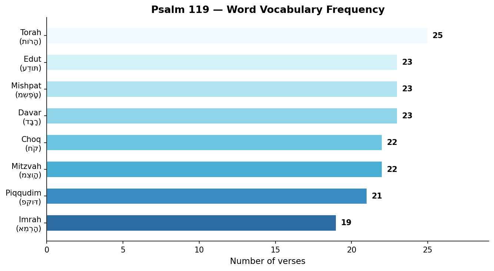
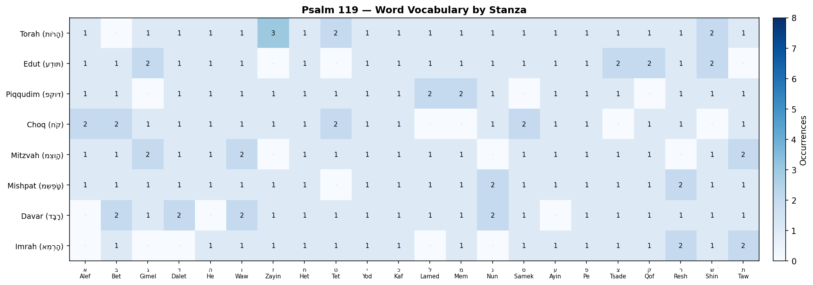
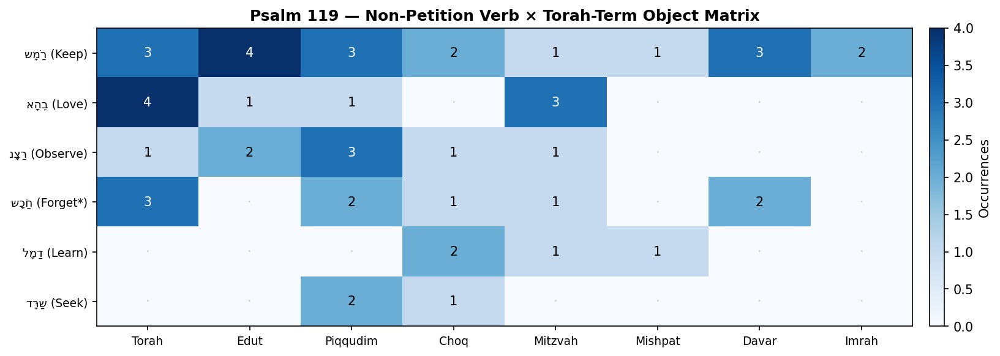
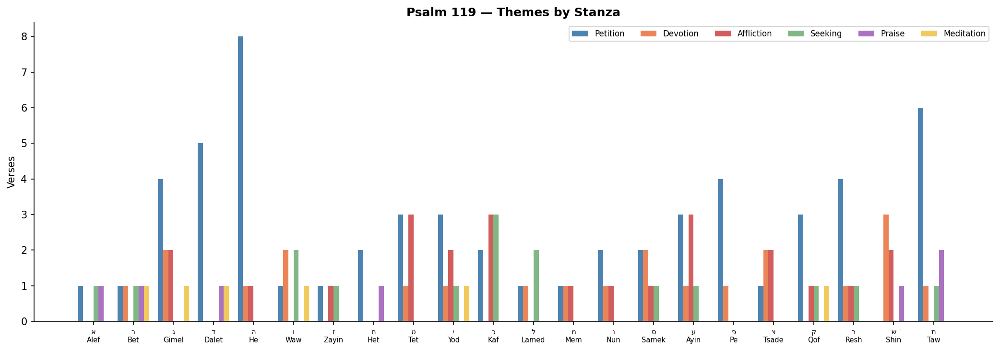

# Psalm 119 — Word Vocabulary and Thematic Analysis

Psalm 119 is the longest chapter in the Bible (176 verses) and the most elaborate
alphabetic acrostic in the Hebrew scriptures: 22 stanzas of 8 verses each, one stanza
for every letter of the Hebrew alphabet. Its subject is singular — the *word of God* —
explored through 8 interlocking vocabulary terms, a rich cascade of petitions, and
recurring emotional themes.

## Contents

- [Structure: The Acrostic Poem](#structure-the-acrostic-poem)
- [Word Vocabulary Analysis](#word-vocabulary-analysis)
- [Word Vocabulary by Stanza](#word-vocabulary-by-stanza)
- [Requests and Petitions to God](#requests-and-petitions-to-god)
- [The Psalmist's Own Verbs](#the-psalmists-own-verbs)
- [Affirmations of Love and Devotion](#affirmations-of-love-and-devotion)
- [Lament: Affliction and Enemies](#lament-affliction-and-enemies)
- [Seeking, Longing, and Hope](#seeking-longing-and-hope)
- [Praise and Testimony](#praise-and-testimony)
- [Meditation on God's Word](#meditation-on-gods-word)
- [Thematic Map by Stanza](#thematic-map-by-stanza)
- [Charts](#charts)

---

## Key Observations

1. **Torah** (*תּוֹרָה*) is the most frequent Word term, appearing in
   25 of the psalm's 176 verses —
   nearly every other verse on average.
2. **58 verses** (out of 176) contain at least one petition to God.
   The most repeated single verb is *ḥayyenî* ("revive / preserve me alive") — 9 times —
   revealing the psalmist's deepest felt need as spiritual life from God.
3. The two terms for **teaching** (*lammdenî* = "teach me" and *havinênî* = "give me
   understanding") together account for 13 petition verbs — more than any other category.
   The psalmist's most urgent desire is not rescue but *comprehension* of God's word.
4. **Affliction and enemies** appear throughout but cluster especially in the final
   stanzas (Resh–Taw, vv. 153–176), where petitions for deliverance also intensify.
5. No single stanza lacks a Word vocabulary term. Even the stanzas with the fewest
   term occurrences (typically 5–6) still weave in every major synonym at least once
   across the stanza's 8 verses.
6. **Devotion and seeking** overlap substantially: many verses that express love for
   God's word also express earnest pursuit. The two themes form the emotional spine of
   the psalm alongside the petition voice.
7. **שָׁמַר** (keep/observe) is the most frequent non-petition verb (21 occurrences) and
   the only one whose direct objects span all 8 Torah vocabulary terms — it is the most
   comprehensive verb of covenant faithfulness in the psalm. Alongside it, **אָהֵב** (love)
   and **שָׂנֵא** (hate) form a devotional binary: the psalmist loves Torah's eight synonyms
   and hates falsehood, false paths, and half-heartedness.

---

## Structure: The Acrostic Poem

Psalm 119 is a 22-stanza alphabetic acrostic. Each stanza consists of exactly 8 verses,
and every verse in a stanza begins with the same Hebrew letter. The structure is relentless:
22 × 8 = 176 verses, surveying the whole scope of the poet's devotion to God's word
from Alef to Taw — the Hebrew equivalent of A to Z.

| Stanza | Letter | Name | Verses |
|---|---|---|---|
| 1 | א | Alef | 1–8 |
| 2 | ב | Bet | 9–16 |
| 3 | ג | Gimel | 17–24 |
| 4 | ד | Dalet | 25–32 |
| 5 | ה | He | 33–40 |
| 6 | ו | Waw | 41–48 |
| 7 | ז | Zayin | 49–56 |
| 8 | ח | Het | 57–64 |
| 9 | ט | Tet | 65–72 |
| 10 | י | Yod | 73–80 |
| 11 | כ | Kaf | 81–88 |
| 12 | ל | Lamed | 89–96 |
| 13 | מ | Mem | 97–104 |
| 14 | נ | Nun | 105–112 |
| 15 | ס | Samek | 113–120 |
| 16 | ע | Ayin | 121–128 |
| 17 | פ | Pe | 129–136 |
| 18 | צ | Tsade | 137–144 |
| 19 | ק | Qof | 145–152 |
| 20 | ר | Resh | 153–160 |
| 21 | שׁ | Shin | 161–168 |
| 22 | ת | Taw | 169–176 |

---

## Word Vocabulary Analysis

Eight distinct Hebrew nouns are used interchangeably throughout Psalm 119 as synonyms
for God's revealed word. Together they appear approximately **178 times**
across the psalm's 176 verses. Scholars disagree on whether these terms carry distinct
nuances or function as pure synonyms; the analysis below presents each term's usage and
frequency.

| Term | Hebrew | English | Verses |
|---|---|---|---|
| Torah | תּוֹרָה | Law / Instruction | 25 |
| Edut | עֵדוּת | Testimonies | 23 |
| Mishpat | מִשְׁפָּט | Judgments / Rules | 23 |
| Davar | דָּבָר | Word / Promise | 23 |
| Choq | חֹק | Statutes | 22 |
| Mitzvah | מִצְוָה | Commandments | 22 |
| Piqqudim | פִּקּוּד | Precepts | 21 |
| Imrah | אִמְרָה | Word / Saying | 19 |

### Term Descriptions

**Torah** (תּוֹרָה) — *Law / Instruction* · 25 verses

The foundational term for God's revealed instruction. Encompasses both specific commandments and the whole of divine teaching. The psalmist's love for the *Torah* frames the entire poem (vv. 1, 97, 165).

**Edut** (עֵדוּת) — *Testimonies* · 23 verses

God's testimonies or decrees — utterances that bear witness to his character and will. The noun is always plural in Psalm 119, emphasizing the fullness of what God has declared.

**Piqqudim** (פִּקּוּד) — *Precepts* · 21 verses

Specific charges or directives entrusted to Israel. The word conveys a sense of personal assignment and accountability for each command given.

**Choq** (חֹק) — *Statutes* · 22 verses

Engraved or inscribed laws — fixed, unchangeable decrees. The image of engraving underscores the permanent authority of God's ordinances.

**Mitzvah** (מִצְוָה) — *Commandments* · 22 verses

Direct divine commands, stressing the authoritative source. The psalmist runs in the way of the *mitzvot* and lifts his hands toward them (vv. 32, 48).

**Mishpat** (מִשְׁפָּט) — *Judgments / Rules* · 23 verses

Judicial decisions and ordinances grounded in God's role as righteous judge. The psalmist praises God's *mishpatim* even at midnight (v. 62).

**Davar** (דָּבָר) — *Word / Promise* · 23 verses

The divine word or promise. In Psalm 119 the *davar* is both God's command and his pledged faithfulness — the ground of the psalmist's hope (vv. 25, 107, 169).

**Imrah** (אִמְרָה) — *Word / Saying* · 19 verses

A spoken utterance or saying. *Imrah* often highlights the personal, direct character of God's speech and is used in parallel with *davar*. The psalmist's soul faints for God's *imrah* (v. 81).

---

## Word Vocabulary by Stanza

The table below shows how many verses in each stanza contain each Word term.
A dot (·) indicates zero occurrences.

| Stanza | Vv. | Torah | Edut | Piqqudim | Choq | Mitzvah | Mishpat | Davar | Imrah | Total |
|---|---|---|---|---|---|---|---|---|---|---|
| א Alef | 1–8 | 1 | 1 | 1 | 2 | 1 | 1 | · | · | 7 |
| ב Bet | 9–16 | · | 1 | 1 | 2 | 1 | 1 | 2 | 1 | 9 |
| ג Gimel | 17–24 | 1 | 2 | · | 1 | 2 | 1 | 1 | · | 8 |
| ד Dalet | 25–32 | 1 | 1 | 1 | 1 | 1 | 1 | 2 | · | 8 |
| ה He | 33–40 | 1 | 1 | 1 | 1 | 1 | 1 | · | 1 | 7 |
| ו Waw | 41–48 | 1 | 1 | 1 | 1 | 2 | 1 | 2 | 1 | 10 |
| ז Zayin | 49–56 | 3 | · | 1 | 1 | · | 1 | 1 | 1 | 8 |
| ח Het | 57–64 | 1 | 1 | 1 | 1 | 1 | 1 | 1 | 1 | 8 |
| ט Tet | 65–72 | 2 | · | 1 | 2 | 1 | · | 1 | 1 | 8 |
| י Yod | 73–80 | 1 | 1 | 1 | 1 | 1 | 1 | 1 | 1 | 8 |
| כ Kaf | 81–88 | 1 | 1 | 1 | 1 | 1 | 1 | 1 | 1 | 8 |
| ל Lamed | 89–96 | 1 | 1 | 2 | · | 1 | 1 | 1 | · | 7 |
| מ Mem | 97–104 | 1 | 1 | 2 | · | 1 | 1 | 1 | 1 | 8 |
| נ Nun | 105–112 | 1 | 1 | 1 | 1 | · | 2 | 2 | · | 8 |
| ס Samek | 113–120 | 1 | 1 | · | 2 | 1 | 1 | 1 | 1 | 8 |
| ע Ayin | 121–128 | 1 | 1 | 1 | 1 | 1 | 1 | · | 1 | 7 |
| פ Pe | 129–136 | 1 | 1 | 1 | 1 | 1 | 1 | 1 | 1 | 8 |
| צ Tsade | 137–144 | 1 | 2 | 1 | · | 1 | 1 | 1 | 1 | 8 |
| ק Qof | 145–152 | 1 | 2 | · | 1 | 1 | 1 | 1 | 1 | 8 |
| ר Resh | 153–160 | 1 | 1 | 1 | 1 | · | 2 | 1 | 2 | 9 |
| שׁ Shin | 161–168 | 2 | 2 | 1 | · | 1 | 1 | 1 | 1 | 9 |
| ת Taw | 169–176 | 1 | · | 1 | 1 | 2 | 1 | 1 | 2 | 9 |

---

## Requests and Petitions to God

Psalm 119 is saturated with direct petition. Across **58 verses**, the
psalmist addresses God with imperative verbs or jussive forms that express wishes and
requests. These petitions reveal both the psalmist's need and his theology: he does not
merely *obey* God's word — he pleads with God to *enable* him to live it.

### Most-Repeated Petition Verbs

| Verb (gloss) | Times |
|---|---|
| Preserve alive me | 9 |
| Teach me | 8 |
| Give understanding me | 5 |
| Take away | 3 |
| Show favor to me | 2 |
| May it be | 2 |
| Save me | 2 |
| See | 2 |
| Forsake me | 1 |
| Deal bountifully | 1 |
| Uncover | 1 |
| Hide | 1 |

### Petitions by Category

#### Teach & Illuminate

*Petitions for understanding, instruction, and revelation*

**Ps 119:12** · **לַמְּדֵ֥/נִי** — teach me\
*Blessed art thou, O Lord: teach me thy statutes.*

**Ps 119:26** · **לַמְּדֵ֥/נִי** — teach me\
*I have declared my ways, and thou heardest me: teach me thy statutes.*

**Ps 119:27** · **הֲבִינֵ֑/נִי** — give understanding of me\
*Make me to understand the way of thy precepts: so shall I talk of thy wondrous works.*

**Ps 119:29** · **הָסֵ֣ר** — remove (Hiphil) | **חָנֵּֽ/נִי\׃** — show favor to me\
*Remove from me the way of lying: and grant me thy law graciously.*

**Ps 119:33** · **הוֹרֵ֣/נִי** — teach me\
*Teach me, O Lord, the way of thy statutes; and I shall keep it unto the end.*

**Ps 119:34** · **הֲ֭בִינֵ/נִי** — give understanding me\
*Give me understanding, and I shall keep thy law; yea, I shall observe it with my whole heart.*

**Ps 119:35** · **הַ֭דְרִיכֵ/נִי** — lead me\
*Make me to go in the path of thy commandments; for therein do I delight.*

**Ps 119:58** · **חָ֝נֵּ֗/נִי** — show favor to me\
*I intreated thy favour with my whole heart: be merciful unto me according to thy word.*

**Ps 119:64** · **לַמְּדֵֽ/נִי\׃** — teach me\
*The earth, O Lord, is full of thy mercy: teach me thy statutes.*

**Ps 119:66** · **לַמְּדֵ֑/נִי** — teach me\
*Teach me good judgment and knowledge: for I have believed thy commandments.*

**Ps 119:68** · **לַמְּדֵ֥/נִי** — teach me\
*Thou art good, and doest good; teach me thy statutes.*

**Ps 119:73** · **הֲ֝בִינֵ֗/נִי** — give understanding me\
*Thy hands have made me and fashioned me: give me understanding, that I may learn thy commandments.*

**Ps 119:108** · **רְצֵה\־** — accept (Qal) | **לַמְּדֵֽ/נִי\׃** — teach me\
*Accept, I beseech thee, the freewill offerings of my mouth, O Lord, and teach me thy judgments.*

**Ps 119:124** · **עֲשֵׂ֖ה** — do (Qal) | **לַמְּדֵֽ/נִי\׃** — teach me\
*Deal with thy servant according unto thy mercy, and teach me thy statutes.*

**Ps 119:125** · **הֲבִינֵ֑/נִי** — give understanding me\
*I am thy servant; give me understanding, that I may know thy testimonies.*

**Ps 119:133** · **הָכֵ֣ן** — direct (Hiphil)\
*Order my steps in thy word: and let not any iniquity have dominion over me.*

**Ps 119:135** · **הָאֵ֣ר** — make shine (Hiphil)\
*Make thy face to shine upon thy servant; and teach me thy statutes.*

**Ps 119:144** · **הֲבִינֵ֥/נִי** — give understanding me\
*The righteousness of thy testimonies is everlasting: give me understanding, and I shall live.*

**Ps 119:169** · **הֲבִינֵֽ/נִי\׃** — give understanding me\
*Let my cry come near before thee, O Lord: give me understanding according to thy word.*

#### Revive & Strengthen

*Petitions for life, renewal, and endurance*

**Ps 119:25** · **חַ֝יֵּ֗/נִי** — preserve alive me\
*My soul cleaveth unto the dust: quicken thou me according to thy word.*

**Ps 119:28** · **קַ֝יְּמֵ֗/נִי** — strengthen me\
*My soul melteth for heaviness: strengthen thou me according unto thy word.*

**Ps 119:37** · **הַעֲבֵ֣ר** — take away (Hiphil) | **חַיֵּֽ/נִי\׃** — preserve alive me\
*Turn away mine eyes from beholding vanity; and quicken thou me in thy way.*

**Ps 119:40** · **חַיֵּֽ/נִי\׃** — preserve alive me\
*Behold, I have longed after thy precepts: quicken me in thy righteousness.*

**Ps 119:88** · **חַיֵּ֑/נִי** — preserve alive me\
*Quicken me after thy lovingkindness; so shall I keep the testimony of thy mouth.*

**Ps 119:107** · **חַיֵּ֥/נִי** — preserve alive me\
*I am afflicted very much: quicken me, O Lord, according unto thy word.*

**Ps 119:116** · **סָמְכֵ֣/נִי** — sustain me\
*Uphold me according unto thy word, that I may live: and let me not be ashamed of my hope.*

**Ps 119:117** · **סְעָדֵ֥/נִי** — uphold me\
*Hold thou me up, and I shall be safe: and I will have respect unto thy statutes continually.*

**Ps 119:149** · **שִׁמְעָ֣/ה** — hear | **חַיֵּֽ/נִי\׃** — preserve alive me\
*Hear my voice according unto thy lovingkindness: O Lord, quicken me according to thy judgment.*

**Ps 119:154** · **רִיבָ֣/ה** — conduct | **חַיֵּֽ/נִי\׃** — preserve alive me\
*Plead my cause, and deliver me: quicken me according to thy word.*

**Ps 119:156** · **חַיֵּֽ/נִי\׃** — preserve alive me\
*Great are thy tender mercies, O Lord: quicken me according to thy judgments.*

**Ps 119:159** · **רְ֭אֵה** — see (Qal) | **חַיֵּֽ/נִי\׃** — preserve alive me\
*Consider how I love thy precepts: quicken me, O Lord, according to thy lovingkindness.*

**Ps 119:170** · **הַצִּילֵֽ/נִי\׃** — deliver me\
*Let my supplication come before thee: deliver me according to thy word.*

**Ps 119:175** · **תְּֽחִי\־** — may it live (Qal)\
*Let my soul live, and it shall praise thee; and let thy judgments help me.*

#### Save & Deliver

*Petitions for rescue from affliction and enemies*

**Ps 119:86** · **עָזְרֵֽ/נִי\׃** — help me\
*All thy commandments are faithful: they persecute me wrongfully; help thou me.*

**Ps 119:94** · **הוֹשִׁיעֵ֑/נִי** — save me\
*I am thine, save me; for I have sought thy precepts.*

**Ps 119:134** · **פְּ֭דֵ/נִי** — redeem me\
*Deliver me from the oppression of man: so will I keep thy precepts.*

**Ps 119:145** · **עֲנֵ֥/נִי** — answer me\
*I cried with my whole heart; hear me, O Lord: I will keep thy statutes.*

**Ps 119:146** · **הוֹשִׁיעֵ֑/נִי** — save me\
*I cried unto thee; save me, and I shall keep thy testimonies.*

**Ps 119:154** · **רִיבָ֣/ה** — conduct | **חַיֵּֽ/נִי\׃** — preserve alive me\
*Plead my cause, and deliver me: quicken me according to thy word.*

#### Grace & Attention

*Petitions for God's face, favor, and attentiveness*

**Ps 119:49** · **זְכֹר\־** — remember (Qal)\
*Remember the word unto thy servant, upon which thou hast caused me to hope.*

**Ps 119:108** · **רְצֵה\־** — accept (Qal) | **לַמְּדֵֽ/נִי\׃** — teach me\
*Accept, I beseech thee, the freewill offerings of my mouth, O Lord, and teach me thy judgments.*

**Ps 119:132** · **פְּנֵה\־** — turn (Qal)\
*Look thou upon me, and be merciful unto me, as thou usest to do unto those that love thy name.*

**Ps 119:149** · **שִׁמְעָ֣/ה** — hear | **חַיֵּֽ/נִי\׃** — preserve alive me\
*Hear my voice according unto thy lovingkindness: O Lord, quicken me according to thy judgment.*

**Ps 119:153** · **רְאֵֽה\־** — see (Qal)\
*Consider mine affliction, and deliver me: for I do not forget thy law.*

**Ps 119:159** · **רְ֭אֵה** — see (Qal) | **חַיֵּֽ/נִי\׃** — preserve alive me\
*Consider how I love thy precepts: quicken me, O Lord, according to thy lovingkindness.*

**Ps 119:176** · **בַּקֵּ֣שׁ** — seek (Piel)\
*I have gone astray like a lost sheep; seek thy servant; for I do not forget thy commandments.*

#### Protect & Order

*Petitions for God to act, direct, and guard*

**Ps 119:8** · **תַּעַזְבֵ֥/נִי** — you forsake me\
*I will keep thy statutes: O forsake me not utterly.*

**Ps 119:17** · **גְּמֹ֖ל** — deal bountifully (Qal)\
*Deal bountifully with thy servant, that I may live, and keep thy word.*

**Ps 119:19** · **תַּסְתֵּ֥ר** — you hide (Hiphil)\
*I am a stranger in the earth: hide not thy commandments from me.*

**Ps 119:29** · **הָסֵ֣ר** — remove (Hiphil) | **חָנֵּֽ/נִי\׃** — show favor to me\
*Remove from me the way of lying: and grant me thy law graciously.*

**Ps 119:36** · **הַט\־** — incline (Hiphil)\
*Incline my heart unto thy testimonies, and not to covetousness.*

**Ps 119:37** · **הַעֲבֵ֣ר** — take away (Hiphil) | **חַיֵּֽ/נִי\׃** — preserve alive me\
*Turn away mine eyes from beholding vanity; and quicken thou me in thy way.*

**Ps 119:38** · **הָקֵ֣ם** — fulfill (Hiphil)\
*Stablish thy word unto thy servant, who is devoted to thy fear.*

**Ps 119:39** · **הַעֲבֵ֣ר** — take away (Hiphil)\
*Turn away my reproach which I fear: for thy judgments are good.*

**Ps 119:43** · **תַּצֵּ֬ל** — you take away (Hiphil)\
*And take not the word of truth utterly out of my mouth; for I have hoped in thy judgments.*

**Ps 119:122** · **עֲרֹ֣ב** — stand surety for (Qal) | **יַעַשְׁקֻ֥/נִי** — they oppress me\
*Be surety for thy servant for good: let not the proud oppress me.*

**Ps 119:124** · **עֲשֵׂ֖ה** — do (Qal) | **לַמְּדֵֽ/נִי\׃** — teach me\
*Deal with thy servant according unto thy mercy, and teach me thy statutes.*

#### Other

*Additional petitions*

**Ps 119:18** · **גַּל\־** — uncover (Piel)\
*Open thou mine eyes, that I may behold wondrous things out of thy law.*

**Ps 119:22** · **גַּ֣ל** — roll away (Piel)\
*Remove from me reproach and contempt; for I have kept thy testimonies.*

**Ps 119:71** · **אֶלְמַ֥ד** — I may learn (Qal)\
*It is good for me that I have been afflicted; that I might learn thy statutes.*

**Ps 119:76** · **יְהִי\־** — let it be (Qal)\
*Let, I pray thee, thy merciful kindness be for my comfort, according to thy word unto thy servant.*

**Ps 119:80** · **יְהִֽי\־** — may it be (Qal)\
*Let my heart be sound in thy statutes; that I be not ashamed.*

**Ps 119:101** · **אֶשְׁמֹ֥ר** — I may keep (Qal)\
*I have refrained my feet from every evil way, that I might keep thy word.*

**Ps 119:122** · **עֲרֹ֣ב** — stand surety for (Qal) | **יַעַשְׁקֻ֥/נִי** — they oppress me\
*Be surety for thy servant for good: let not the proud oppress me.*

**Ps 119:172** · **תַּ֣עַן** — may it sing (Qal)\
*My tongue shall speak of thy word: for all thy commandments are righteousness.*

**Ps 119:173** · **תְּהִֽי\־** — may it be (Qal)\
*Let thine hand help me; for I have chosen thy precepts.*

---

## The Psalmist's Own Verbs

Alongside his petitions to God, the psalmist declares what he himself does. These
non-petition verb forms — 273 tokens across the psalm — reveal the psalmist's active
posture toward God's word and form the obverse of the petition voice: he asks God to
*help* him keep, love, and understand Torah, but he also affirms that he already does so.

### Most-Frequent Declared Actions

| Verb (English) | Hebrew | N | Primary Object |
|---|---|---|---|
| Keep / Observe | שָׁמַר | 21 | Edut (4×) |
| Love | אָהֵב | 12 | Torah (4×) |
| Observe / Guard | נָצַר | 10 | Piqqudim (3×) |
| Forget (negated) | שָׁכַח | 9 | Torah (3×) |
| Do / Make | עָשָׂה | 7 | — |
| Live | חָיָה | 7 | — |
| Wait / Hope | יָחַל | 6 | — |
| Meditate | שִׂיחַ | 6 | — |
| Pursue | רָדַף | 5 | — |
| Learn | לָמַד | 5 | Choq (2×) |
| Seek | דָּרַשׁ | 5 | Piqqudim (2×) |
| Afflict | עָנָה | 4 | — |

### What the Psalmist Keeps, Loves, and Observes

The six Torah-directed verbs (keep, love, observe, not-forget, learn, seek) all take
the eight canonical Torah vocabulary terms as direct objects. The matrix below shows
how many times each verb governs each term.

| Verb | Torah | Edut | Piqqudim | Choq | Mitzvah | Mishpat | Davar | Imrah | Total |
|---|---|---|---|---|---|---|---|---|---|
| שָׁמַר (Keep) | 3 | 4 | 3 | 2 | 1 | 1 | 3 | 2 | 19 |
| אָהֵב (Love) | 4 | 1 | 1 | · | 3 | · | · | · | 9 |
| נָצַר (Observe) | 1 | 2 | 3 | 1 | 1 | · | · | · | 8 |
| שָׁכַח (Forget*) | 3 | · | 2 | 1 | 1 | · | 2 | · | 9 |
| לָמַד (Learn) | · | · | · | 2 | 1 | 1 | · | · | 4 |
| דָּרַשׁ (Seek) | · | · | 2 | 1 | · | · | · | · | 3 |

*\* שָׁכַח (forget) is always negated in Psalm 119 — "I will not forget your law/word."
All nine occurrences are negated declarations of faithfulness, not admissions of failure.*

**שָׁמַר (keep/observe)** stands out: with 21 occurrences it is the most frequent
non-petition verb, and its objects span all 8 Torah vocabulary terms — the only verb
in the psalm that governs the entire Torah synonymy:

- **Torah** — 3× (vv. 44, 55, 136)
- **Edut** — 4× (vv. 88, 146, 167, 168)
- **Piqqudim** — 3× (vv. 63, 134, 168)
- **Choq** — 2× (vv. 5, 8)
- **Mitzvah** — 1× (vv. 60)
- **Mishpat** — 1× (vv. 106)
- **Davar** — 3× (vv. 17, 57, 101)
- **Imrah** — 2× (vv. 67, 158)

**אָהֵב (love)** concentrates on מִצְוָה (commandments, 3×) and תּוֹרָה (Torah, 3×),
anchoring the psalmist's affective devotion in the two most foundational Torah terms.

**שָׁכַח (forget)** — always negated — takes תּוֹרָה (3×) and דָּבָר / פִּקּוּדִים /
מִצְוָה as objects. The psalmist's most consistent negative declaration is precisely
that he does *not* forget God's word.

### What the Psalmist Hates

שָׂנֵא (hate, 4 occurrences) takes exclusively negative objects — a binary counterpart
to the love vocabulary:

| Verse | Object | Gloss |
|---|---|---|
| 104 | אֹרַח | false path |
| 113 | סֵעֵף | half-hearted people |
| 128 | אֹרַח | false path |
| 163 | שֶׁקֶר | falsehood |

The psalmist loves every Torah synonym; he hates every form of deception and
half-heartedness. The binary is sharp and deliberate.

---

## Affirmations of Love and Devotion

The psalmist does not merely *keep* God's commandments — he *loves* them.
Love (H157, אָהַב) and delight (H2654, חָפֵץ; H7521, רָצָה) vocabulary
appears in **22 verses**, expressing an affective, not merely
legal, relationship to God's word.

| Verse | KJV Text |
|---|---|
| Ps 119:16 | I will delight myself in thy statutes: I will not forget thy word. |
| Ps 119:23 | Princes also did sit and speak against me: but thy servant did meditate in thy statutes. |
| Ps 119:24 | Thy testimonies also are my delight and my counsellors. |
| Ps 119:35 | Make me to go in the path of thy commandments; for therein do I delight. |
| Ps 119:47 | And I will delight myself in thy commandments, which I have loved. |
| Ps 119:48 | My hands also will I lift up unto thy commandments, which I have loved; and I will meditate in thy statutes. |
| Ps 119:70 | Their heart is as fat as grease; but I delight in thy law. |
| Ps 119:77 | Let thy tender mercies come unto me, that I may live: for thy law is my delight. |
| Ps 119:92 | Unless thy law had been my delights, I should then have perished in mine affliction. |
| Ps 119:97 | O how love I thy law! it is my meditation all the day. |
| Ps 119:108 | Accept, I beseech thee, the freewill offerings of my mouth, O Lord, and teach me thy judgments. |
| Ps 119:113 | I hate vain thoughts: but thy law do I love. |
| Ps 119:119 | Thou puttest away all the wicked of the earth like dross: therefore I love thy testimonies. |
| Ps 119:127 | Therefore I love thy commandments above gold; yea, above fine gold. |
| Ps 119:132 | Look thou upon me, and be merciful unto me, as thou usest to do unto those that love thy name. |
| Ps 119:140 | Thy word is very pure: therefore thy servant loveth it. |
| Ps 119:143 | Trouble and anguish have taken hold on me: yet thy commandments are my delights. |
| Ps 119:159 | Consider how I love thy precepts: quicken me, O Lord, according to thy lovingkindness. |
| Ps 119:163 | I hate and abhor lying: but thy law do I love. |
| Ps 119:165 | Great peace have they which love thy law: and nothing shall offend them. |
| Ps 119:167 | My soul hath kept thy testimonies; and I love them exceedingly. |
| Ps 119:174 | I have longed for thy salvation, O Lord; and thy law is my delight. |

---

## Lament: Affliction and Enemies

The psalmist faces real opposition. Words for affliction (H6031, עָנָה), adversaries
(H6862, צַר), enemies (H341, אֹיֵב), and persecution (H7291, רָדַף) appear in
**24 verses**. Far from trivializing suffering, Psalm 119 is partly
a psalm of the persecuted faithful. The psalmist's clinging to God's word intensifies
*because* he is under pressure.

| Verse | KJV Text |
|---|---|
| Ps 119:21 | Thou hast rebuked the proud that are cursed, which do err from thy commandments. |
| Ps 119:22 | Remove from me reproach and contempt; for I have kept thy testimonies. |
| Ps 119:39 | Turn away my reproach which I fear: for thy judgments are good. |
| Ps 119:51 | The proud have had me greatly in derision: yet have I not declined from thy law. |
| Ps 119:67 | Before I was afflicted I went astray: but now have I kept thy word. |
| Ps 119:69 | The proud have forged a lie against me: but I will keep thy precepts with my whole heart. |
| Ps 119:71 | It is good for me that I have been afflicted; that I might learn thy statutes. |
| Ps 119:75 | I know, O Lord, that thy judgments are right, and that thou in faithfulness hast afflicted me. |
| Ps 119:78 | Let the proud be ashamed; for they dealt perversely with me without a cause: but I will meditate in thy precepts. |
| Ps 119:84 | How many are the days of thy servant? when wilt thou execute judgment on them that persecute me? |
| Ps 119:85 | The proud have digged pits for me, which are not after thy law. |
| Ps 119:86 | All thy commandments are faithful: they persecute me wrongfully; help thou me. |
| Ps 119:104 | Through thy precepts I get understanding: therefore I hate every false way. |
| Ps 119:107 | I am afflicted very much: quicken me, O Lord, according unto thy word. |
| Ps 119:113 | I hate vain thoughts: but thy law do I love. |
| Ps 119:121 | I have done judgment and justice: leave me not to mine oppressors. |
| Ps 119:122 | Be surety for thy servant for good: let not the proud oppress me. |
| Ps 119:128 | Therefore I esteem all thy precepts concerning all things to be right; and I hate every false way. |
| Ps 119:139 | My zeal hath consumed me, because mine enemies have forgotten thy words. |
| Ps 119:143 | Trouble and anguish have taken hold on me: yet thy commandments are my delights. |
| Ps 119:150 | They draw nigh that follow after mischief: they are far from thy law. |
| Ps 119:157 | Many are my persecutors and mine enemies; yet do I not decline from thy testimonies. |
| Ps 119:161 | Princes have persecuted me without a cause: but my heart standeth in awe of thy word. |
| Ps 119:163 | I hate and abhor lying: but thy law do I love. |

---

## Seeking, Longing, and Hope

Seeking vocabulary (H1875 דָּרַשׁ, H7836 שָׁחַר, H1245 בָּקַשׁ) and longing/waiting
vocabulary (H6960 קָוָה, H3176 יָחַל, H3615 כָּלָה) appear in **16 verses**.
The psalmist is not passive; he actively pursues God and pines for his word with the
urgency of physical thirst.

| Verse | KJV Text |
|---|---|
| Ps 119:2 | Blessed are they that keep his testimonies, and that seek him with the whole heart. |
| Ps 119:10 | With my whole heart have I sought thee: O let me not wander from thy commandments. |
| Ps 119:43 | And take not the word of truth utterly out of my mouth; for I have hoped in thy judgments. |
| Ps 119:45 | And I will walk at liberty: for I seek thy precepts. |
| Ps 119:49 | Remember the word unto thy servant, upon which thou hast caused me to hope. |
| Ps 119:74 | They that fear thee will be glad when they see me; because I have hoped in thy word. |
| Ps 119:81 | My soul fainteth for thy salvation: but I hope in thy word. |
| Ps 119:82 | Mine eyes fail for thy word, saying, When wilt thou comfort me? |
| Ps 119:87 | They had almost consumed me upon earth; but I forsook not thy precepts. |
| Ps 119:94 | I am thine, save me; for I have sought thy precepts. |
| Ps 119:95 | The wicked have waited for me to destroy me: but I will consider thy testimonies. |
| Ps 119:114 | Thou art my hiding place and my shield: I hope in thy word. |
| Ps 119:123 | Mine eyes fail for thy salvation, and for the word of thy righteousness. |
| Ps 119:147 | I prevented the dawning of the morning, and cried: I hoped in thy word. |
| Ps 119:155 | Salvation is far from the wicked: for they seek not thy statutes. |
| Ps 119:176 | I have gone astray like a lost sheep; seek thy servant; for I do not forget thy commandments. |

---

## Praise and Testimony

Praise vocabulary (H1984 הָלַל, H3034 יָדָה, H5608 סָפַר, H7623 שָׁבַח) appears in
**7 verses**. The psalmist's devotion is not private; he commits to
praising God and declaring his righteous ordinances "before kings" (v. 46) and
teaching transgressors God's ways (v. 171).

| Verse | KJV Text |
|---|---|
| Ps 119:7 | I will praise thee with uprightness of heart, when I shall have learned thy righteous judgments. |
| Ps 119:13 | With my lips have I declared all the judgments of thy mouth. |
| Ps 119:26 | I have declared my ways, and thou heardest me: teach me thy statutes. |
| Ps 119:62 | At midnight I will rise to give thanks unto thee because of thy righteous judgments. |
| Ps 119:164 | Seven times a day do I praise thee because of thy righteous judgments. |
| Ps 119:171 | My lips shall utter praise, when thou hast taught me thy statutes. |
| Ps 119:175 | Let my soul live, and it shall praise thee; and let thy judgments help me. |

---

## Meditation on God's Word

Two specific verbs mark *intentional engagement* with God's word:
- **שִׂיחַ** (H7878, *siaḥ*) — meditate, muse, talk to oneself about something
- **הָגָה** (H1897, *hagah*) — meditate, mutter, recite softly

These appear in **6 verses** and describe the sustained, repeated
turning of the mind to God's word — the practice underlying the whole psalm.

| Verse | KJV Text |
|---|---|
| Ps 119:15 | I will meditate in thy precepts, and have respect unto thy ways. |
| Ps 119:23 | Princes also did sit and speak against me: but thy servant did meditate in thy statutes. |
| Ps 119:27 | Make me to understand the way of thy precepts: so shall I talk of thy wondrous works. |
| Ps 119:48 | My hands also will I lift up unto thy commandments, which I have loved; and I will meditate in thy statutes. |
| Ps 119:78 | Let the proud be ashamed; for they dealt perversely with me without a cause: but I will meditate in thy precepts. |
| Ps 119:148 | Mine eyes prevent the night watches, that I might meditate in thy word. |

---

## Thematic Map by Stanza

The table shows, for each stanza, how many verses contain each theme.
A stanza with a high petition count alongside high affliction count often reveals
a section of particular distress. Stanzas where devotion and seeking overlap mark
peak expressions of the psalmist's love for God's word.

| Stanza | Vv. | Petitions | Devotion | Affliction | Seeking | Praise | Meditation |
|---|---|---|---|---|---|---|---|
| א Alef | 1–8 | 1 | · | · | 1 | 1 | · |
| ב Bet | 9–16 | 1 | 1 | · | 1 | 1 | 1 |
| ג Gimel | 17–24 | 4 | 2 | 2 | · | · | 1 |
| ד Dalet | 25–32 | 5 | · | · | · | 1 | 1 |
| ה He | 33–40 | 8 | 1 | 1 | · | · | · |
| ו Waw | 41–48 | 1 | 2 | · | 2 | · | 1 |
| ז Zayin | 49–56 | 1 | · | 1 | 1 | · | · |
| ח Het | 57–64 | 2 | · | · | · | 1 | · |
| ט Tet | 65–72 | 3 | 1 | 3 | · | · | · |
| י Yod | 73–80 | 3 | 1 | 2 | 1 | · | 1 |
| כ Kaf | 81–88 | 2 | · | 3 | 3 | · | · |
| ל Lamed | 89–96 | 1 | 1 | · | 2 | · | · |
| מ Mem | 97–104 | 1 | 1 | 1 | · | · | · |
| נ Nun | 105–112 | 2 | 1 | 1 | · | · | · |
| ס Samek | 113–120 | 2 | 2 | 1 | 1 | · | · |
| ע Ayin | 121–128 | 3 | 1 | 3 | 1 | · | · |
| פ Pe | 129–136 | 4 | 1 | · | · | · | · |
| צ Tsade | 137–144 | 1 | 2 | 2 | · | · | · |
| ק Qof | 145–152 | 3 | · | 1 | 1 | · | 1 |
| ר Resh | 153–160 | 4 | 1 | 1 | 1 | · | · |
| שׁ Shin | 161–168 | · | 3 | 2 | · | 1 | · |
| ת Taw | 169–176 | 6 | 1 | · | 1 | 2 | · |

---

## Charts

| Chart | Description |
|---|---|
| [Word Term Frequencies](charts/word-term-frequencies.png) | Frequency of the 8 canonical Word terms across Psalm 119 |
| [Word Vocabulary by Stanza](charts/word-terms-by-stanza.png) | Heatmap: which terms appear in which stanzas |
| [Themes by Stanza](charts/themes-by-stanza.png) | Thematic distribution across all 22 stanzas |
| [Verb × Torah-Term Object Matrix](charts/verb-torah-object-matrix.png) | Which Torah terms each key non-petition verb governs |

---

*Data source: Macula-Hebrew (OSHB); English text: KJV.*
